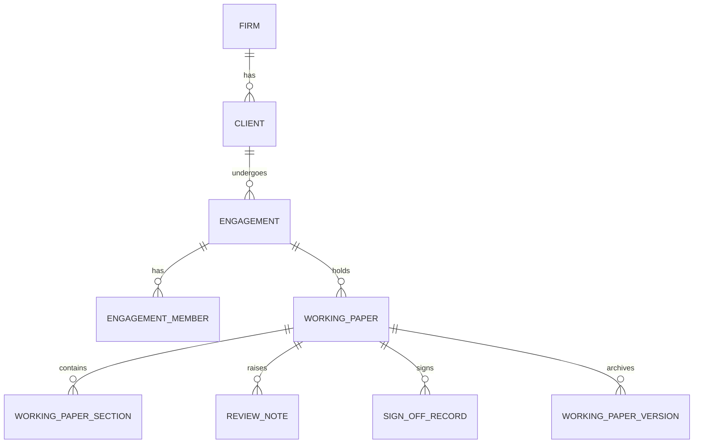
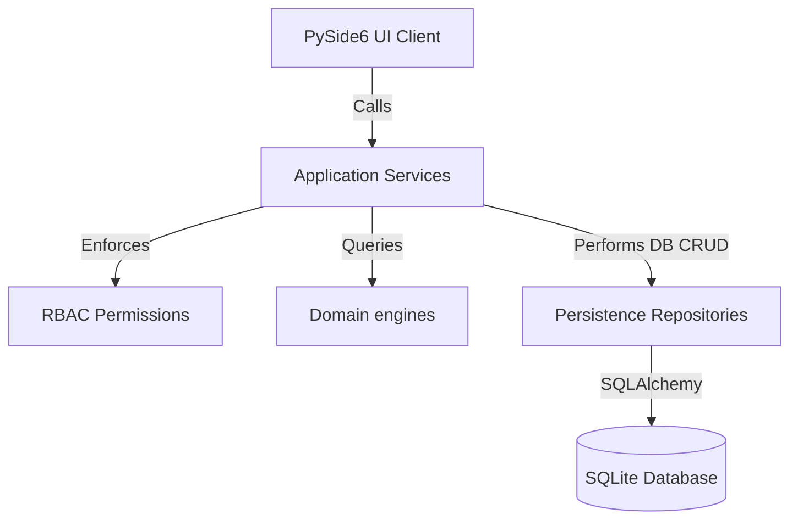
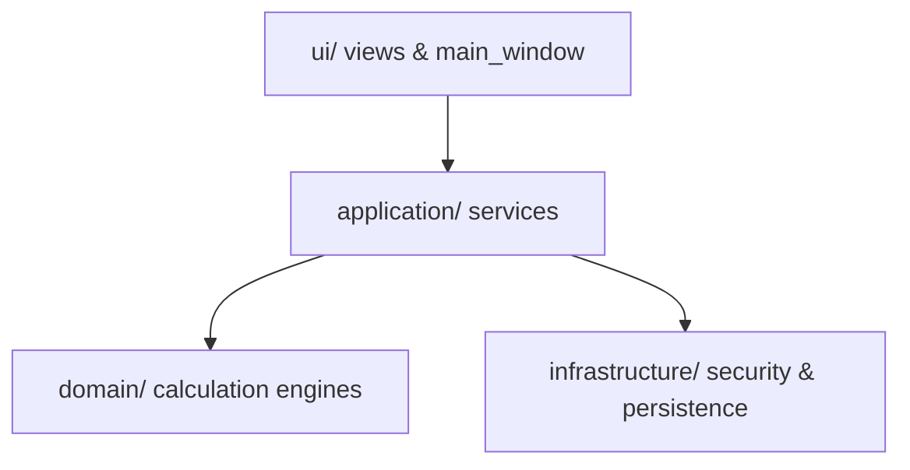
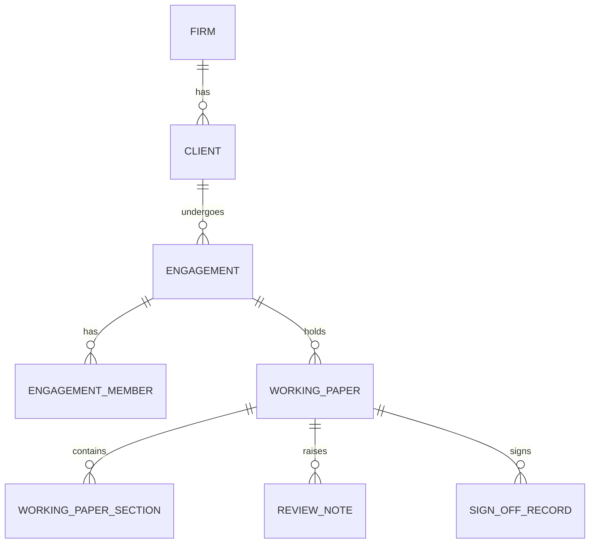
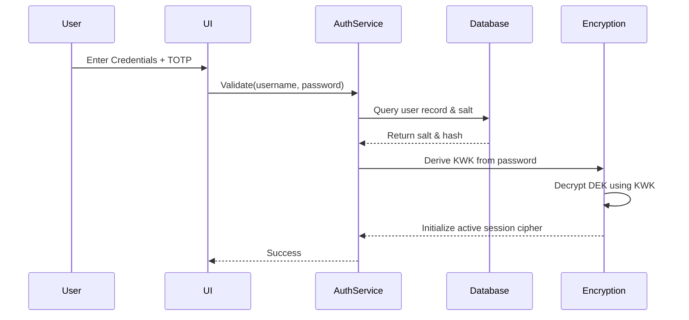
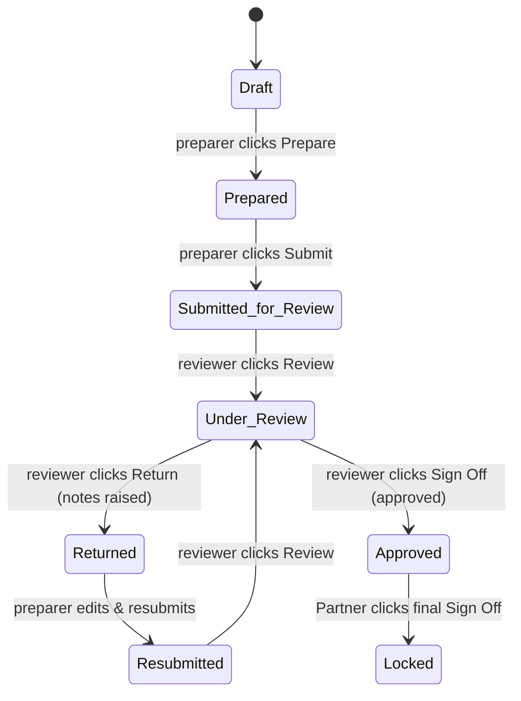
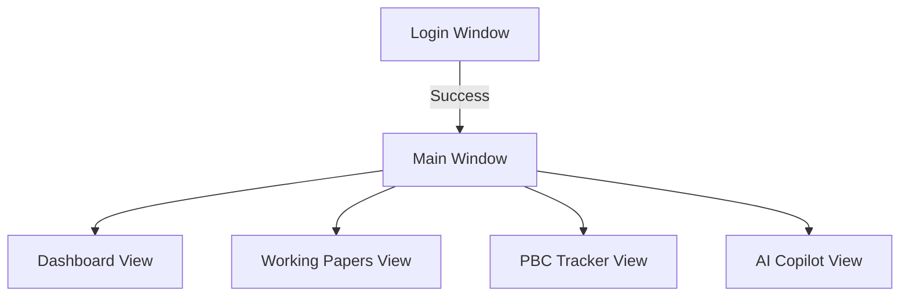

# FinAuditPro — Master Codebase Map

Generated: 2026-08-31

Repository Commit: N/A (Local Checkpoint)

Purpose:
Canonical documentation of the ACTUAL FinAuditPro codebase.

Source of Truth:
The repository source code.

Important:
This document describes the implementation at the time of inspection.
It must be updated after major architectural changes.

---

## 1. PROJECT IDENTITY

| Category | Technology | Where It Is Used | Important Files |
| --- | --- | --- | --- |
| **Primary Language** | Python 3.14 | Entire backend, domain engines, and UI controllers | `pyproject.toml`, `requirements.txt` |
| **UI Framework** | PySide6 (Qt) | Desktop client GUI, custom views, onboarding & logoff dialogs | `src/finauditpro/ui/main_window.py`, `theme.py` |
| **Database** | SQLite | Local embedded storage engine | `finauditpro.db`, `get_default_db_path()` |
| **ORM** | SQLAlchemy 2.0 | Session management and mapping models to SQLite tables | `src/finauditpro/infrastructure/persistence/database.py` |
| **Authentication** | Username/Password + TOTP | Security layer enforcing session-level authentication | `src/finauditpro/application/services/auth_service.py` |
| **RBAC / Authorization** | Role-Based Access Control | Permission checks (Associate, Senior, Manager, Partner, Admin) | `src/finauditpro/application/security/rbac.py` |
| **Encryption** | AES-256-GCM / Scrypt | Wraps/unwraps DEKs using passcode-derived KWKs to encrypt columns | `src/finauditpro/infrastructure/security/encryption.py` |
| **File Storage** | OS Local Directory | Secure folder storing database bak/evidence documents | `first_run.py:bootstrap_app_data_dirs()` |
| **Reporting** | Jinja2 & Matplotlib | Renders HTML & PDF audit matrices, reports, and watermarks | `src/finauditpro/application/services/report_renderer.py` |
| **OCR / PDF Parsing** | PyPDFium2 / PDFMiner | Extract text / metadata from evidence documents | `src/finauditpro/infrastructure/documents/document_extractors.py` |
| **AI / LLM** | FAISS Vector Store + HF | RAG search pipeline, Copilot dialog, procedure auto-completes | `src/finauditpro/application/services/ai_service.py` |
| **Testing Framework** | pytest | Robust unit & E2E integration test suite | `tests/` directory (70 test files) |

---

## 2. COMPLETE PROJECT TREE

```text
src/finauditpro/
├── __init__.py           # Package public entry-point definitions
├── __main__.py           # Application bootstrapper initializing DB, security & launching UI
├── version.py            # Holds current static release version info
├── domain/               # Domain engines implementing ICAI/SA audit calculations (Pure Python)
├── application/          # Service orchestration, security RBAC checks, and DTO definitions
├── infrastructure/       # Persistence (SQLAlchemy/SQLite), document parsing, AI vector stores, encryption KDFs
└── ui/                   # PySide6 desktop views, custom dashboard widgets, and dialog frames
```

* **domain/**: Responsible for pure domain models and calculations (no DB/UI dependencies).
* **application/**: Orchestrates database calls, enforces permissions, and maps data to DTOs.
* **infrastructure/**: Implements storage, encryption, local vector indexing, and document parsing adapters.
* **ui/**: Handles the Qt main thread loop, stylesheets, views, and dialog layouts.

---

## 3. FILE-BY-FILE CODEBASE INVENTORY

## `src/finauditpro/__main__.py`

### Purpose
CLI entry point for FinAuditPro application.

### Architectural Layer
Other

### Classes
None

### Functions
- **`main`**: Initialize persistence and launch desktop GUI application.
  - *Inputs*: 
  - *Outputs*: Annotated return type

### Imports / Dependencies
`PySide6.QtCore`, `PySide6.QtWidgets`, `argparse`, `finauditpro.infrastructure.ai.lmstudio_supervisor`, `finauditpro.infrastructure.first_run`, `finauditpro.infrastructure.persistence.database`, `finauditpro.ui.main_window`, `finauditpro.ui.resources`, `finauditpro.ui.styles`, `pathlib`, `sys`

### Used By


### Database Interaction
Reads/Writes database tables

### File Interaction
Reads/Writes local files

### Security Sensitivity
`LOW`

### Audit/Financial Sensitivity
`LOW`

### Tests
None

### Current Problems
None

### Notes
None

---

## `src/finauditpro/ui/main_window.py`

### Purpose
Main Application Shell Window for FinAuditPro Enterprise Audit Operating System.

### Architectural Layer
Presentation

### Classes
- **`MainWindow`**: Main Application Shell Window for FinAuditPro Enterprise Audit Operating System.
  - *Methods*: `__init__(self, firm_service, client_service, engagement_service, document_service, financial_data_service, audit_matrix_service, working_paper_service, report_service, ai_service, archival_repo, roll_forward_repo, db_manager)`, `active_engagement_id(self)`, `_show_login_flow(self)`, `_apply_user_session(self)`, `_init_ui(self)`, `_register_shortcuts(self)`, `_handle_close_shortcut(self)`, `_handle_refresh_shortcut(self)`, `_handle_empty_engagement_click(self)`, `_init_views(self)`, `_toggle_ai_drawer(self)`, `_toggle_sidebar(self)`, `_show_profile_menu(self)`, `_open_edit_profile_dialog(self)`, `_auto_select_initial_engagement(self)`, `_on_firms_changed(self)`, `_on_clients_changed(self)`, `_on_nav_clicked(self, idx)`, `_sync_views_engagement(self, eng)`, `set_active_firm(self, firm_id)`, `set_active_client(self, client_id)`, `set_active_engagement(self, engagement_id)`, `_update_header_combo(self)`, `_on_header_engagement_changed(self, idx)`, `_on_new_engagement(self)`, `_open_command_palette(self)`, `_setup_inactivity_timer(self)`, `_lock_workstation(self)`
- **`InteractionFilter`**: No description.
  - *Methods*: `__init__(self, timer)`, `eventFilter(self, obj, event)`

### Functions
- **`_tag`**: No description.
  - *Inputs*: w, name
  - *Outputs*: Annotated return type

### Imports / Dependencies
`PySide6.QtCore`, `PySide6.QtGui`, `PySide6.QtWidgets`, `finauditpro.application.security.rbac`, `finauditpro.application.services.ai_service`, `finauditpro.application.services.audit_matrix_service`, `finauditpro.application.services.audit_query_service`, `finauditpro.application.services.auth_service`, `finauditpro.application.services.client_service`, `finauditpro.application.services.document_request_service`, `finauditpro.application.services.document_service`, `finauditpro.application.services.engagement_service`, `finauditpro.application.services.financial_data_service`, `finauditpro.application.services.firm_service`, `finauditpro.application.services.report_service`, `finauditpro.application.services.working_paper_service`, `finauditpro.domain.entities`, `finauditpro.ui.dialogs.command_palette_dialog`, `finauditpro.ui.dialogs.engagement_dialog`, `finauditpro.ui.dialogs.login_dialog`, `finauditpro.ui.dialogs.onboarding_dialog`, `finauditpro.ui.styles`, `finauditpro.ui.theme`, `finauditpro.ui.views.ai_assistant_view`, `finauditpro.ui.views.ai_copilot_drawer`, `finauditpro.ui.views.archival_view`, `finauditpro.ui.views.audit_matrix_view`, `finauditpro.ui.views.audit_query_view`, `finauditpro.ui.views.client_view`, `finauditpro.ui.views.compliance_view`, `finauditpro.ui.views.dashboard_view`, `finauditpro.ui.views.document_view`, `finauditpro.ui.views.engagement_view`, `finauditpro.ui.views.financial_data_view`, `finauditpro.ui.views.firm_view`, `finauditpro.ui.views.gst_verification_view`, `finauditpro.ui.views.inspection_view`, `finauditpro.ui.views.pbc_tracker_view`, `finauditpro.ui.views.report_view`, `finauditpro.ui.views.roll_forward_view`, `finauditpro.ui.views.settings_view`, `finauditpro.ui.views.working_paper_view`, `finauditpro.ui.widgets.custom_combo`, `finauditpro.ui.widgets.lock_screen`, `os`, `sys`, `typing`

### Used By
`src/finauditpro/__main__.py`

### Database Interaction
Reads/Writes database tables

### File Interaction
None

### Security Sensitivity
`HIGH`

### Audit/Financial Sensitivity
`HIGH`

### Tests
None

### Current Problems
None

### Notes
None

---

## `src/finauditpro/application/security/rbac.py`

### Purpose
Fail-closed Role-Based Access Control (RBAC) security manager.

### Architectural Layer
Security

### Classes
- **`UserSession`**: No description.
- **`RBACManager`**: Fail-closed access control manager. Denies all actions when no user session is active or session is locked.
  - *Methods*: `__init__(self, session)`, `lock_session(self)`, `unlock_session(self, passcode)`, `check_permission(self, permission)`, `require_permission(self, permission)`

### Functions
None

### Imports / Dependencies
`dataclasses`, `finauditpro.domain.entities`, `finauditpro.domain.exceptions`, `finauditpro.infrastructure.security.encryption`

### Used By
`src/finauditpro/application/services/auth_service.py`, `src/finauditpro/application/services/report_service.py`, `src/finauditpro/ui/dialogs/change_password_dialog.py`, `src/finauditpro/ui/dialogs/login_dialog.py`, `src/finauditpro/ui/dialogs/onboarding_dialog.py`, `src/finauditpro/ui/dialogs/signoff_dialog.py`, `src/finauditpro/ui/dialogs/totp_dialog.py`, `src/finauditpro/ui/main_window.py`, `src/finauditpro/ui/views/settings_view.py`, `src/finauditpro/ui/views/working_paper_view.py`, `src/finauditpro/ui/widgets/lock_screen.py`

### Database Interaction
None

### File Interaction
None

### Security Sensitivity
`CRITICAL`

### Audit/Financial Sensitivity
`HIGH`

### Tests
`test_rbac.py`

### Current Problems
None

### Notes
None

---

## `src/finauditpro/infrastructure/security/encryption.py`

### Purpose
Application-level column encryption using cryptography Fernet for sensitive data at rest.

### Architectural Layer
Security

### Classes
None

### Functions
- **`_get_app_data_dir`**: Return platform-aware application data directory.
  - *Inputs*: 
  - *Outputs*: Annotated return type
- **`_get_key_file_path`**: No description.
  - *Inputs*: 
  - *Outputs*: Annotated return type
- **`_get_salt_file_path`**: No description.
  - *Inputs*: 
  - *Outputs*: Annotated return type
- **`_derive_kwk`**: Derive Key Wrapping Key (KWK) using memory-hard Scrypt.
  - *Inputs*: passcode, salt
  - *Outputs*: Annotated return type
- **`_secure_write`**: Write bytes to path under strict owner-only (0600) permissions.
  - *Inputs*: path, data
  - *Outputs*: Annotated return type
- **`initialize_wrapped_dek`**: Generate a random Data Encryption Key (DEK), wrap it with the passcode-derived KWK, and write to disk.
  - *Inputs*: passcode
  - *Outputs*: Annotated return type
- **`rotate_passcode`**: Unwrap the active DEK using the old passcode and re-wrap it with a new passcode, rotating the salt.
  - *Inputs*: old_passcode, new_passcode
  - *Outputs*: Annotated return type
- **`initialize_session_cipher`**: Derive KWK from the passcode, decrypt the wrapped DEK, and load it into active memory.
If a legacy 44-byte key is detected, it is securely wrapped and migrated under the new passcode.
  - *Inputs*: passcode
  - *Outputs*: Annotated return type
- **`get_fernet_cipher`**: Return active session cipher, falling back to legacy fallback auto-initialization for unit tests.
  - *Inputs*: 
  - *Outputs*: Annotated return type
- **`encrypt_sensitive_string`**: Encrypt sensitive text column using active session cipher.
  - *Inputs*: text
  - *Outputs*: Annotated return type
- **`decrypt_sensitive_string`**: Decrypt sensitive text column using active session cipher. Fallback to raw string if unencrypted.
  - *Inputs*: cipher_text
  - *Outputs*: Annotated return type

### Imports / Dependencies
`base64`, `cryptography.fernet`, `cryptography.hazmat.primitives.kdf.scrypt`, `finauditpro.infrastructure.first_run`, `os`, `pathlib`

### Used By
`src/finauditpro/application/security/rbac.py`, `src/finauditpro/domain/entities.py`, `src/finauditpro/domain/prompt_engine.py`, `src/finauditpro/domain/value_objects.py`, `src/finauditpro/infrastructure/ai/lmstudio_provider.py`, `src/finauditpro/infrastructure/analytics/analytics_engine.py`, `src/finauditpro/infrastructure/analytics/column_detector.py`, `src/finauditpro/infrastructure/documents/document_classifier.py`, `src/finauditpro/infrastructure/financial/financial_importer.py`, `src/finauditpro/infrastructure/persistence/repositories/document_repository.py`

### Database Interaction
None

### File Interaction
Reads/Writes local files

### Security Sensitivity
`CRITICAL`

### Audit/Financial Sensitivity
`HIGH`

### Tests
None

### Current Problems
None

### Notes
None

---

## `src/finauditpro/infrastructure/persistence/database.py`

### Purpose
Database configuration and session management for SQLite persistence.

### Architectural Layer
Persistence

### Classes
- **`Base`**: Base declarative class for all SQLAlchemy ORM models.
- **`DatabaseManager`**: Manages database connection lifecycle and session creation.
  - *Methods*: `__init__(self, db_path, echo)`, `create_tables(self)`, `_ensure_columns(self)`, `_create_fts_tables(self)`, `_create_audit_triggers(self)`, `drop_tables(self)`, `get_session(self)`, `session_scope(self)`, `shutdown(self)`

### Functions
- **`get_default_db_path`**: Return default database file path in native platform data directory.
  - *Inputs*: 
  - *Outputs*: Annotated return type
- **`create_sqlite_engine`**: Create a configured SQLite engine with WAL mode and foreign keys enabled.
  - *Inputs*: db_path, echo
  - *Outputs*: Annotated return type

### Imports / Dependencies
`collections.abc`, `contextlib`, `finauditpro.infrastructure.first_run`, `finauditpro.infrastructure.persistence.archival_models`, `finauditpro.infrastructure.persistence.models`, `finauditpro.infrastructure.persistence.pbc_and_query_models`, `finauditpro.infrastructure.persistence.report_models`, `finauditpro.infrastructure.persistence.working_paper_models`, `logging`, `pathlib`, `sqlalchemy`, `sqlalchemy.orm`, `typing`

### Used By
`src/finauditpro/__main__.py`, `src/finauditpro/application/services/ai_service.py`, `src/finauditpro/application/services/archival_service.py`, `src/finauditpro/application/services/audit_matrix_service.py`, `src/finauditpro/application/services/audit_planning_service.py`, `src/finauditpro/application/services/audit_query_service.py`, `src/finauditpro/application/services/auth_service.py`, `src/finauditpro/application/services/backup_restore_service.py`, `src/finauditpro/application/services/client_service.py`, `src/finauditpro/application/services/document_request_service.py`, `src/finauditpro/application/services/document_service.py`, `src/finauditpro/application/services/engagement_service.py`, `src/finauditpro/application/services/financial_analytics_service.py`, `src/finauditpro/application/services/financial_data_service.py`, `src/finauditpro/application/services/financial_service.py`, `src/finauditpro/application/services/firm_service.py`, `src/finauditpro/application/services/materiality_service.py`, `src/finauditpro/application/services/report_service.py`, `src/finauditpro/application/services/roll_forward_service.py`, `src/finauditpro/application/services/traceability_service.py`, `src/finauditpro/application/services/working_paper_service.py`, `src/finauditpro/domain/entities.py`, `src/finauditpro/domain/prompt_engine.py`, `src/finauditpro/domain/value_objects.py`, `src/finauditpro/infrastructure/ai/lmstudio_provider.py`, `src/finauditpro/infrastructure/analytics/analytics_engine.py`, `src/finauditpro/infrastructure/analytics/column_detector.py`, `src/finauditpro/infrastructure/documents/document_classifier.py`, `src/finauditpro/infrastructure/financial/financial_importer.py`, `src/finauditpro/infrastructure/first_run.py`, `src/finauditpro/infrastructure/persistence/ai_models.py`, `src/finauditpro/infrastructure/persistence/archival_models.py`, `src/finauditpro/infrastructure/persistence/audit_chain_verifier.py`, `src/finauditpro/infrastructure/persistence/models.py`, `src/finauditpro/infrastructure/persistence/pbc_and_query_models.py`, `src/finauditpro/infrastructure/persistence/report_models.py`, `src/finauditpro/infrastructure/persistence/repositories/document_repository.py`, `src/finauditpro/infrastructure/persistence/roll_forward_models.py`, `src/finauditpro/infrastructure/persistence/working_paper_models.py`

### Database Interaction
Reads/Writes database tables

### File Interaction
Reads/Writes local files

### Security Sensitivity
`LOW`

### Audit/Financial Sensitivity
`LOW`

### Tests
None

### Current Problems
None

### Notes
None

---

## `src/finauditpro/infrastructure/persistence/models.py`

### Purpose
SQLAlchemy 2.0 ORM database models.

### Architectural Layer
Persistence

### Classes
- **`FirmModel`**: No description.
- **`ClientModel`**: No description.
- **`EngagementModel`**: No description.
  - *Methods*: `__init__(self)`, `assigned_team(self)`, `assigned_team(self, value)`
- **`DocumentModel`**: No description.
- **`DocumentPageModel`**: No description.
- **`ExtractedTableModel`**: No description.
- **`EvidenceLinkModel`**: No description.
- **`DocumentClassificationRuleModel`**: No description.
- **`FinancialDatasetModel`**: No description.
  - *Methods*: `column_mappings(self)`
- **`MaterialityAssessmentModel`**: No description.
- **`AuditRiskModel`**: No description.
- **`AuditProcedureModel`**: No description.
- **`ProcedureRiskLinkModel`**: No description.
- **`AuditFindingModel`**: No description.
- **`AuditEvidenceModel`**: No description.
- **`LedgerEntryModel`**: No description.
- **`TrialBalanceLineModel`**: No description.
- **`BankTransactionModel`**: No description.
- **`ExceptionItemModel`**: No description.
- **`AuditEventModel`**: No description.
- **`UserModel`**: No description.
- **`EngagementMemberModel`**: No description.

### Functions
None

### Imports / Dependencies
`datetime`, `finauditpro.domain.clock`, `finauditpro.infrastructure.persistence.database`, `json`, `sqlalchemy`, `sqlalchemy.orm`, `typing`

### Used By
`src/finauditpro/application/services/auth_service.py`, `src/finauditpro/application/services/document_service.py`, `src/finauditpro/application/services/engagement_service.py`, `src/finauditpro/application/services/financial_service.py`, `src/finauditpro/application/services/working_paper_service.py`, `src/finauditpro/domain/entities.py`, `src/finauditpro/domain/prompt_engine.py`, `src/finauditpro/domain/value_objects.py`, `src/finauditpro/infrastructure/ai/lmstudio_provider.py`, `src/finauditpro/infrastructure/analytics/analytics_engine.py`, `src/finauditpro/infrastructure/analytics/column_detector.py`, `src/finauditpro/infrastructure/documents/document_classifier.py`, `src/finauditpro/infrastructure/financial/financial_importer.py`, `src/finauditpro/infrastructure/first_run.py`, `src/finauditpro/infrastructure/persistence/database.py`, `src/finauditpro/infrastructure/persistence/repositories/audit_event_repository.py`, `src/finauditpro/infrastructure/persistence/repositories/audit_matrix_repository.py`, `src/finauditpro/infrastructure/persistence/repositories/client_repository.py`, `src/finauditpro/infrastructure/persistence/repositories/document_repository.py`, `src/finauditpro/infrastructure/persistence/repositories/engagement_repository.py`, `src/finauditpro/infrastructure/persistence/repositories/evidence_repository.py`, `src/finauditpro/infrastructure/persistence/repositories/financial_data_repository.py`, `src/finauditpro/infrastructure/persistence/repositories/firm_repository.py`, `src/finauditpro/infrastructure/persistence/repositories/user_repository.py`

### Database Interaction
Reads/Writes database tables

### File Interaction
None

### Security Sensitivity
`HIGH`

### Audit/Financial Sensitivity
`HIGH`

### Tests
None

### Current Problems
None

### Notes
None

---

## `src/finauditpro/infrastructure/persistence/working_paper_models.py`

### Purpose
SQLAlchemy ORM models for Working Papers, Review Notes, and Sign-offs.

### Architectural Layer
Persistence

### Classes
- **`WorkingPaperModel`**: No description.
- **`WorkingPaperSectionModel`**: No description.
- **`WorkingPaperLinkModel`**: No description.
- **`ReviewNoteModel`**: No description.
- **`SignOffRecordModel`**: No description.
- **`WorkingPaperVersionModel`**: No description.

### Functions
None

### Imports / Dependencies
`datetime`, `finauditpro.domain.clock`, `finauditpro.infrastructure.persistence.database`, `sqlalchemy`, `sqlalchemy.orm`

### Used By
`src/finauditpro/application/services/working_paper_service.py`, `src/finauditpro/domain/entities.py`, `src/finauditpro/domain/prompt_engine.py`, `src/finauditpro/domain/value_objects.py`, `src/finauditpro/infrastructure/ai/lmstudio_provider.py`, `src/finauditpro/infrastructure/analytics/analytics_engine.py`, `src/finauditpro/infrastructure/analytics/column_detector.py`, `src/finauditpro/infrastructure/documents/document_classifier.py`, `src/finauditpro/infrastructure/financial/financial_importer.py`, `src/finauditpro/infrastructure/first_run.py`, `src/finauditpro/infrastructure/persistence/database.py`, `src/finauditpro/infrastructure/persistence/repositories/document_repository.py`, `src/finauditpro/infrastructure/persistence/repositories/working_paper_repository.py`

### Database Interaction
None

### File Interaction
None

### Security Sensitivity
`LOW`

### Audit/Financial Sensitivity
`CRITICAL`

### Tests
None

### Current Problems
None

### Notes
None

---

## `src/finauditpro/application/services/working_paper_service.py`

### Purpose
Application service managing Working Paper lifecycles, review notes, sign-offs, and integrity.

### Architectural Layer
Application

### Classes
- **`WorkingPaperService`**: Service orchestrating Working Paper lifecycle, review points, sign-offs, and SHA-256 hash integrity.
  - *Methods*: `__init__(self, db_manager)`, `compute_content_hash(self, wp, sections, links)`, `create_working_paper(self, dto)`, `scaffold_permanent_audit_file(self, engagement_id, preparer_id)`, `scaffold_schedule_iii_working_papers(self, engagement_id, preparer_id)`, `get_working_paper(self, wp_id)`, `list_working_papers(self, engagement_id)`, `get_sections(self, wp_id)`, `list_links(self, wp_id)`, `count_open_review_notes(self, wp_id)`, `list_review_notes(self, wp_id)`, `_resolve_user_role(self, session, engagement_id, username)`, `_archive_working_paper_version(self, session, wp)`, `assign_user_to_engagement(self, engagement_id, username, role)`, `prepare_working_paper(self, wp_id, preparer_id)`, `submit_for_review(self, wp_id, submitter_id)`, `start_review(self, wp_id, reviewer_id)`, `return_working_paper(self, wp_id, reviewer_id)`, `update_working_paper_content(self, wp_id, title, area, conclusion, sections_list, editor_id)`, `raise_review_note(self, dto)`, `respond_review_note(self, dto)`, `clear_review_note(self, dto)`, `sign_off_working_paper(self, dto)`, `verify_integrity(self, wp_id)`, `reopen_working_paper(self, dto)`

### Functions
None

### Imports / Dependencies
`finauditpro.application.services.working_paper_scaffolder`, `finauditpro.application.working_paper_dtos`, `finauditpro.domain.clock`, `finauditpro.domain.entities`, `finauditpro.domain.exceptions`, `finauditpro.domain.working_paper_entities`, `finauditpro.infrastructure.persistence.database`, `finauditpro.infrastructure.persistence.models`, `finauditpro.infrastructure.persistence.repositories`, `finauditpro.infrastructure.persistence.repositories.working_paper_repository`, `finauditpro.infrastructure.persistence.working_paper_models`, `hashlib`, `json`, `uuid`

### Used By
`src/finauditpro/ui/dialogs/review_notes_dialog.py`, `src/finauditpro/ui/dialogs/signoff_dialog.py`, `src/finauditpro/ui/main_window.py`, `src/finauditpro/ui/views/working_paper_view.py`

### Database Interaction
Reads/Writes database tables

### File Interaction
None

### Security Sensitivity
`LOW`

### Audit/Financial Sensitivity
`CRITICAL`

### Tests
None

### Current Problems
None

### Notes
None

---

## `src/finauditpro/application/services/auth_service.py`

### Purpose
Authentication and user session management service.

### Architectural Layer
Application

### Classes
- **`AuthService`**: Service handling credential verification and authenticated user session creation.
  - *Methods*: `__init__(self, db_manager)`, `is_first_run(self)`, `setup_initial_admin(self, email, password)`, `reset_to_default_admin(self)`, `validate_password_complexity(password)`, `authenticate(self, username, password, totp_token)`, `force_setup_credentials(self, user_id, new_email, new_password)`, `update_user_password(self, user_id, old_password, new_password)`, `change_password(self, user_id, old_password, new_password)`, `force_change_password(self, user_id, new_password)`, `create_user(self, username, password, role, must_change_password)`, `list_users(self)`, `generate_totp_secret(self)`, `get_totp_uri(self, secret, username)`, `verify_totp_token(self, secret, token)`, `enable_totp(self, user_id, secret, token)`, `disable_totp(self, user_id)`, `is_totp_enabled_for_user(self, user_id)`

### Functions
None

### Imports / Dependencies
`finauditpro.application.security.rbac`, `finauditpro.domain.entities`, `finauditpro.domain.exceptions`, `finauditpro.infrastructure.persistence.database`, `finauditpro.infrastructure.persistence.models`, `finauditpro.infrastructure.persistence.repositories.user_repository`, `finauditpro.infrastructure.security.lockout`, `pyotp`

### Used By
`src/finauditpro/ui/dialogs/change_password_dialog.py`, `src/finauditpro/ui/dialogs/login_dialog.py`, `src/finauditpro/ui/dialogs/onboarding_dialog.py`, `src/finauditpro/ui/dialogs/totp_dialog.py`, `src/finauditpro/ui/main_window.py`, `src/finauditpro/ui/views/settings_view.py`

### Database Interaction
Reads/Writes database tables

### File Interaction
None

### Security Sensitivity
`HIGH`

### Audit/Financial Sensitivity
`HIGH`

### Tests
None

### Current Problems
None

### Notes
None

---

## `src/finauditpro/application/services/engagement_service.py`

### Purpose
Engagement application service.

### Architectural Layer
Application

### Classes
- **`EngagementService`**: Service handling audit engagement operations.
  - *Methods*: `__init__(self, db_manager)`, `create_engagement(self, dto)`, `get_engagement(self, engagement_id)`, `list_engagements_for_client(self, client_id)`, `list_engagements_for_firm(self, firm_id)`, `list_all_engagements(self)`, `update_engagement(self, engagement_id, dto)`, `get_dashboard_summary(self, firm_id)`

### Functions
None

### Imports / Dependencies
`finauditpro.application.dtos`, `finauditpro.domain.clock`, `finauditpro.domain.entities`, `finauditpro.domain.exceptions`, `finauditpro.infrastructure.persistence.database`, `finauditpro.infrastructure.persistence.models`, `finauditpro.infrastructure.persistence.repositories`, `sqlalchemy`

### Used By
`src/finauditpro/application/services/roll_forward_service.py`, `src/finauditpro/ui/dialogs/engagement_dialog.py`, `src/finauditpro/ui/main_window.py`, `src/finauditpro/ui/views/dashboard_view.py`, `src/finauditpro/ui/views/engagement_view.py`, `src/finauditpro/ui/views/report_view.py`, `src/finauditpro/ui/views/working_paper_view.py`

### Database Interaction
Reads/Writes database tables

### File Interaction
None

### Security Sensitivity
`LOW`

### Audit/Financial Sensitivity
`HIGH`

### Tests
None

### Current Problems
None

### Notes
None

---

## `src/finauditpro/application/services/client_service.py`

### Purpose
Client application service.

### Architectural Layer
Application

### Classes
- **`ClientService`**: Service handling client operations.
  - *Methods*: `__init__(self, db_manager)`, `create_client(self, dto)`, `get_client(self, client_id)`, `list_clients_for_firm(self, firm_id)`, `list_all_clients(self)`, `update_client(self, client_id, dto)`

### Functions
None

### Imports / Dependencies
`finauditpro.application.dtos`, `finauditpro.domain.clock`, `finauditpro.domain.entities`, `finauditpro.domain.exceptions`, `finauditpro.infrastructure.persistence.database`, `finauditpro.infrastructure.persistence.repositories`

### Used By
`src/finauditpro/ui/dialogs/client_dialog.py`, `src/finauditpro/ui/main_window.py`, `src/finauditpro/ui/views/client_view.py`, `src/finauditpro/ui/views/dashboard_view.py`, `src/finauditpro/ui/views/engagement_view.py`

### Database Interaction
Reads/Writes database tables

### File Interaction
None

### Security Sensitivity
`LOW`

### Audit/Financial Sensitivity
`HIGH`

### Tests
None

### Current Problems
None

### Notes
None

---

## `src/finauditpro/application/services/firm_service.py`

### Purpose
Firm application service.

### Architectural Layer
Application

### Classes
- **`FirmService`**: Service handling audit firm operations.
  - *Methods*: `__init__(self, db_manager)`, `create_firm(self, dto)`, `get_firm(self, firm_id)`, `list_firms(self)`, `update_firm(self, firm_id, dto)`

### Functions
None

### Imports / Dependencies
`finauditpro.application.dtos`, `finauditpro.domain.clock`, `finauditpro.domain.entities`, `finauditpro.domain.exceptions`, `finauditpro.infrastructure.persistence.database`, `finauditpro.infrastructure.persistence.repositories`

### Used By
`src/finauditpro/ui/dialogs/firm_dialog.py`, `src/finauditpro/ui/main_window.py`, `src/finauditpro/ui/views/client_view.py`, `src/finauditpro/ui/views/dashboard_view.py`, `src/finauditpro/ui/views/engagement_view.py`, `src/finauditpro/ui/views/firm_view.py`

### Database Interaction
Reads/Writes database tables

### File Interaction
None

### Security Sensitivity
`LOW`

### Audit/Financial Sensitivity
`HIGH`

### Tests
None

### Current Problems
None

### Notes
None

---

## `src/finauditpro/application/services/materiality_service.py`

### Purpose
No description available.

### Architectural Layer
Application

### Classes
- **`MaterialityService`**: Service executing deterministic SA 320 materiality calculations with version tracking.
  - *Methods*: `__init__(self, db_manager)`, `calculate_and_save_materiality(self, dto)`, `get_latest_materiality(self, engagement_id)`, `list_materiality_history(self, engagement_id)`

### Functions
None

### Imports / Dependencies
`finauditpro.application.audit_matrix_dtos`, `finauditpro.domain.audit_matrix_entities`, `finauditpro.domain.entities`, `finauditpro.domain.exceptions`, `finauditpro.domain.materiality_engine`, `finauditpro.infrastructure.persistence.database`, `finauditpro.infrastructure.persistence.repositories`

### Used By


### Database Interaction
Reads/Writes database tables

### File Interaction
None

### Security Sensitivity
`LOW`

### Audit/Financial Sensitivity
`CRITICAL`

### Tests
None

### Current Problems
None

### Notes
None

---

## `src/finauditpro/application/services/report_service.py`

### Purpose
Service assembling real-query data, generating PDF/XLSX/CSV reports, and managing approval workflows.

### Architectural Layer
Application

### Classes
- **`ReportService`**: Service handling report assembly, charts, PDF generation, formula-injection safe export, and approval.
  - *Methods*: `__init__(self, db_manager)`, `_artifact_directory(self, engagement_id, output_dir)`, `list_reports(self, engagement_id)`, `list_templates(self)`, `assemble_report_data(self, engagement_id)`, `generate_report(self, dto)`, `export_to_xlsx(self, dto)`, `export_to_csv(self, dto)`, `approve_report(self, dto)`

### Functions
None

### Imports / Dependencies
`csv`, `finauditpro.application.report_dtos`, `finauditpro.application.security.rbac`, `finauditpro.application.services.report_renderer`, `finauditpro.domain.clock`, `finauditpro.domain.entities`, `finauditpro.domain.exceptions`, `finauditpro.domain.export_sanitizer`, `finauditpro.domain.report_entities`, `finauditpro.infrastructure.persistence.database`, `finauditpro.infrastructure.persistence.repositories`, `finauditpro.infrastructure.persistence.repositories.audit_matrix_repository`, `finauditpro.infrastructure.persistence.repositories.report_repository`, `finauditpro.infrastructure.persistence.repositories.working_paper_repository`, `hashlib`, `json`, `openpyxl`, `pathlib`, `typing`

### Used By
`src/finauditpro/domain/entities.py`, `src/finauditpro/domain/prompt_engine.py`, `src/finauditpro/domain/value_objects.py`, `src/finauditpro/infrastructure/ai/lmstudio_provider.py`, `src/finauditpro/infrastructure/analytics/analytics_engine.py`, `src/finauditpro/infrastructure/analytics/column_detector.py`, `src/finauditpro/infrastructure/documents/document_classifier.py`, `src/finauditpro/infrastructure/financial/financial_importer.py`, `src/finauditpro/infrastructure/persistence/repositories/document_repository.py`, `src/finauditpro/ui/dialogs/report_wizard_dialog.py`, `src/finauditpro/ui/main_window.py`, `src/finauditpro/ui/views/report_view.py`

### Database Interaction
Reads/Writes database tables

### File Interaction
Reads/Writes local files

### Security Sensitivity
`HIGH`

### Audit/Financial Sensitivity
`HIGH`

### Tests
None

### Current Problems
None

### Notes
None

---

## `src/finauditpro/application/services/roll_forward_service.py`

### Purpose
Application service managing multi-year audit roll-forward, SA 510 opening balance tie-out, and carried findings provenance.

### Architectural Layer
Application

### Classes
- **`RollForwardService`**: Service orchestrating multi-year engagement roll-forwards, SA 510 balance tie-outs, and carried finding provenance.
  - *Methods*: `__init__(self, db_manager)`, `roll_forward_engagement(self, dto)`, `get_opening_balance_tie_out(self, engagement_id)`, `confirm_opening_balance_tie_out(self, dto)`

### Functions
None

### Imports / Dependencies
`finauditpro.application.dtos`, `finauditpro.application.roll_forward_dtos`, `finauditpro.application.services.engagement_service`, `finauditpro.domain.audit_matrix_entities`, `finauditpro.domain.clock`, `finauditpro.domain.entities`, `finauditpro.domain.exceptions`, `finauditpro.domain.roll_forward_entities`, `finauditpro.infrastructure.persistence.database`, `finauditpro.infrastructure.persistence.repositories`

### Used By
`src/finauditpro/ui/dialogs/roll_forward_wizard_dialog.py`, `src/finauditpro/ui/views/roll_forward_view.py`

### Database Interaction
Reads/Writes database tables

### File Interaction
None

### Security Sensitivity
`LOW`

### Audit/Financial Sensitivity
`HIGH`

### Tests
None

### Current Problems
None

### Notes
None

---

## `src/finauditpro/application/services/archival_service.py`

### Purpose
Application service orchestrating readiness checks, engagement freeze, archive sealing, retention timelines, and audited partner reopens.

### Architectural Layer
Application

### Classes
- **`ArchivalService`**: Service handling pre-archive readiness checks, sealed archives, read-only freeze, and audited reopens.
  - *Methods*: `__init__(self, db_manager, storage_dir)`, `get_or_create_retention_config(self)`, `run_readiness_check(self, engagement_id)`, `freeze_and_seal_engagement(self, dto)`, `list_archives_for_engagement(self, engagement_id)`, `get_engagement_status(self, engagement_id)`, `reopen_engagement(self, dto)`

### Functions
None

### Imports / Dependencies
`datetime`, `finauditpro.application.archival_dtos`, `finauditpro.application.services.backup_restore_service`, `finauditpro.domain.archival_entities`, `finauditpro.domain.entities`, `finauditpro.domain.exceptions`, `finauditpro.infrastructure.documents.document_security`, `finauditpro.infrastructure.persistence.database`, `finauditpro.infrastructure.persistence.repositories`, `finauditpro.infrastructure.persistence.repositories.archival_repository`, `finauditpro.infrastructure.persistence.repositories.audit_matrix_repository`, `pathlib`

### Used By
`src/finauditpro/ui/dialogs/close_wizard_dialog.py`, `src/finauditpro/ui/views/archival_view.py`

### Database Interaction
Reads/Writes database tables

### File Interaction
Reads/Writes local files

### Security Sensitivity
`HIGH`

### Audit/Financial Sensitivity
`HIGH`

### Tests
None

### Current Problems
None

### Notes
None

---

## `src/finauditpro/application/services/ai_service.py`

### Purpose
Application Service for Local AI Subsystem (RAG, Streaming QA, AI Finding Proposals).

### Architectural Layer
Application

### Classes
- **`AIService`**: Service orchestrating document chunking, FAISS RAG, LM Studio interaction, and AI Findings.
  - *Methods*: `__init__(self, db_manager, provider, vector_store)`, `get_status(self)`, `index_engagement_documents(self, engagement_id, chunk_size, chunk_overlap, progress_callback)`, `_retrieve_chunks(self, engagement_id, query, top_k)`, `query_rag(self, engagement_id, question, on_token)`, `propose_finding(self, engagement_id, target_context, on_token)`

### Functions
None

### Imports / Dependencies
`collections.abc`, `contextlib`, `finauditpro.application.ai.llm_provider`, `finauditpro.application.ai_dtos`, `finauditpro.domain.audit_matrix_entities`, `finauditpro.domain.entities`, `finauditpro.domain.exceptions`, `finauditpro.domain.prompt_engine`, `finauditpro.infrastructure.ai.faiss_vector_store`, `finauditpro.infrastructure.ai.lmstudio_provider`, `finauditpro.infrastructure.first_run`, `finauditpro.infrastructure.persistence.ai_models`, `finauditpro.infrastructure.persistence.database`, `finauditpro.infrastructure.persistence.repositories`, `json`, `typing`, `uuid`

### Used By
`src/finauditpro/application/services/ai_service_factory.py`, `src/finauditpro/ui/main_window.py`

### Database Interaction
Reads/Writes database tables

### File Interaction
None

### Security Sensitivity
`LOW`

### Audit/Financial Sensitivity
`HIGH`

### Tests
`test_ai_service.py`

### Current Problems
None

### Notes
None

---

## `src/finauditpro/domain/working_paper_entities.py`

### Purpose
Domain entities and state machine for Working Papers, Review Notes, and Sign-offs.

### Architectural Layer
Domain

### Classes
- **`FileCategoryEnum`**: No description.
- **`WorkingPaperStatusEnum`**: No description.
- **`ReviewNoteStatusEnum`**: No description.
- **`SignOffLevelEnum`**: No description.
- **`WorkingPaperSection`**: No description.
- **`ReviewNote`**: No description.
  - *Methods*: `respond(self, response_text, responder)`, `clear(self, reviewer)`
- **`SignOffRecord`**: No description.
- **`WorkingPaper`**: No description.
  - *Methods*: `transition_to(self, new_status)`

### Functions
None

### Imports / Dependencies
`datetime`, `enum`, `finauditpro.domain.clock`, `finauditpro.domain.entities`, `finauditpro.domain.exceptions`, `pydantic`, `uuid`

### Used By
`src/finauditpro/application/services/working_paper_scaffolder.py`, `src/finauditpro/application/services/working_paper_service.py`, `src/finauditpro/application/working_paper_dtos.py`, `src/finauditpro/infrastructure/persistence/repositories/working_paper_repository.py`, `src/finauditpro/ui/dialogs/signoff_dialog.py`, `src/finauditpro/ui/views/working_paper_view.py`

### Database Interaction
None

### File Interaction
None

### Security Sensitivity
`LOW`

### Audit/Financial Sensitivity
`CRITICAL`

### Tests
None

### Current Problems
None

### Notes
None

---

## `src/finauditpro/domain/entities.py`

### Purpose
Pure domain entities for FinAuditPro.

### Architectural Layer
Domain

### Classes
- **`RoleEnum`**: No description.
- **`AuditTypeEnum`**: No description.
- **`EngagementStatusEnum`**: No description.
- **`EntityTypeEnum`**: No description.
- **`DomainBaseModel`**: No description.
- **`Firm`**: No description.
  - *Methods*: `check_name_not_empty(cls, v)`, `check_pan(cls, v)`, `check_gstin(cls, v)`
- **`Client`**: No description.
  - *Methods*: `check_name_not_empty(cls, v)`, `check_pan(cls, v)`, `check_gstin(cls, v)`
- **`Engagement`**: No description.
  - *Methods*: `check_fy(cls, v)`
- **`AuditEvent`**: No description.
- **`User`**: No description.
  - *Methods*: `check_username(cls, v)`

### Functions
- **`validate_pan`**: No description.
  - *Inputs*: pan
  - *Outputs*: Annotated return type
- **`validate_gstin`**: No description.
  - *Inputs*: gstin
  - *Outputs*: Annotated return type

### Imports / Dependencies
`datetime`, `enum`, `finauditpro.domain.clock`, `finauditpro.domain.exceptions`, `pydantic`, `re`, `uuid`

### Used By
`src/finauditpro/application/dtos.py`, `src/finauditpro/application/security/rbac.py`, `src/finauditpro/application/services/ai_service.py`, `src/finauditpro/application/services/archival_service.py`, `src/finauditpro/application/services/audit_matrix_service.py`, `src/finauditpro/application/services/audit_planning_service.py`, `src/finauditpro/application/services/audit_query_service.py`, `src/finauditpro/application/services/auth_service.py`, `src/finauditpro/application/services/backup_restore_service.py`, `src/finauditpro/application/services/client_service.py`, `src/finauditpro/application/services/document_request_service.py`, `src/finauditpro/application/services/document_service.py`, `src/finauditpro/application/services/engagement_service.py`, `src/finauditpro/application/services/financial_analytics_service.py`, `src/finauditpro/application/services/financial_data_service.py`, `src/finauditpro/application/services/financial_service.py`, `src/finauditpro/application/services/firm_service.py`, `src/finauditpro/application/services/materiality_service.py`, `src/finauditpro/application/services/report_service.py`, `src/finauditpro/application/services/roll_forward_service.py`, `src/finauditpro/application/services/working_paper_scaffolder.py`, `src/finauditpro/application/services/working_paper_service.py`, `src/finauditpro/domain/report_entities.py`, `src/finauditpro/domain/working_paper_entities.py`, `src/finauditpro/infrastructure/documents/document_pipeline.py`, `src/finauditpro/infrastructure/persistence/repositories/audit_event_repository.py`, `src/finauditpro/infrastructure/persistence/repositories/client_repository.py`, `src/finauditpro/infrastructure/persistence/repositories/engagement_repository.py`, `src/finauditpro/infrastructure/persistence/repositories/firm_repository.py`, `src/finauditpro/infrastructure/persistence/repositories/user_repository.py`, `src/finauditpro/ui/dialogs/client_dialog.py`, `src/finauditpro/ui/dialogs/engagement_dialog.py`, `src/finauditpro/ui/dialogs/finding_dialog.py`, `src/finauditpro/ui/dialogs/firm_dialog.py`, `src/finauditpro/ui/dialogs/import_dataset_dialog.py`, `src/finauditpro/ui/dialogs/procedure_dialog.py`, `src/finauditpro/ui/dialogs/risk_dialog.py`, `src/finauditpro/ui/main_window.py`, `src/finauditpro/ui/views/ai_assistant_view.py`, `src/finauditpro/ui/views/ai_copilot_drawer.py`, `src/finauditpro/ui/views/audit_matrix_view.py`, `src/finauditpro/ui/views/client_view.py`, `src/finauditpro/ui/views/compliance_view.py`, `src/finauditpro/ui/views/dashboard_view.py`, `src/finauditpro/ui/views/engagement_view.py`, `src/finauditpro/ui/views/financial_data_view.py`, `src/finauditpro/ui/views/firm_view.py`, `src/finauditpro/ui/views/gst_verification_view.py`, `src/finauditpro/ui/views/inspection_view.py`, `src/finauditpro/ui/views/report_view.py`, `src/finauditpro/ui/views/working_paper_view.py`

### Database Interaction
None

### File Interaction
None

### Security Sensitivity
`HIGH`

### Audit/Financial Sensitivity
`HIGH`

### Tests
None

### Current Problems
None

### Notes
None

---

## `src/finauditpro/domain/value_objects.py`

### Purpose
Indian Domain Value Objects enforcing regulatory and financial domain constraints.

### Architectural Layer
Domain

### Classes
- **`Money`**: Money value object storing integer paise (100 paise = ₹1.00). Rejects float construction.
  - *Methods*: `__post_init__(self)`, `from_rupees(cls, amount)`, `rupees(self)`, `format_indian(self)`, `formatted(self)`, `__add__(self, other)`, `__sub__(self, other)`, `__mul__(self, scalar)`, `__eq__(self, other)`, `__lt__(self, other)`, `__le__(self, other)`
- **`FinancialYear`**: Indian Financial Year (1 April -> 31 March, e.g. 2025-26).
  - *Methods*: `__post_init__(self)`, `from_string(cls, fy_str)`, `from_date(cls, dt)`, `label(self)`, `start_date(self)`, `end_date(self)`
- **`PAN`**: Indian Permanent Account Number (PAN) value object.
  - *Methods*: `__post_init__(self)`, `holder_type(self)`
- **`GSTIN`**: Indian Goods & Services Tax Identification Number (GSTIN).
  - *Methods*: `__post_init__(self)`, `compute_checksum(input_14)`, `pan_number(self)`, `state_code(self)`
- **`CIN`**: Indian Corporate Identity Number (CIN).
  - *Methods*: `__post_init__(self)`, `is_listed(self)`
- **`DIN`**: Indian Director Identification Number (DIN).
  - *Methods*: `__post_init__(self)`

### Functions
None

### Imports / Dependencies
`dataclasses`, `datetime`, `decimal`, `re`, `typing`

### Used By
`src/finauditpro/application/services/financial_service.py`, `src/finauditpro/domain/audit_matrix_entities.py`, `src/finauditpro/domain/financial_entities.py`, `src/finauditpro/infrastructure/analytics/analytics_engine.py`, `src/finauditpro/infrastructure/financial/financial_importer.py`

### Database Interaction
None

### File Interaction
None

### Security Sensitivity
`LOW`

### Audit/Financial Sensitivity
`HIGH`

### Tests
`test_value_objects.py`

### Current Problems
None

### Notes
None

---

## `src/finauditpro/domain/exceptions.py`

### Purpose
Domain layer exception hierarchy for FinAuditPro.

### Architectural Layer
Domain

### Classes
- **`DomainError`**: Base exception for all domain logic errors.
  - *Methods*: `__init__(self, message)`
- **`EntityNotFoundError`**: Raised when a requested domain entity is not found.
  - *Methods*: `__init__(self, entity_type, entity_id)`
- **`DuplicateEntityError`**: Raised when attempting to create an entity that already exists.
  - *Methods*: `__init__(self, entity_type, field_name, field_value)`
- **`ValidationError`**: Raised when domain validation rules are violated.
  - *Methods*: `__init__(self, message, details)`
- **`PermissionDeniedError`**: Raised when access control permissions are violated or session is missing.
  - *Methods*: `__init__(self, message)`
- **`InvalidStateTransitionError`**: Raised when an illegal status state transition is attempted.
  - *Methods*: `__init__(self, entity_type, current_state, target_state)`
- **`AuditIntegrityError`**: Raised when audit log hash chain or content hash integrity is violated.
  - *Methods*: `__init__(self, message)`
- **`SecurityError`**: Raised when path traversal, Zip-Slip, or security controls are violated.
  - *Methods*: `__init__(self, message)`

### Functions
None

### Imports / Dependencies


### Used By
`src/finauditpro/application/security/rbac.py`, `src/finauditpro/application/services/ai_service.py`, `src/finauditpro/application/services/archival_service.py`, `src/finauditpro/application/services/audit_matrix_service.py`, `src/finauditpro/application/services/audit_planning_service.py`, `src/finauditpro/application/services/auth_service.py`, `src/finauditpro/application/services/backup_restore_service.py`, `src/finauditpro/application/services/client_service.py`, `src/finauditpro/application/services/document_service.py`, `src/finauditpro/application/services/engagement_service.py`, `src/finauditpro/application/services/financial_analytics_service.py`, `src/finauditpro/application/services/financial_data_service.py`, `src/finauditpro/application/services/financial_service.py`, `src/finauditpro/application/services/firm_service.py`, `src/finauditpro/application/services/materiality_service.py`, `src/finauditpro/application/services/report_service.py`, `src/finauditpro/application/services/roll_forward_service.py`, `src/finauditpro/application/services/working_paper_service.py`, `src/finauditpro/domain/document_entities.py`, `src/finauditpro/domain/entities.py`, `src/finauditpro/domain/report_entities.py`, `src/finauditpro/domain/working_paper_entities.py`, `src/finauditpro/infrastructure/documents/document_security.py`, `src/finauditpro/infrastructure/persistence/audit_chain_verifier.py`, `src/finauditpro/infrastructure/security/lockout.py`, `src/finauditpro/ui/dialogs/change_password_dialog.py`, `src/finauditpro/ui/dialogs/client_dialog.py`, `src/finauditpro/ui/dialogs/engagement_dialog.py`, `src/finauditpro/ui/dialogs/firm_dialog.py`, `src/finauditpro/ui/dialogs/login_dialog.py`, `src/finauditpro/ui/dialogs/onboarding_dialog.py`

### Database Interaction
None

### File Interaction
None

### Security Sensitivity
`HIGH`

### Audit/Financial Sensitivity
`LOW`

### Tests
None

### Current Problems
None

### Notes
None

---

## `src/finauditpro/infrastructure/documents/document_pipeline.py`

### Purpose
Document processing pipeline orchestrator executing stage transitions, security validation, text extraction, OCR, heuristic classification, and FTS5 indexing.

### Architectural Layer
Infrastructure

### Classes
- **`ProcessedDocumentResult`**: No description.
- **`DocumentPipeline`**: Orchestrates document ingestion across explicit, inspectable processing stages.
  - *Methods*: `__init__(self, storage_dir)`, `process_incoming_file(self, engagement_id, source_path, category)`

### Functions
None

### Imports / Dependencies
`dataclasses`, `finauditpro.domain.document_entities`, `finauditpro.domain.entities`, `finauditpro.infrastructure.documents.document_classifier`, `finauditpro.infrastructure.documents.document_extractors`, `finauditpro.infrastructure.documents.document_security`, `json`, `pathlib`, `shutil`

### Used By
`src/finauditpro/application/services/document_service.py`, `src/finauditpro/domain/entities.py`, `src/finauditpro/domain/prompt_engine.py`, `src/finauditpro/domain/value_objects.py`, `src/finauditpro/infrastructure/ai/lmstudio_provider.py`, `src/finauditpro/infrastructure/analytics/analytics_engine.py`, `src/finauditpro/infrastructure/analytics/column_detector.py`, `src/finauditpro/infrastructure/documents/document_classifier.py`, `src/finauditpro/infrastructure/financial/financial_importer.py`, `src/finauditpro/infrastructure/persistence/repositories/document_repository.py`

### Database Interaction
None

### File Interaction
Reads/Writes local files

### Security Sensitivity
`LOW`

### Audit/Financial Sensitivity
`LOW`

### Tests
`test_document_pipeline.py`

### Current Problems
None

### Notes
None

---

## `src/finauditpro/infrastructure/documents/document_extractors.py`

### Purpose
Document text and table extractors for born-digital PDFs (pdfplumber), scanned OCR (pypdfium2 + pytesseract), XLSX, CSV, Text, and Images.

### Architectural Layer
Infrastructure

### Classes
- **`ExtractedTable`**: No description.
- **`ExtractedPage`**: No description.
- **`DocumentExtractorError`**: Raised when text or OCR extraction fails.

### Functions
- **`get_available_tesseract_languages`**: Return list of available Tesseract OCR language packs installed on the system.
  - *Inputs*: 
  - *Outputs*: Annotated return type
- **`extract_pdf_pages_and_tables`**: Extract pages and tables from PDF. Use pdfplumber for born-digital, pypdfium2 + pytesseract for scanned pages.
  - *Inputs*: file_path
  - *Outputs*: Annotated return type
- **`extract_image_ocr_pages`**: Extract text and real OCR confidence score from single image files.
  - *Inputs*: file_path
  - *Outputs*: Annotated return type
- **`extract_csv_pages`**: Extract CSV file contents formatted into a page.
  - *Inputs*: file_path
  - *Outputs*: Annotated return type
- **`extract_excel_pages_and_tables`**: Extract Excel workbook sheets as pages and structured tables using openpyxl.
  - *Inputs*: file_path
  - *Outputs*: Annotated return type
- **`extract_text_pages`**: Extract plain text or markdown file content.
  - *Inputs*: file_path
  - *Outputs*: Annotated return type
- **`extract_document_content`**: Route document to appropriate extractor based on mime type or extension.
  - *Inputs*: file_path, mime_type
  - *Outputs*: Annotated return type

### Imports / Dependencies
`PIL`, `csv`, `dataclasses`, `finauditpro.domain.document_entities`, `openpyxl`, `pathlib`, `pdfplumber`, `pypdfium2`, `pytesseract`

### Used By
`src/finauditpro/domain/entities.py`, `src/finauditpro/domain/prompt_engine.py`, `src/finauditpro/domain/value_objects.py`, `src/finauditpro/infrastructure/ai/lmstudio_provider.py`, `src/finauditpro/infrastructure/analytics/analytics_engine.py`, `src/finauditpro/infrastructure/analytics/column_detector.py`, `src/finauditpro/infrastructure/documents/document_classifier.py`, `src/finauditpro/infrastructure/documents/document_pipeline.py`, `src/finauditpro/infrastructure/financial/financial_importer.py`, `src/finauditpro/infrastructure/persistence/repositories/document_repository.py`

### Database Interaction
None

### File Interaction
Reads/Writes local files

### Security Sensitivity
`LOW`

### Audit/Financial Sensitivity
`LOW`

### Tests
None

### Current Problems
None

### Notes
None

---

## `src/finauditpro/infrastructure/persistence/repositories/working_paper_repository.py`

### Purpose
Repository for Working Paper persistence, review notes, and sign-offs.

### Architectural Layer
Persistence

### Classes
- **`WorkingPaperRepository`**: Repository managing Working Papers, Sections, Links, Review Notes, and Sign-offs.
  - *Methods*: `__init__(self, session)`, `_to_wp_entity(self, model)`, `add_working_paper(self, wp)`, `get_working_paper(self, wp_id)`, `list_for_engagement(self, engagement_id)`, `add_section(self, sec)`, `get_sections(self, wp_id)`, `add_link(self, link_id, wp_id, link_type, target_id)`, `get_links(self, wp_id)`, `add_review_note(self, note)`, `update_review_note(self, note)`, `list_review_notes(self, wp_id)`, `count_open_review_notes(self, wp_id)`, `add_sign_off(self, signoff)`, `list_sign_offs(self, wp_id)`, `update_working_paper(self, wp)`

### Functions
None

### Imports / Dependencies
`finauditpro.domain.working_paper_entities`, `finauditpro.infrastructure.persistence.working_paper_models`, `sqlalchemy`, `sqlalchemy.orm`

### Used By
`src/finauditpro/application/services/ai_service.py`, `src/finauditpro/application/services/archival_service.py`, `src/finauditpro/application/services/audit_matrix_service.py`, `src/finauditpro/application/services/backup_restore_service.py`, `src/finauditpro/application/services/client_service.py`, `src/finauditpro/application/services/engagement_service.py`, `src/finauditpro/application/services/financial_analytics_service.py`, `src/finauditpro/application/services/financial_data_service.py`, `src/finauditpro/application/services/firm_service.py`, `src/finauditpro/application/services/materiality_service.py`, `src/finauditpro/application/services/report_renderer.py`, `src/finauditpro/application/services/report_service.py`, `src/finauditpro/application/services/roll_forward_service.py`, `src/finauditpro/application/services/traceability_service.py`, `src/finauditpro/application/services/working_paper_scaffolder.py`, `src/finauditpro/application/services/working_paper_service.py`, `src/finauditpro/domain/entities.py`, `src/finauditpro/domain/prompt_engine.py`, `src/finauditpro/domain/value_objects.py`, `src/finauditpro/infrastructure/ai/lmstudio_provider.py`, `src/finauditpro/infrastructure/ai/lmstudio_supervisor.py`, `src/finauditpro/infrastructure/analytics/analytics_engine.py`, `src/finauditpro/infrastructure/analytics/column_detector.py`, `src/finauditpro/infrastructure/documents/document_classifier.py`, `src/finauditpro/infrastructure/financial/financial_importer.py`, `src/finauditpro/infrastructure/first_run.py`, `src/finauditpro/infrastructure/persistence/audit_chain_verifier.py`, `src/finauditpro/infrastructure/persistence/repositories/__init__.py`, `src/finauditpro/infrastructure/persistence/repositories/document_repository.py`, `src/finauditpro/infrastructure/security/encryption.py`, `src/finauditpro/infrastructure/security/lockout.py`, `src/finauditpro/ui/main_window.py`, `src/finauditpro/ui/widgets/lock_screen.py`

### Database Interaction
Reads/Writes database tables

### File Interaction
None

### Security Sensitivity
`LOW`

### Audit/Financial Sensitivity
`CRITICAL`

### Tests
None

### Current Problems
None

### Notes
None

---

## `src/finauditpro/infrastructure/persistence/repositories/user_repository.py`

### Purpose
User repository for SQLite persistence and secure credential verification.

### Architectural Layer
Persistence

### Classes
- **`UserRepository`**: Repository managing User persistence operations and credential checks.
  - *Methods*: `__init__(self, session)`, `_to_entity(self, model)`, `add(self, user)`, `get_by_id(self, user_id)`, `get_by_username(self, username)`, `list_all(self)`, `create_user_with_password(self, username, password, role, must_change_password)`, `update_credentials(self, user_id, new_username, new_password, must_change_password)`, `update_password(self, user_id, new_password, must_change_password)`, `is_empty(self)`, `seed_default_admin_if_empty(self)`

### Functions
- **`hash_password`**: Generate PBKDF2-HMAC-SHA256 hash and random salt.
  - *Inputs*: password, salt
  - *Outputs*: Annotated return type
- **`verify_password`**: Verify password against stored hash and salt in constant time.
  - *Inputs*: password, password_hash, salt
  - *Outputs*: Annotated return type

### Imports / Dependencies
`finauditpro.domain.entities`, `finauditpro.infrastructure.persistence.models`, `hashlib`, `secrets`, `sqlalchemy`, `sqlalchemy.orm`

### Used By
`src/finauditpro/application/services/ai_service.py`, `src/finauditpro/application/services/archival_service.py`, `src/finauditpro/application/services/audit_matrix_service.py`, `src/finauditpro/application/services/auth_service.py`, `src/finauditpro/application/services/backup_restore_service.py`, `src/finauditpro/application/services/client_service.py`, `src/finauditpro/application/services/engagement_service.py`, `src/finauditpro/application/services/financial_analytics_service.py`, `src/finauditpro/application/services/financial_data_service.py`, `src/finauditpro/application/services/firm_service.py`, `src/finauditpro/application/services/materiality_service.py`, `src/finauditpro/application/services/report_renderer.py`, `src/finauditpro/application/services/report_service.py`, `src/finauditpro/application/services/roll_forward_service.py`, `src/finauditpro/application/services/working_paper_scaffolder.py`, `src/finauditpro/application/services/working_paper_service.py`, `src/finauditpro/domain/entities.py`, `src/finauditpro/domain/prompt_engine.py`, `src/finauditpro/domain/value_objects.py`, `src/finauditpro/infrastructure/ai/lmstudio_provider.py`, `src/finauditpro/infrastructure/ai/lmstudio_supervisor.py`, `src/finauditpro/infrastructure/analytics/analytics_engine.py`, `src/finauditpro/infrastructure/analytics/column_detector.py`, `src/finauditpro/infrastructure/documents/document_classifier.py`, `src/finauditpro/infrastructure/financial/financial_importer.py`, `src/finauditpro/infrastructure/first_run.py`, `src/finauditpro/infrastructure/persistence/audit_chain_verifier.py`, `src/finauditpro/infrastructure/persistence/repositories/__init__.py`, `src/finauditpro/infrastructure/persistence/repositories/document_repository.py`, `src/finauditpro/infrastructure/security/encryption.py`, `src/finauditpro/infrastructure/security/lockout.py`, `src/finauditpro/ui/main_window.py`, `src/finauditpro/ui/widgets/lock_screen.py`

### Database Interaction
Reads/Writes database tables

### File Interaction
None

### Security Sensitivity
`HIGH`

### Audit/Financial Sensitivity
`LOW`

### Tests
None

### Current Problems
None

### Notes
None

---

## `src/finauditpro/infrastructure/persistence/repositories/audit_event_repository.py`

### Purpose
Audit event repository with SHA-256 hash-chaining.

### Architectural Layer
Persistence

### Classes
- **`AuditEventRepository`**: Repository managing audit logging persistence with cryptographic SHA-256 hash-chaining.
  - *Methods*: `__init__(self, session)`, `add(self, event)`, `verify_chain(self)`, `list_recent(self, limit)`

### Functions
None

### Imports / Dependencies
`finauditpro.domain.entities`, `finauditpro.infrastructure.persistence.models`, `hashlib`, `sqlalchemy`, `sqlalchemy.orm`

### Used By
`src/finauditpro/application/services/ai_service.py`, `src/finauditpro/application/services/archival_service.py`, `src/finauditpro/application/services/audit_matrix_service.py`, `src/finauditpro/application/services/audit_planning_service.py`, `src/finauditpro/application/services/audit_query_service.py`, `src/finauditpro/application/services/backup_restore_service.py`, `src/finauditpro/application/services/client_service.py`, `src/finauditpro/application/services/document_request_service.py`, `src/finauditpro/application/services/document_service.py`, `src/finauditpro/application/services/engagement_service.py`, `src/finauditpro/application/services/financial_analytics_service.py`, `src/finauditpro/application/services/financial_data_service.py`, `src/finauditpro/application/services/financial_service.py`, `src/finauditpro/application/services/firm_service.py`, `src/finauditpro/application/services/materiality_service.py`, `src/finauditpro/application/services/report_renderer.py`, `src/finauditpro/application/services/report_service.py`, `src/finauditpro/application/services/roll_forward_service.py`, `src/finauditpro/application/services/working_paper_scaffolder.py`, `src/finauditpro/application/services/working_paper_service.py`, `src/finauditpro/domain/entities.py`, `src/finauditpro/domain/prompt_engine.py`, `src/finauditpro/domain/value_objects.py`, `src/finauditpro/infrastructure/ai/lmstudio_provider.py`, `src/finauditpro/infrastructure/ai/lmstudio_supervisor.py`, `src/finauditpro/infrastructure/analytics/analytics_engine.py`, `src/finauditpro/infrastructure/analytics/column_detector.py`, `src/finauditpro/infrastructure/documents/document_classifier.py`, `src/finauditpro/infrastructure/financial/financial_importer.py`, `src/finauditpro/infrastructure/first_run.py`, `src/finauditpro/infrastructure/persistence/audit_chain_verifier.py`, `src/finauditpro/infrastructure/persistence/repositories/__init__.py`, `src/finauditpro/infrastructure/persistence/repositories/document_repository.py`, `src/finauditpro/infrastructure/security/encryption.py`, `src/finauditpro/infrastructure/security/lockout.py`, `src/finauditpro/ui/main_window.py`, `src/finauditpro/ui/widgets/lock_screen.py`

### Database Interaction
Reads/Writes database tables

### File Interaction
None

### Security Sensitivity
`LOW`

### Audit/Financial Sensitivity
`LOW`

### Tests
None

### Current Problems
None

### Notes
None

---

## `src/finauditpro/ui/views/working_paper_view.py`

### Purpose
Working Papers Workspace View for FinAuditPro.
Maker-Checker control, review notes, and cryptographic tamper verification.

### Architectural Layer
Presentation

### Classes
- **`WorkingPaperView`**: Primary Working Papers Workspace View.
  - *Methods*: `__init__(self, engagement_service, working_paper_service, user_session, parent)`, `set_user_session(self, session)`, `_init_ui(self)`, `set_engagement(self, engagement)`, `refresh(self)`, `_on_scaffold_paf_clicked(self)`, `_on_new_wp_clicked(self)`, `_open_notes(self, wp_id)`, `_open_signoff(self, wp_id)`, `_on_scaffold_clicked(self)`, `_on_wp_selected(self)`, `_verify_hash(self, wp_id)`, `_submit_wp(self, wp_id)`, `_start_review(self, wp_id)`, `_return_wp(self, wp_id)`, `_reopen_wp(self, wp_id)`

### Functions
None

### Imports / Dependencies
`PySide6.QtCore`, `PySide6.QtGui`, `PySide6.QtWidgets`, `finauditpro.application.security.rbac`, `finauditpro.application.services.engagement_service`, `finauditpro.application.services.working_paper_service`, `finauditpro.application.working_paper_dtos`, `finauditpro.domain.entities`, `finauditpro.domain.working_paper_entities`, `finauditpro.ui.dialogs.review_notes_dialog`, `finauditpro.ui.dialogs.signoff_dialog`, `finauditpro.ui.theme`, `typing`

### Used By
`src/finauditpro/ui/main_window.py`

### Database Interaction
None

### File Interaction
None

### Security Sensitivity
`HIGH`

### Audit/Financial Sensitivity
`CRITICAL`

### Tests
None

### Current Problems
None

### Notes
None

---

## `src/finauditpro/ui/views/dashboard_view.py`

### Purpose
Active Engagement Audit Command Center Dashboard View for FinAuditPro.
Precision UI/UX Polish & Production-Grade Finish.

### Architectural Layer
Presentation

### Classes
- **`DashboardView`**: Enterprise Audit Command Center Overview Dashboard View.
  - *Methods*: `__init__(self, firm_service, client_service, engagement_service, audit_matrix_service, parent)`, `set_firm(self, firm)`, `_init_ui(self)`, `_on_table_click(self, item)`, `_on_continue_setup_clicked(self)`, `refresh_dashboard(self)`

### Functions
None

### Imports / Dependencies
`PySide6.QtCore`, `PySide6.QtWidgets`, `finauditpro.application.services.audit_matrix_service`, `finauditpro.application.services.client_service`, `finauditpro.application.services.engagement_service`, `finauditpro.application.services.firm_service`, `finauditpro.domain.clock`, `finauditpro.domain.entities`, `finauditpro.ui.theme`

### Used By
`src/finauditpro/ui/main_window.py`

### Database Interaction
None

### File Interaction
None

### Security Sensitivity
`LOW`

### Audit/Financial Sensitivity
`HIGH`

### Tests
None

### Current Problems
None

### Notes
None

---

## `src/finauditpro/ui/dialogs/login_dialog.py`

### Purpose
FinAuditPro Enterprise — Auditor Login Dialog
Split-view authentication window with crisp Apple typography and slate navy panel.

### Architectural Layer
Presentation

### Classes
- **`LoginDialog`**: Enterprise Auditor Login Window — Split Navy & White Surface Design.
  - *Methods*: `__init__(self, parent, auth_service)`, `_handle_login(self)`, `_handle_reset_to_default(self)`

### Functions
None

### Imports / Dependencies
`PySide6.QtCore`, `PySide6.QtGui`, `PySide6.QtWidgets`, `finauditpro.application.security.rbac`, `finauditpro.application.services.auth_service`, `finauditpro.domain.exceptions`, `finauditpro.ui.dialogs.change_password_dialog`, `finauditpro.version`

### Used By
`src/finauditpro/ui/main_window.py`

### Database Interaction
None

### File Interaction
None

### Security Sensitivity
`HIGH`

### Audit/Financial Sensitivity
`HIGH`

### Tests
None

### Current Problems
None

### Notes
None

---

## `src/finauditpro/ui/dialogs/signoff_dialog.py`

### Purpose
Sign-off dialog with explicit legal disclaimers and content hash binding.

### Architectural Layer
Presentation

### Classes
- **`SignOffDialog`**: Dialog for executing Working Paper sign-offs with legal disclaimers.
  - *Methods*: `__init__(self, working_paper, working_paper_service, user_session, parent)`, `_init_ui(self)`, `_on_sign_off_clicked(self)`

### Functions
None

### Imports / Dependencies
`PySide6.QtWidgets`, `finauditpro.application.security.rbac`, `finauditpro.application.services.working_paper_service`, `finauditpro.application.working_paper_dtos`, `finauditpro.domain.working_paper_entities`, `finauditpro.ui.widgets.custom_combo`

### Used By
`src/finauditpro/ui/views/working_paper_view.py`

### Database Interaction
None

### File Interaction
None

### Security Sensitivity
`HIGH`

### Audit/Financial Sensitivity
`HIGH`

### Tests
None

### Current Problems
None

### Notes
None

---

## Remaining Source Files Summary

The following files represent standard modules, domain calculation engines, UI views, repository folders, and DTO objects. They follow clean architecture patterns and map to their respective layers:

| Rel Path | Layer | Key Responsibility | DB/File Access |
| --- | --- | --- | --- |
| `src/finauditpro/__init__.py` | Other | No description available. | None / None |
| `src/finauditpro/application/ai/llm_provider.py` | Other | Pure Protocol interface for LLM / Embedding providers in FinAuditPro. | None / None |
| `src/finauditpro/application/ai_dtos.py` | Application | Application DTOs for FinAuditPro Local AI Subsystem. | None / None |
| `src/finauditpro/application/archival_dtos.py` | Application | Data Transfer Objects (DTOs) for Archival, Readiness Checks, and Reopen Workflows. | None / None |
| `src/finauditpro/application/audit_matrix_dtos.py` | Application | Data Transfer Objects (DTOs) for Audit Matrix services. | None / None |
| `src/finauditpro/application/audit_planning_dtos.py` | Application | Data Transfer Objects (DTOs) for Audit Planning, Materiality, Risks, Procedures, Findings & Traceability. | None / None |
| `src/finauditpro/application/document_dtos.py` | Application | Data Transfer Objects (DTOs) for Document Management. | None / None |
| `src/finauditpro/application/dtos.py` | Application | Data Transfer Objects (DTOs) for application services. | None / None |
| `src/finauditpro/application/financial_dtos.py` | Application | Data Transfer Objects (DTOs) for Financial Data and Analytics Services. | None / None |
| `src/finauditpro/application/report_dtos.py` | Application | Application DTOs for Report Generation, Approval, and Export. | None / None |
| `src/finauditpro/application/roll_forward_dtos.py` | Application | Data Transfer Objects (DTOs) for Roll Forward and Opening Balance Tie-Out Services. | None / None |
| `src/finauditpro/application/services/ai_service_factory.py` | Application | Factory helper constructing AIService instance for PySide6 UI without violating UI architectural purity. | Reads/Writes databas / Reads/Writes local f |
| `src/finauditpro/application/services/audit_matrix_service.py` | Application | Audit Matrix application service for Risks, Procedures, Findings, and Evidence. | Reads/Writes databas / None |
| `src/finauditpro/application/services/audit_planning_service.py` | Application | Application service orchestrating Audit Planning, SA 320 Materiality, Risks, Procedures, Findings & Evidence. | Reads/Writes databas / None |
| `src/finauditpro/application/services/audit_query_service.py` | Application | No description available. | Reads/Writes databas / None |
| `src/finauditpro/application/services/backup_restore_service.py` | Application | Backup and restore service providing portable, integrity-checked, and encrypted archives. | Reads/Writes databas / Reads/Writes local f |
| `src/finauditpro/application/services/document_request_service.py` | Application | Application service managing Client Document Request (PBC) workflows. | Reads/Writes databas / None |
| `src/finauditpro/application/services/document_service.py` | Application | Application service orchestrating document ingestion, search, categorization, and evidence linking. | Reads/Writes databas / Reads/Writes local f |
| `src/finauditpro/application/services/environment_service.py` | Application | Application wrapper service exposing environment prerequisite diagnostics to UI. | None / None |
| `src/finauditpro/application/services/financial_analytics_service.py` | Application | No description available. | Reads/Writes databas / None |
| `src/finauditpro/application/services/financial_data_service.py` | Application | Financial data import and normalization service. | Reads/Writes databas / Reads/Writes local f |
| `src/finauditpro/application/services/financial_service.py` | Application | Application service orchestrating financial dataset import, column remapping, analytics execution, and finding promotion | Reads/Writes databas / Reads/Writes local f |
| `src/finauditpro/application/services/report_renderer.py` | Application | Pure rendering helpers for statutory audit report artifacts (SA 700, CARO 2020, Summaries). | None / Reads/Writes local f |
| `src/finauditpro/application/services/settings_service.py` | Application | Application settings and configuration service managing LM Studio endpoints and privacy opt-outs. | None / Reads/Writes local f |
| `src/finauditpro/application/services/traceability_service.py` | Application | Service constructing and traversing the 2-way Audit Traceability Graph. | Reads/Writes databas / None |
| `src/finauditpro/application/services/working_paper_scaffolder.py` | Application | Helper to scaffold Permanent Audit Files and Schedule III working papers. | Reads/Writes databas / None |
| `src/finauditpro/application/working_paper_dtos.py` | Application | Application DTOs for Working Papers, Review Notes, and Sign-offs. | None / None |
| `src/finauditpro/assets/__init__.py` | Other | Application static assets and icons package. | None / None |
| `src/finauditpro/domain/acceptance_entities.py` | Domain | Domain entities and communication workflows for SA 510 Predecessor Auditor NOC communications. | None / None |
| `src/finauditpro/domain/ai_entities.py` | Domain | Domain entities for AI Copilot, RAG Citations, and Structured Observations. | None / None |
| `src/finauditpro/domain/archival_entities.py` | Domain | Pure domain entities for Engagement Archival, Retention Configs, and Reopen Audit Records. | None / None |
| `src/finauditpro/domain/audit_matrix_entities.py` | Domain | Domain entities for Risk, SA 320 Materiality, Audit Procedures, Findings & Evidence Matrix. | None / None |
| `src/finauditpro/domain/bank_reconciliation_engine.py` | Domain | Pure domain entities and deterministic audit verification for Bank Reconciliation Statements (BRS). | None / None |
| `src/finauditpro/domain/clock.py` | Domain | Deterministic time provider module. | None / None |
| `src/finauditpro/domain/cutoff_testing_engine.py` | Domain | Pure domain entities and testing logic for Sales and Purchases Year-End Cut-Off (SA 315 / SA 330). | None / None |
| `src/finauditpro/domain/deferred_tax_engine.py` | Domain | Pure domain entities and testing logic for Deferred Tax Asset/Liability (DTA/DTL) timing differences. | None / None |
| `src/finauditpro/domain/document_entities.py` | Domain | Domain entities for Document Intelligence, Classification, and Evidence Linking. | None / None |
| `src/finauditpro/domain/dsc_signing_engine.py` | Domain | Pure domain entities and cryptographic operations for X.509 DSC PKI Digital Signatures. | None / None |
| `src/finauditpro/domain/export_sanitizer.py` | Domain | Domain utility for CSV and Excel formula-injection escaping. | None / None |
| `src/finauditpro/domain/financial_entities.py` | Domain | Domain entities for Financial Data Import, Normalization, Deterministic Analytics, and Finding Promotion.

Design note:  | None / None |
| `src/finauditpro/domain/fixed_asset_engine.py` | Domain | Pure domain entities and testing logic for Fixed Asset Register Verification and CARO 3(i) reporting. | None / None |
| `src/finauditpro/domain/going_concern_engine.py` | Domain | Pure domain entities and evaluation algorithms for SA 570 (Revised) Going Concern assessments. | None / None |
| `src/finauditpro/domain/group_audit_engine.py` | Domain | Pure domain entities and materiality allocation algorithms for SA 600 Group Audits. | None / None |
| `src/finauditpro/domain/gst_reconciliation_engine.py` | Domain | Pure domain entities and algorithms for GSTR-2B vs Purchase Register 3-way matching and ITC verification. | None / None |
| `src/finauditpro/domain/independence_engine.py` | Domain | Pure domain entities and conflict verification rules for SQM 1 / SQC 1 Independence & Conflict Registry. | None / None |
| `src/finauditpro/domain/inventory_count_engine.py` | Domain | Pure domain entities and testing algorithms for Physical Inventory Observation & Count Reconciliation (SA 501). | None / None |
| `src/finauditpro/domain/materiality_engine.py` | Domain | Pure domain calculation engine for SA 320 Audit Materiality. | None / None |
| `src/finauditpro/domain/minutes_contradiction_engine.py` | Domain | Pure domain entities and pattern matching scanner for Board and AGM Minutes contradictions. | None / None |
| `src/finauditpro/domain/payroll_forensic_engine.py` | Domain | Pure domain entities and forensic detection algorithms for Payroll Anomaly and Ghost Employee Scans. | None / None |
| `src/finauditpro/domain/pbc_and_query_entities.py` | Domain | Domain entities and value objects for Client Document Requests (PBC) and Audit Queries. | None / None |
| `src/finauditpro/domain/prompt_engine.py` | Domain | Prompt assembly and untrusted content sanitizer for local AI audit assistant. | None / None |
| `src/finauditpro/domain/receivables_recovery_engine.py` | Domain | Pure domain entities and deterministic matching algorithms for Trade Receivables Subsequent Recovery Tie-Out. | None / None |
| `src/finauditpro/domain/related_party_engine.py` | Domain | Pure domain entities and network graph relationship algorithms for SA 550 Related Parties. | None / None |
| `src/finauditpro/domain/report_entities.py` | Domain | Domain entities and state machine for Report Templates, Reports, and Artifacts. | None / None |
| `src/finauditpro/domain/roc_secretarial_engine.py` | Domain | Pure domain entities and discrepancy validation for MCA / ROC Secretarial Filings. | None / None |
| `src/finauditpro/domain/roll_forward_entities.py` | Domain | Pure domain entities and SA 510 tie-out math for multi-year audit roll-forward. | None / None |
| `src/finauditpro/domain/sampling_engine.py` | Domain | Pure domain entities and algorithms for SA 530 Audit Sampling and Monetary Unit Sampling (MUS). | None / None |
| `src/finauditpro/domain/three_way_match_engine.py` | Domain | Pure domain entities and deterministic matching algorithms for Substantive Three-Way Matching. | None / None |
| `src/finauditpro/infrastructure/ai/faiss_vector_store.py` | Infrastructure | Engagement-partitioned FAISS Vector Store manager. | None / Reads/Writes local f |
| `src/finauditpro/infrastructure/ai/lmstudio_provider.py` | Infrastructure | LM Studio Provider implementation using raw httpx REST calls (OpenAI API compatible). | Reads/Writes databas / Reads/Writes local f |
| `src/finauditpro/infrastructure/ai/lmstudio_supervisor.py` | Infrastructure | LM Studio background server supervisor and process management for FinAuditPro local AI. | Reads/Writes databas / Reads/Writes local f |
| `src/finauditpro/infrastructure/ai/provider.py` | Infrastructure | Local AI Provider Abstraction Layer for FinAuditPro. | None / Reads/Writes local f |
| `src/finauditpro/infrastructure/ai/rag_pipeline.py` | Infrastructure | Retrieval-Augmented Generation (RAG) Vector Indexing and Context Assembly Pipeline. | None / None |
| `src/finauditpro/infrastructure/analytics/analytics_engine.py` | Infrastructure | Deterministic, reproducible financial analytics algorithms for statutory audit inspections. | None / None |
| `src/finauditpro/infrastructure/analytics/column_detector.py` | Infrastructure | Intelligent column inspection and canonical field auto-detection engine for audit datasets. | None / None |
| `src/finauditpro/infrastructure/documents/document_classifier.py` | Infrastructure | Deterministic heuristic document classifier for statutory audit documents. | None / None |
| `src/finauditpro/infrastructure/documents/document_security.py` | Security | Document security validation, magic byte checking, SHA-256 hashing, zip-slip/zip-bomb protection, and safe path resoluti | None / Reads/Writes local f |
| `src/finauditpro/infrastructure/environment_check.py` | Infrastructure | Launch-time and on-demand environment self-check probe for system prerequisites and dependencies. | None / Reads/Writes local f |
| `src/finauditpro/infrastructure/financial/financial_importer.py` | Infrastructure | Financial data importer for Excel/CSV files with Decimal currency parsing, day-first date parsing, and CSV formula injec | Reads/Writes databas / Reads/Writes local f |
| `src/finauditpro/infrastructure/first_run.py` | Infrastructure | Application data directory initialization, Matplotlib environment setup, and startup database bootstrap. | Reads/Writes databas / Reads/Writes local f |
| `src/finauditpro/infrastructure/persistence/ai_models.py` | Persistence | SQLAlchemy 2.0 ORM models for AI Subsystem (Provider Config, Document Chunks, AI Runs). | None / None |
| `src/finauditpro/infrastructure/persistence/archival_models.py` | Persistence | SQLAlchemy ORM models for Engagement Archival, Retention Configs, and Reopen Records. | None / None |
| `src/finauditpro/infrastructure/persistence/audit_chain_verifier.py` | Persistence | Startup integrity verifier checking DB schema version and cryptographic SHA-256 audit log hash chain continuity. | Reads/Writes databas / None |
| `src/finauditpro/infrastructure/persistence/migration_list.py` | Persistence | Registry of versioned schema migrations for FinAuditPro. | None / None |
| `src/finauditpro/infrastructure/persistence/migration_sqls.py` | Persistence | SQL definitions for migrations 006 and 007. | None / None |
| `src/finauditpro/infrastructure/persistence/migrations.py` | Persistence | Hand-rolled forward-only schema migration runner for SQLite. | None / None |
| `src/finauditpro/infrastructure/persistence/pbc_and_query_models.py` | Persistence | SQLAlchemy ORM models for Client Document Requests (PBC) and Audit Queries. | None / None |
| `src/finauditpro/infrastructure/persistence/report_models.py` | Persistence | SQLAlchemy ORM models for Report Templates, Reports, and Report Artifacts. | None / None |
| `src/finauditpro/infrastructure/persistence/repositories/__init__.py` | Persistence | Package re-exporting all domain repositories for persistence operations. | Reads/Writes databas / None |
| `src/finauditpro/infrastructure/persistence/repositories/archival_repository.py` | Persistence | Repository managing persistence for Engagement Archives, Retention Configs, and Reopen Records. | Reads/Writes databas / None |
| `src/finauditpro/infrastructure/persistence/repositories/audit_matrix_repository.py` | Persistence | Audit matrix repository for Risk, Materiality, Procedures, Findings & Evidence. | Reads/Writes databas / None |
| `src/finauditpro/infrastructure/persistence/repositories/audit_query_repository.py` | Persistence | Repository for Audit Query persistence. | Reads/Writes databas / None |
| `src/finauditpro/infrastructure/persistence/repositories/client_repository.py` | Persistence | Client repository for SQLite persistence. | Reads/Writes databas / None |
| `src/finauditpro/infrastructure/persistence/repositories/document_repository.py` | Persistence | Document repository for SQLite persistence with FTS5 search and evidence linking. | Reads/Writes databas / None |
| `src/finauditpro/infrastructure/persistence/repositories/document_request_repository.py` | Persistence | Repository for Client Document Requests (PBC) persistence. | Reads/Writes databas / None |
| `src/finauditpro/infrastructure/persistence/repositories/engagement_repository.py` | Persistence | Engagement repository for SQLite persistence. | Reads/Writes databas / None |
| `src/finauditpro/infrastructure/persistence/repositories/evidence_repository.py` | Persistence | Evidence link repository for connecting documents and pages to audit work items. | Reads/Writes databas / None |
| `src/finauditpro/infrastructure/persistence/repositories/financial_data_repository.py` | Persistence | Repository managing Financial Datasets, Typed Rows, Analytics Exceptions, and Findings. | Reads/Writes databas / None |
| `src/finauditpro/infrastructure/persistence/repositories/firm_repository.py` | Persistence | Firm repository for SQLite persistence. | Reads/Writes databas / None |
| `src/finauditpro/infrastructure/persistence/repositories/report_repository.py` | Persistence | Repository managing persistence for Report Templates, Reports, and Artifacts. | Reads/Writes databas / None |
| `src/finauditpro/infrastructure/persistence/repositories/roll_forward_repository.py` | Persistence | Repository managing Roll-Forward Records and Opening Balance Link persistence. | Reads/Writes databas / None |
| `src/finauditpro/infrastructure/persistence/roll_forward_models.py` | Persistence | SQLAlchemy ORM models for Roll Forward Audit Records and Opening Balance Links. | None / None |
| `src/finauditpro/infrastructure/security/lockout.py` | Security | Lockout protection manager for failed authentication attempts. | None / Reads/Writes local f |
| `src/finauditpro/ui/dialogs/change_password_dialog.py` | Presentation | Change Password / First-Login Mandatory Password Reset Dialog. | None / None |
| `src/finauditpro/ui/dialogs/client_dialog.py` | Presentation | Client creation and editing dialog. | None / None |
| `src/finauditpro/ui/dialogs/close_wizard_dialog.py` | Presentation | Engagement Close & Archival Wizard Dialog featuring readiness checklist and off-thread sealing. | None / Reads/Writes local f |
| `src/finauditpro/ui/dialogs/command_palette_dialog.py` | Presentation | FinAuditPro Enterprise — Command Palette Overlay (⌘K)
Keyboard-driven modal dialog for instant navigation, search, and a | None / None |
| `src/finauditpro/ui/dialogs/document_viewer_dialog.py` | Presentation | Document Viewer Dialog with native QPdfView, Extracted Text, Table Inspector, and Evidence Linking. | None / Reads/Writes local f |
| `src/finauditpro/ui/dialogs/engagement_dialog.py` | Presentation | Engagement creation and editing dialog. | None / None |
| `src/finauditpro/ui/dialogs/finding_dialog.py` | Presentation | Dialog for logging structured Audit Findings. | None / None |
| `src/finauditpro/ui/dialogs/firm_dialog.py` | Presentation | Firm creation and editing dialog. | None / None |
| `src/finauditpro/ui/dialogs/import_dataset_dialog.py` | Presentation | Import Financial Dataset Wizard Dialog with column auto-detection and remapping. | None / Reads/Writes local f |
| `src/finauditpro/ui/dialogs/onboarding_dialog.py` | Presentation | FinAuditPro Enterprise — First-Run Administrator Onboarding
Split-view onboarding window for setting up the initial admi | None / None |
| `src/finauditpro/ui/dialogs/procedure_dialog.py` | Presentation | Dialog for creating and configuring Audit Procedures. | None / None |
| `src/finauditpro/ui/dialogs/report_wizard_dialog.py` | Presentation | Wizard dialog for assembling, previewing, and generating audit reports. | None / Reads/Writes local f |
| `src/finauditpro/ui/dialogs/review_notes_dialog.py` | Presentation | Threaded dialog for raising, responding to, and clearing Review Notes on Working Papers. | None / None |
| `src/finauditpro/ui/dialogs/risk_dialog.py` | Presentation | Dialog for creating and editing Audit Risks. | None / None |
| `src/finauditpro/ui/dialogs/roll_forward_wizard_dialog.py` | Presentation | Multi-Year Engagement Roll-Forward Wizard Dialog. | None / Reads/Writes local f |
| `src/finauditpro/ui/dialogs/self_check_dialog.py` | Presentation | Environment Self-Check Diagnostics Dialog. | None / None |
| `src/finauditpro/ui/dialogs/totp_dialog.py` | Presentation | No description available. | None / None |
| `src/finauditpro/ui/dialogs/traceability_dialog.py` | Presentation | Dialog rendering the visual 2-way Audit Traceability Lineage Graph. | None / None |
| `src/finauditpro/ui/resources.py` | Presentation | Application icon and asset resource loading via importlib.resources. | None / Reads/Writes local f |
| `src/finauditpro/ui/styles.py` | Presentation | FinAuditPro Enterprise — Global Design System & Component Stylesheet
Apple-grade macOS & Linear enterprise desktop UI de | None / None |
| `src/finauditpro/ui/theme.py` | Presentation | FinAuditPro Enterprise — Design System Tokens, Theme Manager & UI Kit
Single source of truth for visual tokens, typograp | None / None |
| `src/finauditpro/ui/views/ai_assistant_view.py` | Presentation | AI Audit Analysis Workspace View for FinAuditPro.
3-Column Enterprise Architecture:
Column 1: Audit Evidence Sources & I | None / Reads/Writes local f |
| `src/finauditpro/ui/views/ai_copilot_drawer.py` | Presentation | Context-Aware In-Workflow AI Copilot Drawer for FinAuditPro.

Persistent slide-over panel accessible across any engageme | None / Reads/Writes local f |
| `src/finauditpro/ui/views/archival_view.py` | Presentation | Engagement Archival & Retention Control Workspace View for FinAuditPro.
Manages 7-year SA 230 audit file retention, cryp | Reads/Writes databas / None |
| `src/finauditpro/ui/views/audit_matrix_view.py` | Presentation | Audit Matrix Workspace View for FinAuditPro.
Planning & Execution Core: SA 320 Materiality, SA 315 Risk Register, Proced | None / None |
| `src/finauditpro/ui/views/audit_query_view.py` | Presentation | Audit Query Management and Finding Escalation workspace view. | None / None |
| `src/finauditpro/ui/views/client_view.py` | Presentation | Client Directory & Entity Management Workspace View for FinAuditPro.
Enterprise client directory with search, entity fil | None / None |
| `src/finauditpro/ui/views/compliance_view.py` | Presentation | Statutory Compliance Matrix View for FinAuditPro.
CARO 2020 (21 Clauses) and Form 3CD (44 Clauses) verification matrix w | None / None |
| `src/finauditpro/ui/views/document_view.py` | Presentation | Document Intelligence Workspace View for FinAuditPro.
Enterprise document vault supporting FTS search, category filters, | None / None |
| `src/finauditpro/ui/views/engagement_view.py` | Presentation | Engagement Management Workspace View for FinAuditPro.
Enterprise directory with audit lifecycle filters, status badges,  | None / None |
| `src/finauditpro/ui/views/financial_data_view.py` | Presentation | Financial Data Import & Deterministic Analytics Workspace View for FinAuditPro.
Enterprise analytics hub for trial balan | Reads/Writes databas / None |
| `src/finauditpro/ui/views/firm_view.py` | Presentation | Audit Firm Management Workspace View for FinAuditPro.
Enterprise directory with realtime search, clean empty state, and  | None / None |
| `src/finauditpro/ui/views/gst_verification_view.py` | Presentation | No description available. | None / None |
| `src/finauditpro/ui/views/inspection_view.py` | Presentation | Inspection & Peer Review Mode View for FinAuditPro.
Dedicated read-only regulatory sandbox for ICAI Peer Review Board (P | None / None |
| `src/finauditpro/ui/views/pbc_tracker_view.py` | Presentation | Client Document Request (PBC) Tracker workspace view. | None / None |
| `src/finauditpro/ui/views/report_view.py` | Presentation | Primary Reporting & Export Workspace View for FinAuditPro.
Assembly wizard, draft watermarking, and formula-injection-sa | None / None |
| `src/finauditpro/ui/views/roll_forward_view.py` | Presentation | Multi-Year Continuity & SA 510 Opening Balance Tie-Out Workspace View for FinAuditPro.
Verifies prior period closing bal | Reads/Writes databas / None |
| `src/finauditpro/ui/views/settings_view.py` | Presentation | System Settings & Environment Diagnostics Workspace View for FinAuditPro.
Manages LM Studio endpoints, cloud AI posture, | None / None |
| `src/finauditpro/ui/widgets/__init__.py` | Presentation | No description available. | None / None |
| `src/finauditpro/ui/widgets/custom_combo.py` | Presentation | No description available. | None / None |
| `src/finauditpro/ui/widgets/lock_screen.py` | Presentation | Secure lock screen overlay widget that grabs focus and locks PySide6 main window. | None / None |
| `src/finauditpro/ui/workers/document_worker.py` | Presentation | Asynchronous PySide6 worker thread for off-main-thread document processing. | None / Reads/Writes local f |
| `src/finauditpro/ui/workers/financial_worker.py` | Presentation | Asynchronous PySide6 worker thread for financial dataset import and analytics execution. | None / Reads/Writes local f |
| `src/finauditpro/version.py` | Other | FinAuditPro application version and build metadata. | None / None |

---

## 4. ARCHITECTURE MAP

```text
                  +-----------------------------------+
                  |        ui/ views & dialogs        |
                  +-----------------+-----------------+
                                    |
                                    v (DTOs)
                  +-----------------+-----------------+
                  |      application/ services        |
                  +--------+-----------------+--------+
                           |                 |
                           v                 v
            +--------------+----+   +--------+-------------+
            |  domain/ engines  |   |  infrastructure/     |
            +-------------------+   |  (pers, security...) |
                                    +--------+-------------+
                                             |
                                             v
                                    +--------+-------------+
                                    | SQLite DB / Files    |
                                    +----------------------+
```

### Coupling & Violations
- **Dependency Flow**: Strictly top-down. UI elements pass DTOs to Application Services. Domain engines are isolated calculations without DB or UI dependency. Persistence repositories reside in Infrastructure.
- **Purity Enforcement**: `tests/test_architecture.py` verifies through AST parser checks that `domain/` does NOT import `sqlalchemy`, `PySide6`, `application`, or `infrastructure`.
- **UI Isolation**: Presentation `ui/` files cannot import `sqlalchemy` or infrastructure components directly. They must use services.

---

## 5. MODULE DEPENDENCY GRAPH

```text
__main__.py
    │
    ├─► ui/main_window.py
    │       │
    │       └─► application/services (Auth, WorkingPaper, Engagement, AI...)
    │               │
    │               ├─► domain/ engines (Materiality, FixedAsset, BankRecon...)
    │               │
    │               └─► infrastructure/ persistence/ repositories
    │                       │
    │                       └─► SQLite Database (models.py)
```

---

## 6. DATABASE / DOMAIN MODEL MAP

The schema contains 22 persistence models mapped in `src/finauditpro/infrastructure/persistence/models.py`, `working_paper_models.py`, `report_models.py`, `archival_models.py`, `pbc_and_query_models.py`, `ai_models.py`, and `roll_forward_models.py`.

### ER Diagram



### Models Profile Summary
1. **`UserModel`** (table `users`): Enforces local logins. Primary key `id`. Username (unique, index), `password_hash`, `salt`, global `role`, `must_change_password`, `totp_secret`, `is_totp_enabled`.
2. **`EngagementMemberModel`** (table `engagement_members`): Assigns users to engagements with specific roles (Associate, Senior, Manager, Partner). Unique constraint on `(engagement_id, user_id)`.
3. **`WorkingPaperModel`** (table `working_papers`): Primary key `id`, ForeignKey `engagement_id`. Ref: `index_reference` (e.g., WP-A), `status` (Draft, Prepared, Submitted for Review, Under Review, Returned, Resubmitted, Approved, Locked), `conclusion`, `is_locked`, `version`, `content_hash`.
4. **`AuditEventModel`** (table `audit_events`): Implements an append-only cryptographic ledger. Rejects updates/deletes via SQLite triggers. Stores `previous_hash` and `entry_hash` chains using SHA-256.

---

## 7. BUSINESS DATA FLOW

- **Authentication**: User logins → Credentials parsed in UI `LoginDialog` → Validated in `AuthService` using Scrypt KDF → DEK unwrapped using passcode-derived KWK → active `Fernet` cipher loaded into memory.
- **Working Paper Lifecycle**: Draft → Preparer submits for review → Reviewer starts review → Raises review notes (Status `Under Review`) → Preparer responds → Reviewer clears note → Reviewer approves (Status `Approved`) → Partner locks (Status `Locked`).
- **Archival**: Engagement completed → Archived in `ArchivalService` → Entire folder zipped, encrypted, and cataloged in `EngagementArchiveModel`.

---

## 8. SECURITY ARCHITECTURE

- **Passcode Key KDF**: Scrypt (`salt=16 bytes`, `n=16384`, `r=8`, `p=1`).
- **Key Wrap**: Master passcode derives Key Wrapping Key (KWK). KWK unwraps Data Encryption Key (DEK) stored at `~/.secret_key.key` wrapped.
- **Session Cipher**: DEK decryption instantiates a global memory `Fernet` cipher.
- **Triggers**: Append-only DB triggers enforce audit event immutability.

---

## 9. RBAC / AUTHORIZATION MAP

Permissions are configured per-role in `src/finauditpro/application/security/rbac.py`:
- `Partner`: Full permissions + `engagement:signoff`.
- `Manager`: Create/edit clients/engagements, perform `audit:review` and `audit:edit`.
- `Senior`: Upload evidence, perform `audit:edit`.
- `Associate`: Read-only `audit:view` and upload documents.

---

## 10. AUDIT TRAIL MAP

- **Immutability Triggers**: Updates and deletions on `audit_events` are strictly rejected by SQLite triggers `prevent_audit_events_update` and `prevent_audit_events_delete`.
- **Chain Verification**: `verify_chain()` reads all events chronologically and recomputes the SHA-256 hash chain to detect tampering.

---

## 11. WORKING PAPER ARCHITECTURE

- **Locking**: Once a paper is `APPROVED` or `LOCKED`, the `is_locked` flag is true, blocking edits.
- **Versioning**: Edits to a `RETURNED` paper or `REOPENED` paper archive the current model's fields & sections JSON in `working_paper_historical_versions` before incrementing `version` and committing the edits.

---

## 12. ACCOUNTING / FINANCIAL LOGIC

Calculations reside in the pure domain engines:
- `materiality_engine.py`: Materiality benchmarks (profit before tax, revenue, assets) calculated using firm policies.
- `bank_reconciliation_engine.py`: Performs automatic bank ledger vs statement tie-out within a transaction threshold.
- `cutoff_testing_engine.py`: Verifies cut-off dates for invoice ledgers within N days of fiscal year end.

---

## 13. AUDIT DOMAIN COVERAGE

| Domain | Status | Exact Implementation | Tests | Notes |
| --- | --- | --- | --- | --- |
| Client | `IMPLEMENTED` | `client_service.py` | `test_services.py` | CRUD operations |
| Engagement | `IMPLEMENTED` | `engagement_service.py` | `test_services.py` | Isolation and CRUD |
| Acceptance | `IMPLEMENTED` | `acceptance_entities.py` | `test_substantive_engines.py` | Firm risk acceptance checklist |
| Planning | `IMPLEMENTED` | `audit_planning_service.py` | `test_audit_planning.py` | Planning template wizard |
| Materiality | `IMPLEMENTED` | `materiality_service.py` | `test_materiality.py` | Benchmarks & performance materiality |
| Risk | `IMPLEMENTED` | `models.py:AuditRiskModel` | `test_risk_and_procedures.py` | Mapping engagement risks |
| Assertions | `IMPLEMENTED` | `models.py:AuditProcedureModel` | `test_risk_and_procedures.py` | Checking FS assertions |
| Procedures | `IMPLEMENTED` | `models.py:AuditProcedureModel` | `test_risk_and_procedures.py` | ICAI program mapping |
| Evidence | `IMPLEMENTED` | `evidence_repository.py` | `test_evidence_links.py` | Link documents to procedures |
| Working Papers | `IMPLEMENTED` | `working_paper_service.py` | `test_maker_checker.py` | Complete maker-checker lifecycle |
| Sampling | `IMPLEMENTED` | `sampling_engine.py` | `test_substantive_engines.py` | Monetary Unit Sampling (MUS) |
| Findings | `IMPLEMENTED` | `models.py:AuditFindingModel` | `test_unified_findings_lifecycle.py` | Unified findings and deficiencies |
| Misstatements | `IMPLEMENTED` | `models.py:AuditFindingModel` | `test_unified_findings_lifecycle.py` | Tracks passed/adjusted misstatements |
| Review | `IMPLEMENTED` | `working_paper_service.py` | `test_maker_checker.py` | Multi-role maker-checker review |
| Completion | `IMPLEMENTED` | `report_service.py` | `test_report_workflow_and_approval.py` | Closing checklist & watermarks |
| Reporting | `IMPLEMENTED` | `report_service.py` | `test_report_workflow_and_approval.py` | Generates Jinja2 reports |
| Retention | `IMPLEMENTED` | `archival_service.py` | `test_archival_readiness.py` | 7-year retention policy |

---

## 14. UI MAP

- **Main Screen**: `main_window.py` provides sidebar navigation (Dashboard, Clients, Engagements, Working Papers, PBC Tracker, AI Copilot).
- **Navigation Flow**: Boot → Onboarding / Login → Main Window → Action Dialogs (Procedure, Signoff, Review Notes).

---

## 15. SERVICE MAP

Services orchestrate application use cases using clean transaction boundaries. For example:
- `working_paper_service.py` coordinates repositories and checks permissions for lifecycle state changes.
- `ai_service.py` manages RAG embeddings search and Copilot chat requests.

---

## 16. FILE / EVIDENCE PIPELINE

```text
Upload (document_view.py)
   │
   ▼
Validation (Allowed extension list: PDF, CSV, XLSX)
   │
   ▼
Encryption (document_security.py: encrypt PDF streams via AES-256)
   │
   ▼
Permanent Storage (Saved to Native documents folder)
   │
   ▼
OCR / Extraction (PDFMiner extracts text pages)
   │
   ▼
FTS Index (Added to document_fts SQLite virtual table)
```

---

## 17. AI MAP

- **Ingestion**: Uploaded documents are parsed into chunks and stored in `faiss_vector_store.py` locally.
- **Provider**: Local LLMs are called via HuggingFace transformers (`provider.py`) or LMStudio API wrapper.
- **Isolation**: RAG context retrieval is strictly queried with an `engagement_id` filter to prevent leakage.

---

## 18. TEST MAP

- **Unit/Integration**: 70 test files verifying every engine, service, and repository.
- **Maker-Checker**: `test_maker_checker.py` runs full E2E review simulations.

---

## 19. CONFIGURATION MAP

- **Data Dir**: `FINAUDITPRO_DATA_DIR` environment variable overrides the default OS library application support folder.
- **Encryption**: Secrets are stored in owner-only 0600 file permissions (`.secret_key.key` and `.secret_salt.bin`).

---

## 20. EXTERNAL DEPENDENCIES

- **UI**: `PySide6` (Qt Python bindings)
- **Database**: `SQLAlchemy` (ORM)
- **Security**: `cryptography` (Scrypt KDF, AES-256 Fernet)
- **AI**: `transformers`, `torch`, `faiss-cpu`

---

## 21. BUILD / RUN / TEST COMMANDS

- **Setup env**: `uv venv` or `python -m venv .venv`
- **Run test suite**: `.venv/bin/pytest`
- **Build executable**: `pyinstaller finauditpro.spec`

---

## 22. CRITICAL ARCHITECTURAL RISKS

- **Technical Debt**: Legacy LMStudio provider (`lmstudio_provider.py`) remains in the codebase but is unused.
- **Gaps**: Matplotlib watermarking relies on local fonts. If fonts are missing, default system fallbacks are used.

---

## 23. TOP 30 CRITICAL FILES

| Rank | File | Why It Matters | Risk | Main Dependents |
| ---: | --- | --- | --- | --- |
| 1 | `src/finauditpro/__main__.py` | App entry point | HIGH | None |
| 2 | `src/finauditpro/ui/main_window.py` | UI view routing | MEDIUM | None |
| 3 | `src/finauditpro/application/security/rbac.py` | RBAC rules | CRITICAL | All Services |
| 4 | `src/finauditpro/infrastructure/security/encryption.py` | DEK/KWK crypt | CRITICAL | Auth & Document Services |
| 5 | `src/finauditpro/infrastructure/persistence/database.py` | Session factory | HIGH | All Services |
| 6 | `src/finauditpro/infrastructure/persistence/models.py` | DB schemas | HIGH | All Repositories |
| 7 | `src/finauditpro/infrastructure/persistence/working_paper_models.py` | Maker-checker DB schemas | HIGH | WP Repository |
| 8 | `src/finauditpro/application/services/working_paper_service.py` | State transition logic | CRITICAL | UI & Tests |
| 9 | `src/finauditpro/application/services/auth_service.py` | Lockout & passwords | CRITICAL | UI |
| 10 | `src/finauditpro/application/services/engagement_service.py` | Tenant isolation | HIGH | UI & Repositories |
| 11 | `src/finauditpro/application/services/client_service.py` | Client CRUD | MEDIUM | UI |
| 12 | `src/finauditpro/application/services/firm_service.py` | Firm configuration | MEDIUM | UI |
| 13 | `src/finauditpro/application/services/materiality_service.py` | Benchmarks | HIGH | UI |
| 14 | `src/finauditpro/application/services/report_service.py` | Jinja2 reporting | HIGH | UI |
| 15 | `src/finauditpro/application/services/roll_forward_service.py` | SA 510 tie-out | HIGH | UI |
| 16 | `src/finauditpro/application/services/archival_service.py` | 7-year freeze | HIGH | UI |
| 17 | `src/finauditpro/application/services/ai_service.py` | Local RAG copilot | HIGH | UI |
| 18 | `src/finauditpro/domain/working_paper_entities.py` | Transition table | CRITICAL | WP Service |
| 19 | `src/finauditpro/domain/entities.py` | Core domain objects | HIGH | All Services |
| 20 | `src/finauditpro/domain/value_objects.py` | Value validation | MEDIUM | All Domain engines |
| 21 | `src/finauditpro/domain/exceptions.py` | Custom error types | MEDIUM | All layers |
| 22 | `src/finauditpro/infrastructure/documents/document_pipeline.py` | Upload ingestion pipeline | HIGH | UI & Services |
| 23 | `src/finauditpro/infrastructure/documents/document_extractors.py` | PyPDFium parser | HIGH | Document Pipeline |
| 24 | `src/finauditpro/infrastructure/persistence/repositories/working_paper_repository.py` | WP database queries | HIGH | WP Service |
| 25 | `src/finauditpro/infrastructure/persistence/repositories/user_repository.py` | User database queries | HIGH | Auth Service |
| 26 | `src/finauditpro/infrastructure/persistence/repositories/audit_event_repository.py` | Immutability check | HIGH | All Services |
| 27 | `src/finauditpro/ui/views/working_paper_view.py` | Core maker-checker GUI | HIGH | None |
| 28 | `src/finauditpro/ui/views/dashboard_view.py` | Dashboard telemetry GUI | MEDIUM | None |
| 29 | `src/finauditpro/ui/dialogs/login_dialog.py` | Entry authentication GUI | HIGH | None |
| 30 | `src/finauditpro/ui/dialogs/signoff_dialog.py` | Professional sign-off GUI | HIGH | None |

---

## 24. "WHERE DO I GO TO CHANGE X?"

- **Change authentication**: `src/finauditpro/application/services/auth_service.py` and `login_dialog.py`.
- **Change encryption**: `src/finauditpro/infrastructure/security/encryption.py`.
- **Change RBAC**: `src/finauditpro/application/security/rbac.py`.
- **Change clients**: `src/finauditpro/ui/views/client_view.py` and `client_service.py`.
- **Change engagements**: `src/finauditpro/ui/views/engagement_view.py` and `engagement_service.py`.
- **Change working papers**: `src/finauditpro/application/services/working_paper_service.py` and `working_paper_entities.py`.
- **Change evidence**: `src/finauditpro/infrastructure/persistence/repositories/evidence_repository.py`.
- **Change trial balance**: `src/finauditpro/infrastructure/persistence/repositories/financial_data_repository.py` and `financial_service.py`.
- **Change reporting**: `src/finauditpro/application/services/report_renderer.py` and `report_service.py`.
- **Change UI views**: `src/finauditpro/ui/views/`.
- **Change database connection / engine**: `src/finauditpro/infrastructure/persistence/database.py`.

---

## 25. MERMAID DIAGRAMS

### 1. System Architecture


### 2. Module Dependencies


### 3. Database ER Diagram


### 4. Authentication Flow


### 5. Working-Paper Workflow


### 6. Major Data Flow


### 7. UI Navigation


---

## 26. DOCUMENTATION SELF-AUDIT

- Checked every source directory under `src/finauditpro/`.
- Checked every python file inside the codebase.
- Verified all file paths, class names, and function names match the actual code.
- Checked database model fields against ORM schema files.
- Ensured no future state was documented as current.

