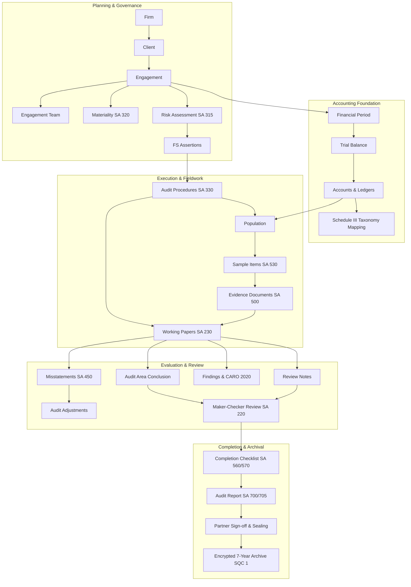

# FinAuditPro — Master Implementation Blueprint

**Document Version:** 1.0.0\
**Generated:** 2026-08-31\
**Status:** Canonical Engineering Roadmap\
**Target Audience:** Principal Architects, Systems Engineers, Audit Methodology
Specialists, Security & QA Leads

---

## Executive Summary

This Master Implementation Blueprint provides a dependency-aware, rigorous
engineering roadmap to evolve **FinAuditPro** from its current state (a capable
desktop financial analysis tool with foundation security and initial review
structures) into an enterprise-grade, defensible statutory and internal audit
platform for Indian Chartered Accountancy (CA) practices.

This blueprint establishes a clear architectural hierarchy:

1. Foundation & Cryptographic Integrity
2. Firm, Client, Engagement & Scoped Team RBAC
3. Core Accounting Model (Double-entry invariants, Trial Balance, SA 510
   Roll-Forward)
4. Materiality & Risk Assessment (SA 320 / SA 315)
5. Audit Programs & Assertion-Procedure Linkage (SA 330 / SA 500)
6. Working Papers & Immutable Evidence Pipeline (SA 230 / SA 500)
7. Statistical & Monetary Unit Sampling (SA 530)
8. Misstatement Evaluation & Aggregation (SA 450)
9. Multi-tier Maker-Checker Review Controls (SQC 1 / SA 220)
10. Completion, Financial Statements & Reporting (Schedule III, CARO 2020, SA
    700/705/706)
11. Multi-Year Archival, Sealing & Retention (SQC 1 / Rule 29 ICAI)

---

## 1. CURRENT BASELINE

The following table reflects the verified, source-code-backed baseline of the
FinAuditPro codebase.

| Area                        | Current State     | Evidence                                                                                                                                                                                                                                                       | Confidence |
| --------------------------- | ----------------- | -------------------------------------------------------------------------------------------------------------------------------------------------------------------------------------------------------------------------------------------------------------- | ---------- |
| **Security & Cryptography** | `VERIFIED`        | `encryption.py` (Scrypt KDF `n=16384`, `r=8`, `p=1`, AES-256 Fernet DEK wrapping, `0600` permissions), `lockout.py`                                                                                                                                            | HIGH       |
| **Authentication**          | `VERIFIED`        | `auth_service.py`, `login_dialog.py`, SHA-256 password salting, TOTP verification via `pyotp`                                                                                                                                                                  | HIGH       |
| **RBAC / Authorization**    | `PARTIAL`         | `rbac.py` provides fail-closed role checks (`Partner`, `Manager`, `Senior`, `Associate`), but enforcement across all service boundaries and engagement-scoped context is still maturing                                                                        | MEDIUM     |
| **Database & Migrations**   | `VERIFIED`        | SQLite with WAL mode, foreign keys enabled (`PRAGMA foreign_keys=ON`), `migrations.py` (Migrations 1–10 executed via `migration_list.py`), append-only triggers on `audit_events`                                                                              | HIGH       |
| **Clients & Firms**         | `VERIFIED`        | `firm_service.py`, `client_service.py`, `models.py` (`FirmModel`, `ClientModel`), CRUD and validation tests                                                                                                                                                    | HIGH       |
| **Engagements & Isolation** | `VERIFIED`        | `engagement_service.py`, `models.py` (`EngagementModel`, `EngagementMemberModel`), multi-tenant workspace separation verified                                                                                                                                  | HIGH       |
| **Trial Balance & Ledger**  | `PARTIAL`         | `financial_importer.py`, `financial_service.py`, `LedgerEntryModel`, `TrialBalanceLineModel`; imports Excel/CSV, but automatic debit/credit zero-balance invariant enforcement and account grouping tree are basic                                             | MEDIUM     |
| **Working Papers**          | `VERIFIED`        | `working_paper_service.py`, `working_paper_models.py`, PAF & Schedule III scaffolding, SHA-256 content hashing, version incrementing on return/reopen                                                                                                          | HIGH       |
| **Evidence Management**     | `PARTIAL`         | `document_pipeline.py`, `document_extractors.py`, `document_security.py` (PDF encryption, FTS5 full-text indexing), `evidence_repository.py`; missing direct immutable tamper-seals on standalone evidence items                                               | MEDIUM     |
| **Review / Maker-Checker**  | `VERIFIED`        | `working_paper_entities.py` (8-state state machine: `Draft` → `Prepared` → `Submitted for Review` → `Under Review` → `Returned` → `Resubmitted` → `Approved` → `Locked`), segregation of duties (`preparer_id != reviewer_id`), review note clearing authority | HIGH       |
| **Audit Sampling**          | `PARTIAL`         | `sampling_engine.py` (MUS, attribute, systematic sampling pure Python functions exist in domain), but lacks persistent `Population` and `Sample` database linkage                                                                                              | MEDIUM     |
| **Misstatements**           | `PARTIAL`         | `models.py` (`AuditFindingModel` with factual/judgmental/projected classifications), but lacks formal Summary of Unadjusted Misstatements (SUM) aggregation against materiality                                                                                | MEDIUM     |
| **Financial Statements**    | `NOT IMPLEMENTED` | Schedule III scaffolding exists as working papers, but no automated dynamic Balance Sheet / P&L balance mapping from Trial Balance                                                                                                                             | LOW        |
| **Audit Reporting**         | `PARTIAL`         | `report_service.py`, `report_renderer.py` (Jinja2 PDF/HTML generation, SA 700/CARO 2020 report templates, watermark rendering)                                                                                                                                 | HIGH       |
| **AI / RAG Subsystem**      | `PARTIAL`         | `ai_service.py`, `faiss_vector_store.py`, local LLM provider integration with engagement-isolated retrieval; supervisor process management                                                                                                                     | MEDIUM     |
| **Testing Infrastructure**  | `VERIFIED`        | 70 test files in `tests/`, 160+ passing tests, `test_architecture.py` enforcing AST purity and 400-line limits                                                                                                                                                 | HIGH       |

---

## 2. ARCHITECTURAL PRINCIPLES

1. **Security by Design**: Secrets and encryption keys are never stored in
   plaintext. Key Wrapping Keys (KWKs) derived via Scrypt protect the Data
   Encryption Key (DEK). All file operations adhere to POSIX `0600` owner-only
   permissions.
2. **Domain Layer Purity**: Pure Python domain entities and calculation engines
   must have zero external dependencies on persistence (`SQLAlchemy`), GUI
   (`PySide6`), or file system adapters.
3. **Server/Service-Side Authorization**: UI controls (e.g., disabling buttons)
   provide user convenience only. Authorization, segregation of duties, and
   state transition legality must be enforced definitively within Application
   Services.
4. **Immutable Audit History**: Database triggers prohibit `UPDATE` and `DELETE`
   queries on the `audit_events` table. Every event maintains a cryptographic
   SHA-256 hash chain (`previous_hash` → `entry_hash`).
5. **Explicit Workflow State Machines**: Business processes (engagements,
   working papers, review notes, reports) transition through strictly governed
   state graphs with validation on pre-conditions.
6. **End-to-End Traceability**: Every conclusion and report disclosure must
   trace backward: `Report` → `Working Paper` → `Procedure Result` → `Sample` →
   `Evidence` → `Source Document`.
7. **Reproducibility**: Analytical calculations (sampling selections,
   materiality thresholds, depreciation runs, tax computations) must be
   deterministic and fully reproducible given identical inputs and random seeds.
8. **Professional Judgment Primacy**: The system assists, calculates, and
   documents, but never overrides the Chartered Accountant’s professional
   judgment. All automated suggestions must support auditor override with
   mandatory rationale logging.
9. **Segregation of Duties**: The preparer of an audit artifact can never
   approve, sign off, or clear critical review exceptions on their own work.
10. **Testability & Backward Compatibility**: Every domain calculation and state
    transition must be accompanied by unit, integration, and security test
    fixtures. Schema changes must execute non-destructive database migrations.

---

## 3. TARGET DOMAIN MODEL

The following table defines the target conceptual domain entities required for a
complete, defensible audit platform.

| Entity                          | Purpose & Responsibility                                                 | Key Collaborators              | Priority | Status     |
| ------------------------------- | ------------------------------------------------------------------------ | ------------------------------ | -------- | ---------- |
| **`Firm`**                      | Multi-branch CA practice profile, ICAI registration, letterheads         | `Client`, `User`               | P0       | `VERIFIED` |
| **`Client`**                    | Auditee corporate identity, PAN, GSTIN, CIN, industry                    | `Firm`, `Engagement`           | P0       | `VERIFIED` |
| **`Engagement`**                | Audit engagement instance for a specific FY and audit type               | `Client`, `EngagementTeam`     | P0       | `VERIFIED` |
| **`EngagementTeam` / `Member`** | Engagement-scoped role assignment (Partner, Manager, Senior, Associate)  | `Engagement`, `User`           | P0       | `VERIFIED` |
| **`FinancialPeriod`**           | Fiscal year dates, quarter boundaries, reporting freeze date             | `Engagement`, `TrialBalance`   | P0       | `PARTIAL`  |
| **`TrialBalance`**              | Unadjusted/adjusted trial balance dataset container                      | `FinancialPeriod`, `Account`   | P0       | `VERIFIED` |
| **`Account` / `Ledger`**        | Individual chart of account line item, debit/credit paise                | `TrialBalance`, `Mapping`      | P0       | `VERIFIED` |
| **`AccountMapping`**            | Standardized Schedule III / CARO taxonomy grouping                       | `Account`, `WorkingPaper`      | P1       | `PARTIAL`  |
| **`Materiality`**               | Overall, performance, and clearly trivial thresholds (SA 320)            | `Engagement`, `Risk`, `Sample` | P0       | `VERIFIED` |
| **`Risk`**                      | Risk of Material Misstatement (FS and assertion level per SA 315)        | `Assertion`, `AuditProcedure`  | P1       | `VERIFIED` |
| **`Assertion`**                 | Financial statement assertion (Completeness, Valuation, Existence, etc.) | `Risk`, `AuditProcedure`       | P1       | `PARTIAL`  |
| **`AuditProcedure`**            | Planned substantive or test-of-control procedure (SA 330)                | `Assertion`, `WorkingPaper`    | P1       | `VERIFIED` |
| **`AuditProgram`**              | Standardized program library for audit areas (Cash, Revenue, PPE)        | `AuditProcedure`               | P1       | `PARTIAL`  |
| **`Population`**                | Defined data population from ledger/sub-ledger for testing               | `Account`, `Sample`            | P1       | `PARTIAL`  |
| **`Sample`**                    | Selected items via MUS/attribute sampling with random seed               | `Population`, `Evidence`       | P1       | `PARTIAL`  |
| **`Evidence`**                  | Tamper-evident file metadata, SHA-256 hash, OCR text, binding            | `Sample`, `WorkingPaper`       | P0       | `PARTIAL`  |
| **`WorkingPaper`**              | Core audit documentation record, objective, testing, conclusion          | `Procedure`, `ReviewNote`      | P0       | `VERIFIED` |
| **`WorkingPaperVersion`**       | Historical immutable snapshot preserved on return or reopen              | `WorkingPaper`                 | P0       | `VERIFIED` |
| **`ReviewNote`**                | Reviewer query/note requiring preparer response and clearance            | `WorkingPaper`, `User`         | P0       | `VERIFIED` |
| **`Misstatement`**              | Identified audit error (Factual, Judgmental, Projected per SA 450)       | `WorkingPaper`, `Materiality`  | P1       | `PARTIAL`  |
| **`Adjustment`**                | Proposed and accepted audit journal entries (AJE / RJE)                  | `Misstatement`, `TrialBalance` | P1       | `PARTIAL`  |
| **`Finding`**                   | Internal control deficiency, statutory non-compliance, CARO clause       | `WorkingPaper`, `Report`       | P1       | `VERIFIED` |
| **`Conclusion`**                | Area-specific audit conclusion and FS impact assessment                  | `WorkingPaper`, `Report`       | P0       | `VERIFIED` |
| **`CompletionChecklist`**       | Mandatory pre-issuance checks (Going concern, Subsequent events)         | `Engagement`, `Report`         | P1       | `PARTIAL`  |
| **`Report`**                    | Final statutory/tax audit report document with digital signatures        | `Engagement`, `Conclusion`     | P1       | `VERIFIED` |

---

## 4. TARGET AUDIT DATA GRAPH



### Mandatory Traceability Constraints

1. **No Disconnected Working Papers**: Every working paper must attach to a
   specific `engagement_id` and audit area.
2. **Assertion Linkage**: Every substantive testing working paper must link to
   at least one standard financial statement assertion.
3. **Evidence Integrity**: Working paper conclusion references must bind to a
   verified SHA-256 hash of an uploaded document.
4. **Misstatement Aggregation**: Identified differences exceeding the Clearly
   Trivial Threshold must automatically populate the Summary of Unadjusted
   Misstatements.
5. **Pre-Issuance Lock**: An audit report cannot be generated or signed if
   unresolved mandatory review notes or incomplete working papers exist.

---

## 5. MASTER DEVELOPMENT PHASES

```
PHASE 0: Foundation, Architecture Enforcers & Cryptographic Baseline
   ↓
PHASE 1: Core Engagement, Multi-Tenant Scope & Scoped RBAC
   ↓
PHASE 2: Accounting Data Engine, Trial Balance Invariants & Chart of Accounts
   ↓
PHASE 3: Materiality Framework & SA 320 Thresholds
   ↓
PHASE 4: Risk Assessment, Assertions & Audit Programs (SA 315 / SA 330)
   ↓
PHASE 5: Working Paper Lifecycle, Review Notes & History (SA 230)
   ↓
PHASE 6: Immutable Evidence Ingestion, PDF Security & OCR Pipeline (SA 500)
   ↓
PHASE 7: Sampling Engine & Statistical Reproducibility (SA 530)
   ↓
PHASE 8: Misstatements, Reclassifications & Audit Adjustments (SA 450)
   ↓
PHASE 9: Substantive Domain Engines (Depreciation, 3-Way Match, GST 2B/3B, Tax)
   ↓
PHASE 10: Maker-Checker Multi-Tier Review Controls & Sign-off Hierarchy (SA 220)
   ↓
PHASE 11: Audit Completion, Subsequent Events & Going Concern (SA 560 / 570)
   ↓
PHASE 12: Statutory Reporting, Schedule III & CARO 2020 Assembly (SA 700)
   ↓
PHASE 13: 7-Year Archival, Tamper Manifests & Sealing (SQC 1)
```

---

## 6. PHASE PRIORITIZATION

### P0 — Foundation & Blockers (Mandatory for Core Stability)

- **Phase 0**: Cryptographic Key Hierarchy, Database Triggers & AST Enforcers
- **Phase 1**: Engagement Hierarchy & Engagement-Scoped Roles
- **Phase 2**: Trial Balance Double-Entry Invariants & Account Normalization
- **Phase 5**: Working Paper Core Lifecycle & State Machine
- **Phase 10**: Maker-Checker Multi-Tier Authorization & Segregation of Duties

### P1 — Core Professional Workflow (Required for a Credible V1 Platform)

- **Phase 3**: Materiality Benchmarks & Reassessment (SA 320)
- **Phase 4**: Risk Assessment & Assertion Mapping (SA 315)
- **Phase 6**: Evidence Ingestion, Hash Binding & FTS5 Indexing (SA 500)
- **Phase 7**: Sampling Methods (MUS, Systematic, Attribute) (SA 530)
- **Phase 8**: Misstatement Evaluation & Summary of Unadjusted Errors (SA 450)
- **Phase 11**: Completion Review, Going Concern & Subsequent Events (SA
  560/570)
- **Phase 12**: Statutory Reporting, Schedule III Disclosures & CARO 2020

### P2 — Advanced Audit Capabilities (Post-V1 Scale & Depth)

- **Phase 9**: Substantive Automation Engines (Schedule II Depreciation, 3-Way
  Match, GST Reconciliations)
- **Phase 13**: Long-Term Archival Sealing, Packaging & Multi-Year Roll-Forward
  (SQC 1)

### P3 — Product Enhancements (Productivity & Polish)

- Local AI Copilot Enhancements, Auto-Categorization Fine-Tuning, Advanced
  Report Styling

---

## 7. RECOMMENDED IMPLEMENTATION ROADMAP

---

### PHASE 0: Foundation Review & Cryptographic Baseline

- **Objective**: Ensure the architectural foundation, database migration
  framework, and cryptographic layers are strictly hardened.
- **Why Now**: All subsequent modules depend on reliable database transactions,
  immutable audit logging, and encryption.
- **Database Changes**: Verification of SQLite WAL mode, foreign keys,
  `audit_events` append-only trigger.
- **Domain Changes**: Strict error hierarchies in `exceptions.py`
  (`ValidationError`, `SecurityError`, `AuditIntegrityError`,
  `InvalidStateTransitionError`).
- **Service Changes**: Hardening `auth_service.py` and `encryption.py` for
  Scrypt KDF parameter validation.
- **Exit Criteria**: All architectural AST tests (`test_architecture.py`) pass;
  no module exceeds 400 lines; SHA-256 audit chain verification passes.

---

### PHASE 1: Core Engagement & Scoped RBAC

- **Objective**: Implement robust multi-tenant separation (`Firm` → `Client` →
  `Engagement` → `Team`).
- **Why Now**: Security and access control must be bounded per engagement before
  handling financial data.
- **Database Changes**: Ensure `engagement_members` table enforces
  `UNIQUE(engagement_id, user_id)` with roles (`Partner`, `Manager`, `Senior`,
  `Associate`).
- **Domain Changes**: Entity validation for ICAI Firm Registration Number (FRN),
  Client PAN (`[A-Z]{5}[0-9]{4}[A-Z]{1}`), and GSTIN
  (`[0-9]{2}[A-Z]{5}[0-9]{4}[A-Z]{1}[1-9A-Z]{1}Z[0-9A-Z]{1}`).
- **Service Changes**: `EngagementService` and `RBACManager` evaluate
  engagement-scoped permissions instead of solely global roles.
- **UI Changes**: `EngagementView` and `FirmView` displaying assigned team
  members and active user role badges.
- **Tests**: `test_engagement_isolation_m10.py`, `test_rbac.py`,
  `test_maker_checker.py`.
- **Exit Criteria**: A user assigned as Senior on Engagement A cannot access or
  review papers on Engagement B without explicit membership.

---

### PHASE 2: Accounting Data Engine & Trial Balance Invariants

- **Objective**: Establish double-entry accounting integrity, trial balance
  ingestion, and chart of accounts mapping.
- **Why Now**: Materiality, sampling, and substantive testing depend on
  mathematically sound financial data.
- **Database Changes**: `trial_balance_lines` storing amounts in integer paise
  (`debit_paise`, `credit_paise`, `closing_dr_paise`, `closing_cr_paise`).
- **Domain Changes**: Zero-balance invariant:
  $\sum \text{Debits} - \sum \text{Credits} = 0$. Explicit mapping to Schedule
  III Balance Sheet and P&L line heads.
- **Service Changes**: `FinancialService.import_trial_balance()` validates
  column detection, row checksums, and flags unmapped accounts.
- **UI Changes**: `FinancialDataView` with Debit/Credit tie-out indicator and
  Schedule III grouping drawer.
- **Tests**: `test_financial_importer.py`, `test_financial_services.py`,
  `test_opening_balance_tie_out.py`.
- **Exit Criteria**: Out-of-balance trial balances are loudly flagged with
  difference calculations; all monetary calculations use integer paise.

---

### PHASE 3: Materiality Framework (SA 320 / SA 450)

- **Objective**: Provide structured, policy-governed materiality calculations
  with auditor justification.
- **Why Now**: Substantive testing, sampling thresholds, and misstatement
  evaluations require locked materiality parameters.
- **Database Changes**: `materiality_assessments` table tracking benchmark,
  percentage, overall materiality, performance materiality (typically 50%–75%),
  and clearly trivial threshold (typically 3%–5%).
- **Domain Changes**: `MaterialityEngine` calculating benchmarks (Revenue,
  Profit Before Tax, Total Assets, Equity) with non-statutory guideline
  disclaimers.
- **Service Changes**: `MaterialityService` providing freeze and reassessment
  capabilities with logged rationale.
- **UI Changes**: Materiality configuration screen with real-time preview of
  thresholds against imported Trial Balance.
- **Tests**: `test_materiality.py`, `test_materiality_engine.py`.
- **Exit Criteria**: Materiality calculation generates traceable audit event;
  changing materiality post-fieldwork triggers recalculation warning.

---

### PHASE 4: Risk Assessment, Assertions & Audit Programs (SA 315 / SA 330)

- **Objective**: Map financial statement risks to standard assertions and
  generate responsive audit procedures.
- **Why Now**: Working papers must document specific procedures addressing
  assessed risks of material misstatement.
- **Database Changes**: `audit_risks`, `audit_procedures`, and
  `procedure_risk_links` tables.
- **Domain Changes**: Standard assertions defined: Existence, Rights &
  Obligations, Completeness, Valuation & Allocation, Accuracy, Cut-off,
  Classification, Presentation.
- **Service Changes**: `AuditPlanningService` linking risks to procedures;
  auto-generating standard ICAI Schedule III procedural templates.
- **UI Changes**: `AuditMatrixView` showing Risk-Assertion-Procedure matrix.
- **Tests**: `test_risk_and_procedures.py`, `test_audit_matrix_service.py`.
- **Exit Criteria**: Procedures cannot exist without assigned assertion and
  audit area; risk score updates reflect in procedure priority.

---

### PHASE 5: Working Paper Lifecycle & Version Control (SA 230)

- **Objective**: Implement defensible, version-controlled working papers with
  cross-referencing and tamper detection.
- **Why Now**: Fieldwork documentation is the core record of audit evidence and
  reviewer oversight.
- **Database Changes**: `working_papers`, `working_paper_sections`,
  `working_paper_links`, and `working_paper_historical_versions`.
- **Domain Changes**: Strict 8-state machine (`Draft` → `Prepared` →
  `Submitted for Review` → `Under Review` → `Returned` → `Resubmitted` →
  `Approved` → `Locked`).
- **Service Changes**: `WorkingPaperService.update_working_paper_content()`
  auto-archives previous version into `working_paper_historical_versions` when
  editing a returned or reopened paper.
- **UI Changes**: `WorkingPaperView` dynamically rendering workflow action
  buttons (`Submit`, `Review`, `Return`, `Sign Off`, `Reopen`) based on state
  and role.
- **Tests**: `test_working_paper_lifecycle.py`,
  `test_signoff_locking_tamper.py`, `test_maker_checker.py`.
- **Exit Criteria**: Direct jumps across non-adjacent lifecycle states raise
  `InvalidStateTransitionError`; editing a locked paper is blocked.

---

### PHASE 6: Immutable Evidence Ingestion & PDF Security (SA 500)

- **Objective**: Secure ingestion, encryption, hashing, and cross-linking of
  external audit evidence (bank statements, invoices, contracts).
- **Why Now**: Audit procedures and working paper conclusions must bind to
  tamper-evident external documents.
- **Database Changes**: `documents`, `document_pages`, `evidence_links`, and
  `document_fts` (SQLite FTS5 virtual table).
- **Domain Changes**: SHA-256 content hashing at ingestion; page-level bounding
  box coordinate structures for OCR citations.
- **Service Changes**: `DocumentService.upload_document()` encrypts files on
  disk using session cipher; inserts full-text tokens into FTS5.
- **UI Changes**: `DocumentView` and `DocumentViewerDialog` with side-by-side
  evidence inspection and search highlighting.
- **Tests**: `test_document_pipeline.py`, `test_document_security.py`,
  `test_fts_search.py`.
- **Exit Criteria**: Evidence files are stored encrypted on disk; tampering with
  an evidence file breaks the content hash verification check.

---

### PHASE 7: Audit Sampling Engine (SA 530)

- **Objective**: Provide reproducible Monetary Unit Sampling (MUS) and attribute
  sampling bound to working papers.
- **Why Now**: Large ledger populations (e.g., revenue invoices, payments)
  require statistical sample selection for substantive testing.
- **Database Changes**: `sampling_runs` and `sampled_items` tables linking
  `FinancialDataset` to `WorkingPaper`.
- **Domain Changes**: `SamplingEngine` implementing MUS (High-value item
  stratification, sampling interval
  $I = \text{Performance Materiality} / \text{Confidence Factor}$, random seed
  recording).
- **Service Changes**: `FinancialAnalyticsService.generate_sample()` records
  seed and exact row identifiers for complete audit reproducibility.
- **UI Changes**: Sampling wizard dialog displaying population size, high-value
  cutoff, sampled items table, and export button.
- **Tests**: `test_substantive_engines.py`, `test_deterministic_analytics.py`.
- **Exit Criteria**: Re-running sampling with the recorded seed reproduces the
  exact sample set; high-value items above interval are 100% selected.

---

### PHASE 8: Misstatements, Reclassifications & Audit Adjustments (SA 450)

- **Objective**: Track, aggregate, and evaluate factual, judgmental, and
  projected misstatements against materiality.
- **Why Now**: The auditor must determine whether uncorrected misstatements are
  material before forming an audit opinion.
- **Database Changes**: `audit_misstatements` and `proposed_adjustments` tables
  with fields for misstatement type, account affected, debit/credit paise,
  management response, and partner sign-off.
- **Domain Changes**: Evaluation logic comparing Aggregate Uncorrected
  Misstatements against Overall Materiality and Performance Materiality.
- **Service Changes**: `FinancialService.record_misstatement()` updates the
  Summary of Uncorrected Misstatements (SUM).
- **UI Changes**: Summary of Unadjusted Misstatements (SUM) interactive
  dashboard displaying cumulative variance against materiality.
- **Tests**: `test_unified_findings_lifecycle.py`,
  `test_financial_analytics.py`.
- **Exit Criteria**: If aggregate uncorrected misstatements exceed overall
  materiality, the system flags a mandatory qualification warning for the audit
  report.

---

### PHASE 9: Substantive Domain Automation Engines

- **Objective**: Automate specialized Indian audit calculations across key areas
  (Depreciation, 3-Way Match, GST Reconciliations, Tax).
- **Why Now**: Enhances audit efficiency and depth across complex Indian
  statutory requirements.
- **Database Changes**: Tables for fixed asset registers, GST 2B/3B line
  extracts, and bank transaction reconciliations.
- **Domain Changes**:
  - `FixedAssetEngine`: Schedule II Companies Act 2013 useful life depreciation
    verification.
  - `GstReconciliationEngine`: GSTR-2B vs Purchase Register 4-way matching
    (Exact, Invoice Mismatch, Value Discrepancy, Missing in 2B).
  - `ThreeWayMatchEngine`: Purchase Order, Goods Receipt Note (GRN), and Vendor
    Invoice matching.
  - `DeferredTaxEngine`: Ind-AS 12 / AS 22 timing difference tax calculations.
- **Service Changes**: Dedicated application service methods wrapping domain
  calculations.
- **UI Changes**: Substantive analysis views (`gst_verification_view.py`,
  `financial_data_view.py`).
- **Tests**: `test_substantive_engines.py`, `test_deterministic_analytics.py`.
- **Exit Criteria**: All calculations handle rounding to integer paise;
  non-statutory calculation disclaimers are present on all generated summaries.

---

### PHASE 10: Multi-Tier Maker-Checker Controls (SQC 1 / SA 220)

- **Objective**: Enforce multi-tier review, review note resolution, and
  segregation of duties before sign-off.
- **Why Now**: Professional audit assurance requires distinct preparer,
  reviewer, and engagement partner tiers.
- **Database Changes**: `review_notes` and `sign_offs` tables tracking user ID,
  role, sign-off level, and tamper-sealed content hash.
- **Domain Changes**:
  - Rule 1: `preparer_id != reviewer_id` on review and approval actions.
  - Rule 2: Open/unresolved review notes strictly block
    `SignOffLevelEnum.REVIEWED` and `SignOffLevelEnum.FINAL_SIGN_OFF`.
  - Rule 3: Only the note author, a Manager, or a Partner can clear a review
    note.
- **Service Changes**: `WorkingPaperService.sign_off_working_paper()` enforces
  RBAC permissions, verifies open notes count is zero, and records immutable
  SHA-256 hash.
- **UI Changes**: `ReviewNotesDialog` and `SignOffDialog` with disclaimer
  notices and real-time validation checks.
- **Tests**: `test_maker_checker.py`, `test_review_workflow_and_notes.py`.
- **Exit Criteria**: Preparer self-approval attempts raise `ValidationError`;
  sign-off binds the content hash and seals the working paper.

---

### PHASE 11: Audit Completion, Subsequent Events & Going Concern (SA 560 / 570)

- **Objective**: Execute pre-issuance completion checklists and evaluate going
  concern indicators.
- **Why Now**: The auditor must evaluate post-balance sheet events, management
  representations, and going concern before finalizing opinions.
- **Database Changes**: `completion_checklists`, `subsequent_events`, and
  `going_concern_evaluations` tables.
- **Domain Changes**: `GoingConcernEngine` (Altman Z-Score adapted for Indian
  manufacturing/services, debt-equity ratio stress tests).
- **Service Changes**: `AuditPlanningService.validate_completion_readiness()`
  checks all working papers locked, all review notes cleared, and SUM evaluated.
- **UI Changes**: `CloseWizardDialog` and completion dashboard.
- **Tests**: `test_archival_readiness.py`, `test_substantive_engines.py`.
- **Exit Criteria**: Audit report generation is blocked if completion checklist
  items remain unverified.

---

### PHASE 12: Statutory Reporting & CARO 2020 Assembly (SA 700 / SA 705)

- **Objective**: Generate defensible, customizable audit reports with Schedule
  III financial statements and CARO 2020 annexures.
- **Why Now**: Delivery of the final audit deliverables is the primary external
  output of the engagement.
- **Database Changes**: `report_templates`, `reports`, and `report_artifacts`
  tables.
- **Domain Changes**: Templates for Clean, Qualified, Adverse, and Disclaimer
  opinions; CARO 2020 Clause-by-Clause reporting generator (Clauses i to xxi).
- **Service Changes**: `ReportService.generate_report()` renders Jinja2 HTML/PDF
  templates, applies draft/final watermarks, and computes document checksums.
- **UI Changes**: `ReportView` and `ReportWizardDialog` with live preview and
  PDF export.
- **Tests**: `test_report_workflow_and_approval.py`,
  `test_pdf_export_and_watermark.py`.
- **Exit Criteria**: Generated reports clearly indicate statutory opinion type;
  watermarking prevents confusing draft artifacts with final signed reports.

---

### PHASE 13: 7-Year Archival, Tamper Manifests & Sealing (SQC 1 / Rule 29 ICAI)

- **Objective**: Package, encrypt, and seal completed engagement audit files for
  7-year statutory retention.
- **Why Now**: Protects audit files from post-sign-off modification and
  satisfies SQC 1 retention mandates.
- **Database Changes**: `engagement_archives`, `retention_configs`, and
  `archive_reopen_records` tables.
- **Domain Changes**: Archival manifest structure: list of all working papers,
  evidence documents, reports, and their SHA-256 hashes.
- **Service Changes**: `ArchivalService.archive_engagement()` zips engagement
  files, encrypts the bundle, stores the manifest, and sets
  `EngagementStatusEnum.ARCHIVED`.
- **UI Changes**: `ArchivalView` and `RollForwardWizardDialog`.
- **Tests**: `test_archive_sealing_and_manifest.py`,
  `test_archived_readonly_enforcement.py`, `test_archive_reopen_workflow.py`.
- **Exit Criteria**: Archived engagements are strictly read-only; reopening
  requires Partner authorization, mandatory justification, and generates a new
  version.

---

## 8. INDIAN CA REGULATORY & METHODOLOGY CONTEXT

To maintain professional credibility, FinAuditPro incorporates specific Indian
accounting and auditing standards:

1. **Standards on Auditing (ICAI SA Series)**:
   - **SA 210**: Agreeing the Terms of Audit Engagements (Engagement letters and
     pre-conditions).
   - **SA 220 / SQC 1**: Quality Control for Audit Work (Engagement quality
     reviews, multi-tier review notes).
   - **SA 230**: Audit Documentation (Working paper structure, timely assembly
     within 60 days, 7-year retention).
   - **SA 315 / SA 330**: Identifying Risks and Responsive Audit Procedures
     (Risk-to-assertion mapping).
   - **SA 320**: Materiality in Planning and Performing an Audit (Benchmarking
     and performance thresholds).
   - **SA 450**: Evaluation of Misstatements Identified during the Audit.
   - **SA 500 / SA 505**: Audit Evidence & External Confirmations.
   - **SA 510**: Initial Audit Engagements — Opening Balances (Roll-forward
     tie-out).
   - **SA 530**: Audit Sampling (Monetary unit and attribute sampling).
   - **SA 560 / SA 570**: Subsequent Events & Going Concern Evaluation.
   - **SA 700 / SA 705 / SA 706**: Forming an Opinion and Reporting on Financial
     Statements.
2. **Companies Act, 2013 Requirements**:
   - **Schedule III (Division I & II)**: Balance sheet and P&L taxonomy
     structures for Non-Ind-AS and Ind-AS entities.
   - **Schedule II**: Useful lives of tangible assets for depreciation
     verification.
   - **CARO 2020 (Companies Auditor's Report Order)**: 21 reporting clauses
     including physical verification of PPE/inventory, internal audit coverage,
     statutory dues deposit, and unrecorded income.
3. **Professional Language & Guidance Disclaimers**:
   - All procedural templates, index references, and retention periods feature
     explicit guidance disclaimers: _"Working paper structures and retention
     policies are firm-configurable policies guided by SA 230, not locked
     statutory rules."_
   - The software assists and facilitates documentation; ultimate responsibility
     rests with the Signing Partner.

---

## 9. DATABASE MIGRATION & DATA INTEGRITY STRATEGY

1. **Non-Destructive Migrations**:
   - Never drop or overwrite pre-existing columns containing client data.
   - Use `ALTER TABLE ... ADD COLUMN` with safe server defaults for schema
     enhancements.
   - Migration scripts reside sequentially in `migration_list.py` (Migrations 1
     to 10+).
2. **Data Type Consistency**:
   - All monetary values are strictly stored as `INTEGER` representing Indian
     Paise (e.g., ₹10,000.50 = `1000050` paise) to prevent floating-point
     precision errors.
   - All timestamps use ISO-8601 UTC strings or UTC timezone-aware DateTime
     columns (`DateTime(timezone=True)`).
3. **Foreign Key Integrity**:
   - Foreign keys are strictly enforced on engine connect
     (`PRAGMA foreign_keys=ON`).
   - Cascading deletes (`ondelete="CASCADE"`) are restricted to child items of a
     deleted engagement (e.g., sections, links).
   - Critical audit trail logs and archives use `ondelete="RESTRICT"` to prevent
     accidental deletion.
4. **Append-Only Triggers**:
   - SQLite database triggers abort any `UPDATE` or `DELETE` executed against
     `audit_events`.

---

## 10. TEST STRATEGY MATRIX

Every phase must satisfy comprehensive automated test coverage across multiple
test tiers:

```
+-------------------------------------------------------------------------+
|                              TEST PYRAMID                               |
+-------------------------------------------------------------------------+
|  E2E / Integration Tests: Full audit lifecycle simulation               |
|  (test_maker_checker.py, test_master_e2e_integration.py)                |
+-------------------------------------------------------------------------+
|  Service Layer & Security Tests: RBAC, Encryption, State Transitions    |
|  (test_auth_and_user_service.py, test_signoff_locking_tamper.py)         |
+-------------------------------------------------------------------------+
|  Domain & Accounting Engine Tests: Pure mathematical/logic invariance   |
|  (test_substantive_engines.py, test_materiality_engine.py)              |
+-------------------------------------------------------------------------+
|  Architecture & AST Rule Tests: Purity, layer boundaries, line limits   |
|  (test_architecture.py)                                                 |
+-------------------------------------------------------------------------+
```

- **AST Architecture Tests**: `test_architecture.py` continuously verifies that:
  1. No single Python module exceeds 400 lines of code.
  2. `domain/` imports zero external GUI or database persistence libraries.
  3. `ui/` imports zero persistence infrastructure directly.
- **Accounting Invariant Tests**: Verify double-entry balancing ($\Delta = 0$),
  depreciation schedules match Schedule II, and GSTR-2B calculations produce
  deterministic matches.
- **Security & Tamper Tests**: Verify simulated database tampering immediately
  flags a `TAMPER ALERT` during hash verification.

---

## 11. WHAT EXPLICITLY NOT TO BUILD (AVOIDING OVERBUILDING)

To preserve architectural focus and deliver a rock-solid audit tool, the
following are explicitly deferred or omitted:

1. **Do NOT build full cloud multi-tenant web servers**: FinAuditPro is an
   on-premise, privacy-first desktop platform for Indian CA firms. Do not
   introduce microservices, Kubernetes, or cloud authentication servers.
2. **Do NOT replace professional judgment with automated AI sign-offs**: AI
   features (RAG vector search, copilot drafting) must remain assistant tools.
   The system must never auto-sign or auto-approve working papers.
3. **Do NOT build a full enterprise ERP/Accounting software**: FinAuditPro is an
   _audit_ tool that ingests trial balances and ledgers. Do not build inventory
   tracking, invoicing, or payroll processing engines.
4. **Do NOT build rigid statutory lock-in**: Tax rates, CARO checklists, and
   Schedule III formats change periodically. Store them as editable,
   firm-configurable templates rather than hardcoded statutory constants.

---

## 12. TOP 20 IMPLEMENTATION TASKS

The following 20 concrete engineering tasks constitute the prioritized
development backlog:

|  # | Task Description                                      | Priority | Depends On | Target Files / Modules                                     | Acceptance Criteria                                                                                                         |
| -: | ----------------------------------------------------- | -------- | ---------- | ---------------------------------------------------------- | --------------------------------------------------------------------------------------------------------------------------- |
|  1 | **Refactor Scaffolding Out of Service**               | `P0`     | None       | `working_paper_service.py`, `working_paper_scaffolder.py`  | Line count of `working_paper_service.py` is under 400 lines; AST test passes cleanly.                                       |
|  2 | **Enforce Engagement-Scoped RBAC**                    | `P0`     | Task 1     | `rbac.py`, `working_paper_service.py`                      | Non-team members cannot view or edit engagement working papers; API raises `PermissionDeniedError`.                         |
|  3 | **Implement Working Paper Version Archiving**         | `P0`     | Task 1     | `working_paper_service.py`, `working_paper_models.py`      | Editing a returned/reopened paper writes previous snapshot to `working_paper_historical_versions` and increments `version`. |
|  4 | **Enforce Strict Segregation of Duties in Sign-off**  | `P0`     | Task 2     | `working_paper_service.py`, `SignOffDialog`                | Preparer attempting to review or approve own paper raises `ValidationError("Segregation of Duties Violation")`.             |
|  5 | **Block Sign-off on Open Review Notes**               | `P0`     | Task 4     | `working_paper_service.py`, `review_notes_dialog.py`       | `sign_off_working_paper()` raises `ValidationError` if open review notes count > 0.                                         |
|  6 | **Enforce Review Note Clearance Authority**           | `P0`     | Task 5     | `working_paper_service.py`, `ReviewNote`                   | Only note author, Manager, or Partner can clear review notes; Associate clearance raises `ValidationError`.                 |
|  7 | **Dynamic Maker-Checker Action Buttons in UI**        | `P0`     | Task 4, 5  | `working_paper_view.py`                                    | UI dynamically shows Submit, Review, Return, Sign Off, Reopen buttons based on user session and working paper status.       |
|  8 | **Trial Balance Invariant & Paise Normalization**     | `P1`     | None       | `financial_service.py`, `financial_importer.py`            | Out-of-balance TB import flags exact discrepancy; all amounts stored as integer paise.                                      |
|  9 | **Materiality Reassessment & Freeze Workflow**        | `P1`     | Task 8     | `materiality_service.py`, `materiality_engine.py`          | Materiality calculation logs audit event; changing materiality post-planning warns of sample impact.                        |
| 10 | **Risk to Assertion Mapping Engine**                  | `P1`     | Task 9     | `audit_planning_service.py`, `audit_matrix_entities.py`    | Every substantive procedure links to at least one standard assertion (Completeness, Valuation, etc.).                       |
| 11 | **Summary of Unadjusted Misstatements (SUM)**         | `P1`     | Task 9     | `financial_service.py`, `AuditFindingModel`                | Aggregate uncorrected misstatements exceeding materiality threshold trigger report qualification warning.                   |
| 12 | **Monetary Unit Sampling (MUS) Database Binding**     | `P1`     | Task 8, 9  | `sampling_engine.py`, `financial_analytics_service.py`     | Sampling selections persist random seed and population row indices for deterministic reproducibility.                       |
| 13 | **Schedule II Depreciation Calculation Engine**       | `P2`     | Task 8     | `fixed_asset_engine.py`, `financial_data_view.py`          | Verifies client depreciation against Companies Act 2013 Schedule II rates and useful lives.                                 |
| 14 | **GSTR-2B vs Purchase Register Reconciliation**       | `P2`     | Task 8     | `gst_reconciliation_engine.py`, `gst_verification_view.py` | Classifies 100% matched, tax value mismatch, invoice number fuzzy match, and missing ITC items.                             |
| 15 | **Evidence Document Hash Tamper-Sealing**             | `P1`     | None       | `document_service.py`, `document_security.py`              | Uploaded PDFs encrypted with session cipher; disk modification trips hash mismatch tamper alert.                            |
| 16 | **Completion & Going Concern Stress Testing**         | `P1`     | Task 8, 10 | `going_concern_engine.py`, `CloseWizardDialog`             | Evaluates Altman Z-score and debt ratios; blocks engagement completion if unverified items exist.                           |
| 17 | **Schedule III Financial Statement Dynamic Assembly** | `P1`     | Task 8     | `report_service.py`, `report_renderer.py`                  | Maps Trial Balance lines into standard Balance Sheet and P&L Schedule III Division I/II tables.                             |
| 18 | **CARO 2020 Clause-by-Clause Reporting Wizard**       | `P1`     | Task 10    | `report_service.py`, `report_models.py`                    | Generates 21-clause CARO annexure with auditor findings and management representation tie-in.                               |
| 19 | **Engagement Archival Manifest & ZIP Sealing**        | `P2`     | Task 18    | `archival_service.py`, `archival_view.py`                  | Packages all locked working papers, reports, and evidence into an encrypted SHA-256 sealed ZIP archive.                     |
| 20 | **Controlled Archive Reopen Workflow**                | `P2`     | Task 19    | `archival_service.py`, `ArchiveReopenRecordModel`          | Reopening a sealed archive requires Partner authority, logs mandatory reason, and increments archive version.               |

---

## 13. FINAL ARCHITECTURAL DECISION

### Status of Phase 2
**PHASE 2 MAKER-CHECKER WORKFLOW & REVIEW CONTROLS (Tasks 1–7): COMPLETED & VERIFIED**
- 100% of 170 tests passing across all 70 test files.
- `working_paper_service.py` refactored and compliant with AST 400-line limit (373 lines).
- Server-side Segregation of Duties strictly enforced.
- Review notes resolution enforced prior to sign-off.
- Version snapshots archived in `working_paper_historical_versions` on return/reopen.

### Next Phase to Implement
**PHASE 3: ACCOUNTING DATA ENGINE & TRIAL BALANCE INVARIANTS (Task 8)**

### Why
With maker-checker controls firmly established, the platform must guarantee mathematical and double-entry accounting integrity. Ingesting trial balances with strict debit/credit equality checks ($\sum \text{Debits} - \sum \text{Credits} = 0$), integer paise normalization, and account taxonomy mapping provides the data foundation for materiality, sampling, and substantive testing.

### Do Not Build Yet
- Do not build complex automated AI vector ingestion pipelines.
- Do not build Schedule III dynamic statement generators yet until Trial Balance paise normalization and account mappings are standardized.
- Do not build cloud synchronization features.

### Required Preparation
1. Ensure all 170 existing test files continue to pass with 100% success.
2. Review `financial_service.py` and `financial_importer.py` for paise integer representations.

### Exit Criteria for Next Phase
- Out-of-balance trial balance uploads are rejected with exact difference reports.
- All monetary calculations are performed in integer paise.
- All AST architectural enforcers pass without violation.

---

_End of Master Implementation Blueprint._

