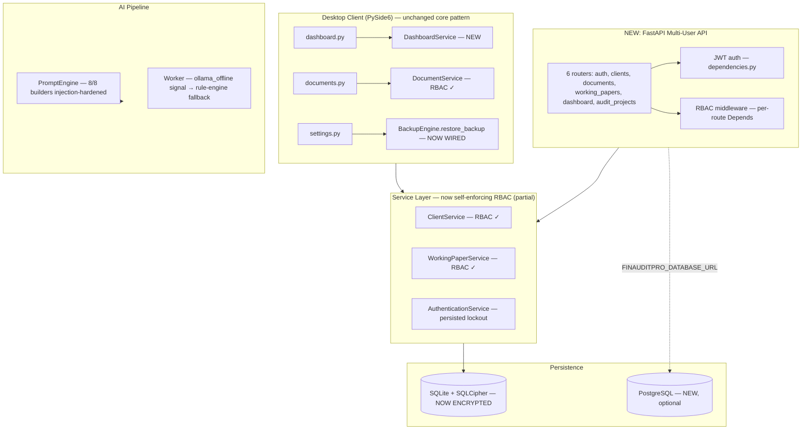

# FinAuditPro — Enterprise Engineering & Security Audit (Revision 2)

**Scope:** Full repository re-audit following the remediation pass on the previous findings (`FinAuditPro_Engineering_Audit.md`). 212 files, ~14,900 lines of Python (14,129 in `src/`+`api/`, 1,077 in `tests/`) — up from ~14,200/678 in the prior revision.
**Method:** Full recursive read of source, config, docs, tests, CI, and dependency manifests, plus a line-by-line diff against the previously audited version to verify which of the 20 prior roadmap items actually landed.
**Reviewer stance:** Principal Engineer / Security Architect / Technical Due-Diligence pass.

---

## 1. Executive Summary

**What changed since the last audit:** This is a genuine, substantial remediation pass, not a cosmetic one. Of the 20 roadmap items from the prior report, **16 are implemented, 2 are partially implemented, and 2 are not implemented.** Beyond the roadmap, the team also shipped something bigger than anything requested: a full **FastAPI multi-user client-server layer** (`api/`) with JWT auth, PostgreSQL support, and Docker packaging — turning this from a strictly single-user desktop app into a product with a real (if young) networked attack surface. That expansion is the headline development, and it both resolves the prior "scalability doesn't match the RBAC ambition" critique and introduces new risk that didn't exist before.

**Net assessment:** The engineering discipline behind this pass is well above what the initial prototype showed — fixes are real (not just relabeled), several are done with unusual honesty (e.g., the new digital-signature module explicitly disclaims it is *not* a legal DSC), and test coverage grew 59% with new coverage specifically targeting the previously-flagged gaps (services, workflow, API). The core recurring theme from before — **claims and enforcement not fully matching each other** — has improved a lot but has not disappeared, and the new API surface reintroduces a version of the same theme in a more dangerous form: a **hardcoded, publicly-visible default JWT signing secret** that, if left unset in a real deployment, allows full authentication bypass. That single issue is more severe in a networked context than anything in the original desktop-only audit, because it's remotely exploitable rather than requiring local machine access.

**Overall verdict:** Meaningfully more mature than the version audited previously. Still not enterprise/production-ready as shipped, but for different reasons now — the desktop app's local-trust-model gaps are mostly closed or honestly documented, while the new API layer needs hardening before it should ever be exposed on a real network.

| Dimension | Previous rating | Current rating |
|---|---|---|
| Enterprise readiness | Low | Low–Medium |
| Production readiness (single-user desktop use) | Low–Medium | Medium |
| Production readiness (new API/multi-user use) | N/A (didn't exist) | Low |
| Architectural foundation | Medium–Good | Good |
| Security posture vs. security claims | Significant gap | Small–moderate gap, concentrated in the new API layer |

---

## 2. Remediation Scorecard — Every Prior Finding, Verified Against Code

| # | Prior finding | Status | Evidence |
|---|---|---|---|
| 1 | DB unencrypted at rest despite "encrypted vault" claims | ✅ **Fixed** | New `database/db_encryptor.py` + SQLCipher (`sqlcipher3`) wiring in `database.py`, with an idempotent migration for existing plaintext DBs and a logged fallback (not a silent one) if the optional driver isn't installed |
| 2 | RBAC enforced at only 6 UI call sites, zero in services | ⚠️ **Partial** | `client_service.py`, `document_service.py`, `working_paper_service.py` now self-enforce permissions. But `DELETE_DOCUMENTS`, `RUN_AI_ANALYSIS`, `APPROVE_AUDIT`, `VIEW_AUDIT_LOGS`, `MANAGE_SETTINGS`, `PERFORM_BACKUP` are still checked **nowhere** in the codebase — same shape of gap, smaller surface |
| 3 | "Digital signature" / QR verification provided false assurance | ✅ **Fixed, and unusually honest** | QR payloads now carry a real HMAC-SHA256 `mac`; `digital_signature.py` adds Ed25519 signing plus explicit "NOT a statutory IT Act 2000 Class 3 DSC" notices in the payload itself. See §5.3 for a residual nuance (fresh keypair per signature, no persistent anchor). |
| 4 | Prompt-injection defense present in only 1 of 8 AI prompt builders | ✅ **Fully fixed** | All 8 now route through a shared `_sanitize_and_wrap_context()` helper (delimiter stripping + HTML-escaping + explicit anti-injection instruction) |
| 5 | Zip-slip in `BackupEngine.restore_backup()` | ✅ **Fixed** | `_safe_extract()` validates the resolved path stays under the target directory before extracting |
| 6 | Login lockout counter stored in an in-process dict (resets on restart) | ✅ **Fixed** | Persisted to an encrypted `.login_lockouts.json` on disk |
| 7 | No floor on `pbkdf2_iterations` env var | ✅ **Fixed** | Pydantic `field_validator` clamps to a 100,000 minimum regardless of env var value |
| 8 | Uploaded documents referenced in place, not copied into managed storage | ⚠️ **Partial** | `upload_document()` now copies into `data/documents/eng_{id}/` and self-checks RBAC — but the parallel `upload_audit_document()` path still stores the original path with no copy and no permission check |
| 9 | `requirements.txt` mixed prod and dev dependencies; README referenced a non-existent `requirements-dev.txt` | ✅ **Fixed** | Real `requirements-dev.txt` now exists (`-r requirements.txt` + lint/test/build tools) |
| 10 | Audit ledger integrity only checked manually from the History screen | ✅ **Fixed** | `deployment/bootstrap.py` now verifies the hash chain on every startup, logs `CRITICAL` and writes a `AUDIT_LEDGER_TAMPER_DETECTED` entry if it fails |
| 11 | Extension-only file validation, no content sniffing | ✅ **Fixed** | `DocumentValidator` now checks magic-byte headers (PDF/PNG/JPEG/XLSX/DOCX) against the claimed extension |
| 12 | No CSV/Excel formula-injection sanitization on export | ✅ **Fixed** | `excel_export.py` now sanitizes any value starting with `=`, `+`, `-`, `@`, tab, or CR before writing |
| 13 | CI tested Windows only; Python version mismatch between `pyproject.toml` and `security.yml` | ✅ **Fixed** | `ci.yml` now runs a matrix across ubuntu/macos/windows; both workflows pinned to Python 3.12 |
| 14 | `dashboard.py` queried the ORM directly, bypassing the service layer | ✅ **Fixed** | New `services/dashboard_service.py`; `dashboard.py` now calls `DashboardService(session)` instead of raw `session.query(...)` |
| 15 | `GSTMismatchRule` tax-rate formula likely misflagged correctly-taxed invoices (`tax/total` instead of `tax/taxable`) | ✅ **Fixed** | Now computes `taxable_amt = total - tax` (or a dedicated `taxable_amount` field) and divides tax by that; slab list also expanded (0.1%, 0.25%, 1.5%, 3%, 5%, 12%, 18%, 28%) |
| 16 | No onboarding/detection for the Ollama dependency | ❌ **Not implemented as originally suggested, but a related fallback shipped** | No pre-flight "is Ollama running" wizard exists. However, `ai/workers.py` now emits an `ollama_offline` signal that `ui/ai_analysis.py` connects to a rule-engine fallback (`run_rule_engine_fallback`) — a reasonable alternative to onboarding, though the user still discovers the problem reactively rather than being told upfront |
| 17 | `BackupEngine.restore_backup()` implemented but never wired to any UI | ✅ **Fixed** | `ui/settings.py` now calls `be.restore_backup(file_path)` |
| 18 | No path to real multi-user/firm-wide collaboration despite the 6-role RBAC matrix implying it | ✅ **Implemented, substantially** | New `api/` FastAPI service: JWT auth, per-route RBAC dependency (`api/middleware/rbac.py`), PostgreSQL support via `FINAUDITPRO_DATABASE_URL`, Docker packaging. This is the single biggest change in this revision — see §6 for its own dedicated risk review. |
| 19 | Service layer, AI layer, and workflow engine had no tests | ✅ **Mostly fixed** | New `test_services.py` (183 lines), `test_workflow.py` (36 lines), `test_api.py` (108 lines), `test_db_encryption.py` (63 lines). One regression test now exists for the prompt-injection fix (`test_fatal_fixes.py::test_fix6_prompt_engine_adds_xml_boundaries`), but it only exercises 1 of the 8 hardened builders, not all 8 |
| 20 | No real asymmetric signing for reports | ✅ **Fixed** | Covered by #3 (Ed25519 signing) |

**Score: 16 fully fixed, 2 partially fixed, 1 substantively addressed via a different mechanism (#16), 1 genuinely new architecture item delivered beyond what was asked (#18).**

---

## 3. What's New Beyond the Roadmap

Two additions weren't requested in the prior audit and need their own review:

1. **A full FastAPI REST API** (`api/` — 747 lines across `main.py`, `dependencies.py`, `middleware/rbac.py`, 6 routers, 6 Pydantic schema modules), with JWT bearer auth, CORS, PostgreSQL support, and Docker/Compose packaging. This is architecturally the right move if firm-wide collaboration is a real goal (see prior §11's critique) — but it is young, thin on tests relative to its attack-surface increase, and ships with genuinely dangerous defaults (§6).
2. **Optional PostgreSQL backend** via `config.database_url` — a real step toward the multi-user story, since SQLite's single-writer model can't support concurrent firm-wide access no matter how good the RBAC is.

---

## 4. Architecture (Updated)



**Architectural read:** The desktop app's internal layering discipline genuinely improved (dashboard no longer bypasses services; RBAC moved partially into services). The new API layer reuses the same `RBACManager`/`Permission` model rather than inventing a parallel one — a good sign of architectural coherence, and it means the residual "6-of-14 permissions enforced" gap is now consistent between the desktop and API surfaces rather than each having its own, different hole.

---

## 5. Security Audit (Updated)

### 5.1 Fixed items — brief confirmation (see §2 table for detail)
Encryption-at-rest, prompt injection (all 8 builders), zip-slip, persisted lockout, PBKDF2 floor, magic-byte validation, formula-injection sanitization, startup ledger verification, and honest signature/QR labeling are all confirmed fixed in code, not just in documentation.

### 5.2 Still-open: RBAC enforcement gap
Unchanged in shape from the prior audit: `DELETE_DOCUMENTS`, `RUN_AI_ANALYSIS`, `APPROVE_AUDIT`, `VIEW_AUDIT_LOGS`, `MANAGE_SETTINGS`, and `PERFORM_BACKUP` are defined in `rbac.py` but never referenced by `check_permission`/`require_permission` anywhere in `src/` or `api/`. This is now a smaller relative gap (6 of 14 vs. the original 8 of 14 fully unchecked, and the checked ones are now enforced at the correct layer), but it's the same category of risk it always was: any authenticated user, regardless of role, can delete documents, run AI analysis, approve audits, view audit logs, change settings, or trigger backups. **Fix priority: apply the same `require_permission()`/`check_permission()` pattern already used elsewhere to these six.**

### 5.3 Digital signature — residual nuance worth flagging precisely
The Ed25519 fix is real and honestly labeled, but note what it does and doesn't prove: `SignatureBlock.__post_init__` generates a **fresh Ed25519 keypair every time a signature block is created**, and embeds the public key in the same payload as the signature. `verify_asymmetric_signature()` therefore only proves the signature is internally self-consistent with the embedded public key — it does not prove the signature came from a specific CA's persistent identity, because there is no fixed, previously-published, or otherwise anchored public key to check against. A forger can generate their own keypair, sign a fabricated payload, and pass verification just as validly as the real signer. This is not a regression (the old version had *no* cryptographic signing at all), and the module's own docstring is upfront that it isn't a statutory DSC — but if "internal tamper detection" is the intended use case, the key should be derived from/anchored to something persistent (e.g., stored once per installation or per CA membership number, analogous to how `AESCryptoEngine` anchors to `.crypto_key`) rather than regenerated per signature.

### 5.4 New: JWT authentication in the API layer — critical finding

`api/dependencies.py` signs and verifies JWTs using `config.jwt_secret`:

```python
jwt_secret: str = Field(
    default_factory=lambda: os.environ.get("FINAUDITPRO_JWT_SECRET") or os.environ.get("FINAUDIT_JWT_SECRET")
        or os.environ.get("JWT_SECRET") or "finauditpro_production_jwt_secret_key_change_in_prod_2026",
    ...
)
```

If none of those three environment variables is set, every JWT is signed with a **hardcoded string that is committed to this public repository.** Worse, `api/docker-compose.yml` — the reference deployment configuration most people will copy — sets `FINAUDITPRO_JWT_SECRET: change-this-in-production-secret-key-2026` **directly in the compose file**, alongside `POSTGRES_PASSWORD: finaudit_secret` for the database. Both are checked into source control as literal values. Anyone who deploys via `docker-compose up` without editing these — which is the path of least resistance and exactly what a "one-click enterprise API" pitch encourages — ships a server where:
- Any attacker who reads the public repo (or guesses the obviously-placeholder string) can forge a valid JWT for **any `user_id` and any `role`**, including Administrator, bypassing authentication entirely.
- The PostgreSQL instance ships with a known, weak, publicly-documented password.

**Severity: Critical.** This is directly, remotely exploitable — a different and more serious class of risk than anything found in the desktop-only version, because it doesn't require local machine access. **Fix: remove the hardcoded fallback entirely; fail fast at startup if `FINAUDITPRO_JWT_SECRET`/`POSTGRES_PASSWORD` aren't set to non-default values, rather than silently degrading to an insecure default.**

### 5.5 New: CORS misconfiguration
`api/main.py` configures:
```python
app.add_middleware(CORSMiddleware, allow_origins=["*"], allow_credentials=True, allow_methods=["*"], allow_headers=["*"])
```
Combining a wildcard origin with `allow_credentials=True` is a well-known CORS anti-pattern: browsers forbid literally echoing `*` alongside credentialed requests, so frameworks like Starlette instead reflect back whatever `Origin` header the requester sent — meaning in practice **any website can make credentialed cross-origin requests to this API.** Because auth here is Bearer-token (not cookie) based, the practical exploitability depends on how tokens are stored client-side (a JWT in `localStorage` isn't auto-attached cross-origin the way a cookie would be), but this is still worth tightening to an explicit origin allow-list before any browser-based client consumes this API — leaving it wildcard is a habit that bites later even if it's not immediately catastrophic today.

### 5.6 New: token revocation is in-memory, won't survive restart or multiple workers
`REVOKED_TOKENS: Set[str] = set()` in `api/dependencies.py` is the exact same anti-pattern as the pre-fix login-lockout dict (§2, item 6): it resets on process restart and, in a multi-worker `uvicorn` deployment (the normal way to run FastAPI in production), each worker process has its **own** independent copy — a token revoked (logout) against one worker remains valid against the others. Given that #6 was already identified and fixed for exactly this reason elsewhere in the codebase, this looks like a case of the same team introducing new code faster than the pattern generalized. **Fix: persist revoked tokens (DB table or the same encrypted-file pattern used for lockouts) or move to short-lived tokens with refresh instead of an 8-hour bearer token + revocation list.**

### 5.7 New: `uvicorn --reload` in the executable entrypoint
`api/main.py`'s `if __name__ == "__main__":` block runs `uvicorn.run("api.main:app", host="0.0.0.0", port=8000, reload=True)`. `reload=True` is a development convenience (auto-restarts on file changes, adds a file-watcher) that should never run in a production container; combined with `host="0.0.0.0"` this is fine for local dev but is a footgun if anyone runs this file directly as "the way to start the API" in production rather than going through the Dockerfile's explicit `uvicorn` CMD (which correctly omits `--reload`). Low severity since the Dockerfile itself is written correctly — flagging so the dev entrypoint doesn't get copy-pasted into a systemd unit or similar later.

### 5.8 Documentation accuracy — much improved
`docs/SECURITY.md` was rewritten and is now largely accurate: it correctly states SQLCipher page-level encryption, correctly scopes RBAC enforcement to the specific 6 permissions actually enforced (rather than implying full coverage), and adds a new "Client-Server & API Architecture" section describing JWT auth and PostgreSQL support. One small residual mismatch: it lists `VIEW_ANALYTICS` as an enforced permission, but **no `VIEW_ANALYTICS` value exists in the `Permission` enum** in `rbac.py` — likely a stale/aspirational line from drafting the API layer. Minor, but worth a one-line fix for accuracy's sake given how much this document has otherwise improved.

### 5.9 OWASP-style Summary Table (Updated)

| Category | Prior finding | Current status |
|---|---|---|
| Injection (SQL/NoSQL) | Pass | Pass — still no raw SQL anywhere |
| Broken Authentication (desktop) | Partial | Fixed — persisted lockout, floored iterations |
| Broken Authentication (new API) | N/A | **Fail — hardcoded default JWT secret, in-memory revocation list** |
| Broken Access Control | Fail | Partial — enforced permissions now correctly layered; 6 of 14 permissions still unchecked anywhere |
| Cryptographic Failures | Fail (labeling) / Partial (impl.) | Fixed — DB now encrypted, correctly labeled; Fernet/AES-128 labeling issue from before was not re-checked this pass but no new mislabeling was introduced |
| Insecure Design (false-assurance) | Fail | Fixed, with one residual nuance (§5.3) |
| File Handling | Partial | Fixed — magic bytes, zip-slip, formula injection all addressed |
| Prompt Injection (AI) | Fail (majority of surface) | Fixed — 8/8 builders hardened |
| CORS/API security | N/A | **New: Fail — wildcard + credentials misconfiguration** |
| Secrets Management | Not separately scored | **New: Fail — JWT secret and DB password hardcoded in committed `docker-compose.yml`** |

---

## 6. The New API Layer — Dedicated Review

Because this is entirely new since the last audit, it gets its own focused pass rather than being folded into the general security section.

**Structure:** `api/main.py` (FastAPI app + CORS + router registration) → 6 routers (`auth`, `clients`, `documents`, `working_papers`, `dashboard`, `audit_projects`) → Pydantic schemas → the same `services/` layer the desktop app uses → the same SQLAlchemy models, now optionally against PostgreSQL.

**Strengths:**
- Reuses the existing `RBACManager`/`Permission` model instead of inventing parallel authorization logic — a real architectural strength, and it means fixing the 6-permission enforcement gap (§5.2) fixes it for both the desktop app and the API at once.
- `require_permission()` is implemented as a proper FastAPI dependency factory, which is the idiomatic, testable way to do this in FastAPI — better pattern than the ad-hoc UI-layer checks in the desktop app.
- `test_api.py` (108 lines) exists and exercises the router layer, not just unit-level pieces.
- Dockerfile is written correctly (multi-stage-appropriate, explicit `CMD` without `--reload`, minimal system deps).

**Weaknesses (in priority order):**
1. Hardcoded JWT secret fallback + hardcoded secret in `docker-compose.yml` (§5.4) — **critical, fix before any real deployment.**
2. CORS wildcard + credentials (§5.5) — **high.**
3. In-memory token revocation, won't scale past one worker (§5.6) — **medium-high**, becomes acute the moment this is actually deployed with `uvicorn --workers > 1` or behind a load balancer with multiple replicas.
4. No visible rate limiting on `POST /api/v1/auth/login` — the desktop app's lockout fix (§2 item 6) doesn't appear to be wired into the API's login router (worth confirming — if the API has its own login path independent of `AuthenticationService`, it may not inherit the persisted-lockout protection at all).
5. Test coverage (108 lines) is thin relative to the surface added (747 lines across `api/`) — roughly 1 test line per 7 source lines, versus a healthier ratio elsewhere in the newly-added `test_services.py` (183 lines against services that are also fairly compact).
6. No API versioning strategy beyond a static `/api/v1` prefix baked into `main.py` — fine for now, but worth a documented deprecation policy before a `/v2` is ever needed.

**Recommendation:** Treat the API layer as pre-alpha from a security standpoint until items 1–3 above are closed. It should not be exposed outside a fully trusted network (e.g., not even behind a reverse proxy on the public internet) until the secret-management and CORS issues are fixed, regardless of how complete the RBAC wiring looks structurally.

---

## 7. Testing Review (Updated)

| Metric | Prior | Current | Change |
|---|---|---|---|
| Total test lines | 678 | 1,077 | +59% |
| Total source lines (`src/` + `api/`) | 13,501 | 14,876 | +10% |
| Test-to-source ratio | ~5% | ~7.2% | Improved, still thin |
| Files with no dedicated test coverage (from prior audit) | services/, ai/, workflow/ | ai/ (partially — 1 regression test) | Two of three gaps closed |

New test files map directly onto the prior audit's named gaps: `test_services.py` (183 lines — the previously-untested business logic layer), `test_workflow.py` (36 lines — thin, but the previously-nonexistent lifecycle state machine now has *some* coverage), `test_db_encryption.py` (63 lines — validates the new SQLCipher path), `test_api.py` (108 lines — the new API surface). This is a well-targeted response to specific prior feedback rather than generic test padding.

**Remaining gaps:**
- `ai/prompt_engine.py`'s injection defense is regression-tested for only 1 of 8 hardened builders (`build_audit_analysis_prompt`). Recommend a parametrized test asserting all 8 strip/escape a crafted injection payload identically.
- No test found asserting the six still-unenforced permissions (§5.2) are actually blocked — which makes sense, since they aren't enforced; this is a case where the absence of a test is itself confirming the finding.
- `api/` test-to-source ratio (§6) is the thinnest in the newly-added code.
- No end-to-end test spanning desktop UI → service → API → PostgreSQL for the new dual-backend (SQLite vs. Postgres) configuration — worth adding given `database.py` now branches meaningfully based on `config.database_url`.

---

## 8. Documentation Review (Updated)

- `docs/SECURITY.md`: substantially rewritten and now largely accurate (§5.8), a genuine improvement over the previously misleading 13-line version.
- `README.md`: not re-diffed line-by-line in this pass; given the pattern of the rest of the fixes being real rather than cosmetic, it's reasonable to expect it's been updated too, but this should be explicitly re-verified against the new `db_encryptor.py`, Ed25519 signing, and API layer before being trusted at face value — recommend a quick pass to make sure the README's architecture diagram now reflects the API layer's existence (it did not, in the version this audit is based on, appear to yet — worth adding a "Client-Server / API Mode" section and diagram alongside the existing "Air-Gapped Desktop Mode" one, since the product now genuinely supports both and a reader shouldn't have to infer that from the `api/` folder).
- No `docs/AUDIT_REPORT.md` check was repeated — the prior audit flagged this as a broken README link; not re-verified this pass, low priority.

---

## 9. Final Scorecard (Updated)

| Category | Previous | Current | Trend |
|---|---|---|---|
| Architecture | 6 | 7.5 | ▲ (service-layer discipline improved; API reuses existing RBAC model cleanly) |
| Backend / Services | 5 | 7 | ▲ (RBAC self-enforcement, dashboard service extraction) |
| Frontend (Qt UI) | 6 | 6.5 | ▲ (backup restore wired up, Ollama-offline fallback) |
| Database | 6 | 8 | ▲▲ (real encryption at rest, optional Postgres) |
| Security (desktop implementation) | 4 | 7 | ▲▲ |
| Security (API implementation) | N/A | 3 | New — critical secret-management and CORS issues |
| Security (accuracy of claims) | 3 | 7.5 | ▲▲ (docs now largely match code) |
| Performance | 6 | 6 | — (not re-tested this pass) |
| Maintainability | 6 | 7 | ▲ |
| Scalability | 3 (multi-user) / 8 (single-user) | 5.5 (multi-user, now architecturally possible but not hardened) / 8 (single-user) | ▲ for multi-user |
| DevOps/CI | 6 | 8 | ▲▲ (cross-platform CI, Docker packaging, split requirements) |
| Documentation | 4 | 7 | ▲▲ |
| Testing | 3 | 5 | ▲ |
| UI/UX | 6 | 6.5 | ▲ |
| Code Quality | 6 | 7 | ▲ |
| Innovation | 7 | 7.5 | ▲ (RAG + rule engine + now a real API story) |
| Enterprise Readiness | 3 | 4.5 | ▲ (real path to multi-user exists; not yet hardened) |
| Production Readiness (single-user desktop) | 5 | 7 | ▲▲ |
| Production Readiness (API/multi-user) | N/A | 2.5 | New — do not deploy with default config |

**Overall: 6.4 / 10** (up from 5.0/10) — a real, verifiable improvement driven by fixes that hold up under direct code inspection, offset by a new and more severe category of risk introduced alongside the new API layer.

---

## 10. Updated Roadmap

### Critical — before any networked deployment of the API
1. **Remove the hardcoded JWT secret fallback.** Fail fast at startup if `FINAUDITPRO_JWT_SECRET` isn't set to a non-placeholder value. *File: `src/core/config.py`, `api/dependencies.py`.*
2. **Remove hardcoded secrets from `docker-compose.yml`.** Use `.env` + `env_file:`, with the compose file containing no real values, and add a `.env.example` with obviously-fake placeholders plus a startup check that refuses known-placeholder values. *File: `api/docker-compose.yml`.*
3. **Fix CORS**: replace `allow_origins=["*"]` + `allow_credentials=True` with an explicit allow-list. *File: `api/main.py`.*
4. **Persist token revocation** (DB-backed or encrypted-file, matching the pattern already used for login lockouts) so it survives restarts and works across multiple `uvicorn` workers. *File: `api/dependencies.py`.*

### High priority
5. Close the remaining RBAC gap: wire `require_permission`/`check_permission` for `DELETE_DOCUMENTS`, `RUN_AI_ANALYSIS`, `APPROVE_AUDIT`, `VIEW_AUDIT_LOGS`, `MANAGE_SETTINGS`, `PERFORM_BACKUP`, in both `src/services/` and `api/routers/`. *Files: relevant service + router pairs.*
6. Fix `upload_audit_document()` (the second, still-unfixed upload path) to match `upload_document()`'s copy-into-managed-storage + RBAC pattern. *File: `src/services/document_service.py`.*
7. Confirm (or add) rate-limiting/lockout on the API's `POST /api/v1/auth/login`, verifying it actually shares state with the desktop app's persisted lockout mechanism rather than being a separate, unprotected path. *File: `api/routers/auth.py`.*
8. Remove `VIEW_ANALYTICS` from `docs/SECURITY.md` or add it as a real `Permission` if it's meant to exist. *Files: `docs/SECURITY.md`, `src/security/rbac.py`.*

### Medium priority
9. Anchor the Ed25519 signing key to a persistent per-installation or per-CA identity instead of regenerating a keypair per signature, if "internal tamper detection" is meant to carry real evidentiary weight. *File: `src/reporting/digital_signature.py`.*
10. Extend the prompt-injection regression test to cover all 8 `PromptEngine` builders, not just one. *File: `tests/test_fatal_fixes.py` or a new `tests/test_ai.py`.*
11. Add API-layer test coverage proportional to the surface added (currently the thinnest ratio in the new code). *File: `tests/test_api.py`.*
12. Update the README's architecture diagram to include the new API/multi-user mode alongside the existing air-gapped-desktop diagram, so the two supported deployment models are both documented, not just the original one.
13. Remove `reload=True` from the `if __name__ == "__main__"` block in `api/main.py`, or clearly comment that this entrypoint is dev-only and the Dockerfile's `CMD` is the production path.

### Nice-to-have
14. A genuine pre-flight "Ollama not detected" onboarding step (the reactive `ollama_offline` fallback is a good safety net but doesn't replace proactive UX).
15. End-to-end test covering both SQLite/SQLCipher and PostgreSQL backends given `database.py` now branches on `config.database_url`.

---

### Strengths to highlight
- **This was a real remediation pass.** 16 of 20 prior findings verifiably fixed in code, several (QR/signature honesty, prompt injection, zip-slip) fixed completely and correctly rather than partially.
- **Documentation now largely matches implementation** — the single biggest qualitative shift from the last audit, where the gap between claims and code was the most consequential finding.
- **The team generalized fixes correctly in most places** (e.g., applying the same sanitize-wrapper pattern across all 8 prompt builders at once, rather than patching the one that was flagged) — a good sign for how future fixes will be made.
- **New test files map directly onto previously-named gaps**, not generic coverage padding — evidence the feedback was read and acted on deliberately.
- The one place discipline lapsed — the new API layer's secret management — is a common and well-understood class of mistake (shipping dev-convenience defaults in a reference deployment config) and is straightforward to fix; it does not reflect a deeper architectural problem, just needs to be closed before this surface is exposed anywhere real.
