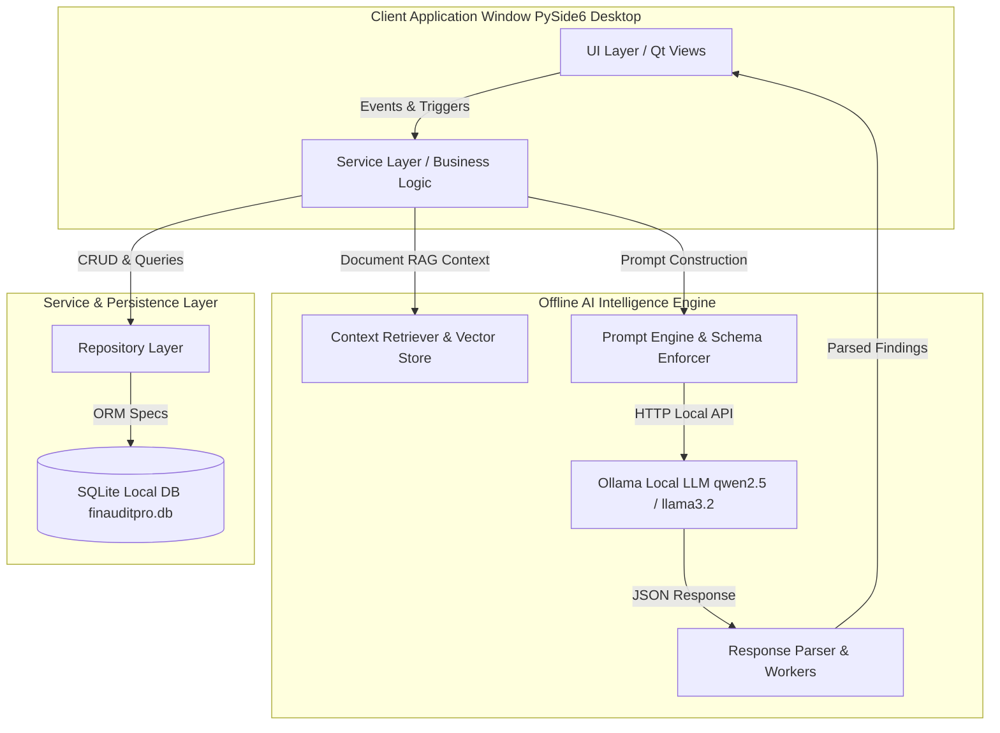
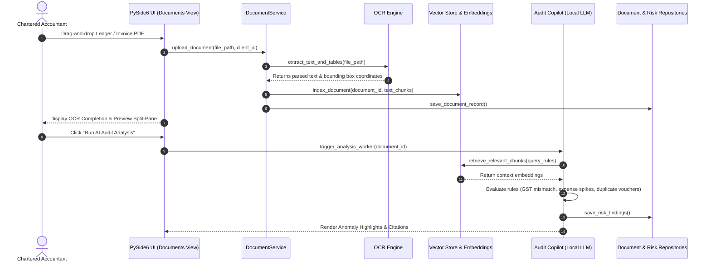
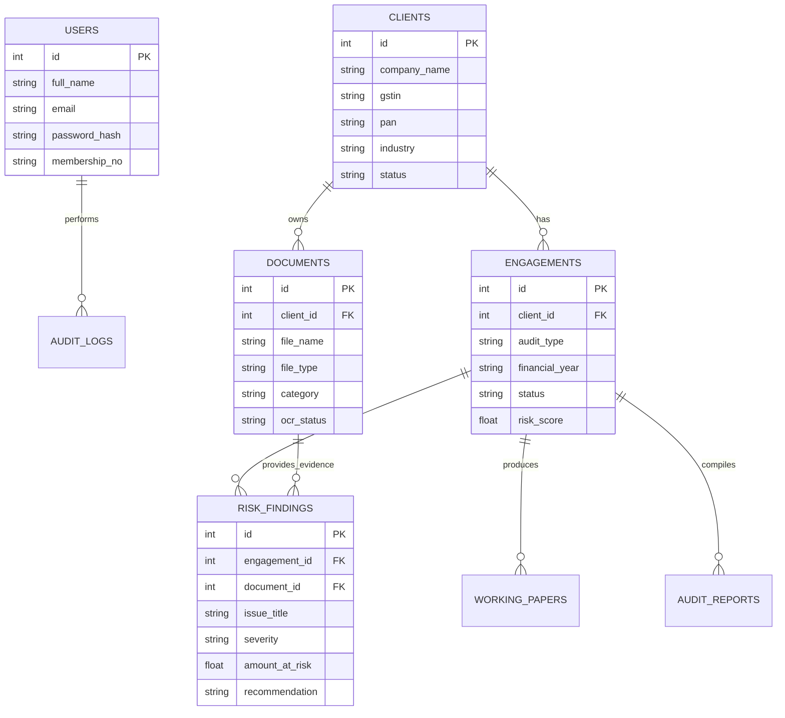

# 🛡️ FinAuditPro: Smart Offline-First AI Financial Audit Assistant

[](https://www.python.org/)
[](https://doc.qt.io/qtforpython-6/)
[](https://www.sqlalchemy.org/)
[](https://ollama.com/)
[](LICENSE)
[](HTML/finauditpro_design_specification.md)

**FinAuditPro** is an enterprise-grade, offline-first desktop application engineered specifically for Chartered Accountants (CAs), financial auditors, and tax consultants. Built with **PySide6 (Qt for Python)**, **SQLAlchemy**, and an **embedded local AI engine (Ollama RAG)**, FinAuditPro automates client engagement tracking, OCR document parsing, GST reconciliation (GSTR-2B vs 3B), statutory compliance monitoring, financial risk detection, working paper generation, and audit report drafting—**with zero client data leaving the practitioner's machine.**

---

## 📸 Executive Overview & Key Highlights

* 🔒 **100% Offline Data Privacy**: Powered by local LLM models via Ollama. No financial records, PAN/GST numbers, or client ledgers are transmitted to cloud endpoints.
* ⚡ **High-Performance PySide6 Desktop GUI**: Enterprise desktop interface designed following Tally Prime, Microsoft Office, and modern FinTech dashboard standards.
* 🤖 **Autonomous AI Audit Copilot**: Performs RAG-based document verification, flags ledger anomalies, calculates portfolio risk scores, and generates CA-standard working papers.
* 📊 **Automated GST Reconciliation**: Compares GSTR-1, GSTR-2B, and GSTR-3B filings to detect tax credit mismatches, missing invoices, and penalty risks.
* 📜 **Statutory Audit Reports**: Drafts audit opinions (Unmodified, Qualified, Adverse, Disclaimer) with complete evidence citation trails.

---

## 🏗️ System Architecture & Workflow

### 1. High-Level Architecture (Layered Pattern)



---

### 2. Document Processing & AI Analysis Sequence



---

## 📁 Repository Structure

```
FinAuditPro/
├── README.md                           # Project Documentation
├── LICENSE                             # MIT License
├── HTML/                               # UI/UX Specification & Prototypes
│   ├── finauditpro_design_specification.md  # Comprehensive Design System Spec
│   ├── finauditpro_dashboard.html      # Dashboard Screen Prototype
│   ├── finauditpro_ai_audit_analysis.html # Split-Pane AI Analysis Prototype
│   ├── finauditpro_client_management.html# Client Directory Prototype
│   └── ...                             # 15 Complete Screen Prototypes
└── src/                                # Core Application Source Code
    ├── main.py                         # Desktop Application Entry Point
    ├── ai/                             # Local AI & RAG Engine
    │   ├── audit_copilot.py            # AI Audit Analysis Worker
    │   ├── context_retriever.py        # Vector Retrieval Pipeline
    │   ├── json_schema.py              # Strict LLM Output Schemas
    │   ├── ollama_client.py            # Local Ollama API Client
    │   ├── prompt_engine.py            # Specialized Financial Prompts
    │   ├── response_parser.py          # Structured JSON & Error Parser
    │   ├── vector_store.py             # Document Chunk & Vector Index
    │   └── workers.py                  # PySide6 QThread Async Workers
    ├── core/                           # System Constants & Exceptions
    │   └── exceptions.py               # Custom Domain Exceptions
    ├── data/                           # Local SQLite Storage Directory
    │   └── finauditpro.db              # SQLite Relational Database
    ├── database/                       # Database Infrastructure
    │   ├── database.py                 # SQLAlchemy Session Engine
    │   ├── models.py                   # Relational Database Models
    │   └── repositories/               # Repository Data Access Objects
    │       ├── client_repo.py          # Client Records Repo
    │       ├── document_repo.py        # Document Storage Repo
    │       ├── engagement_repo.py      # Audit Engagement Repo
    │       ├── risk_repo.py            # Risk Finding Repo
    │       ├── working_paper_repo.py   # CA Working Papers Repo
    │       └── audit_log_repo.py       # Activity Audit Trail Repo
    ├── services/                       # Business Logic Layer
    │   ├── auth_service.py             # User Auth & Permissions
    │   ├── client_service.py           # Client Directory Service
    │   ├── document_service.py         # File Handling & OCR Service
    │   ├── engagement_service.py       # Audit Cycle Tracking
    │   ├── risk_service.py             # Risk Assessment Engine
    │   ├── compliance_service.py       # Statutory Due Date Checker
    │   ├── report_service.py           # Audit Report Generator
    │   └── working_paper_service.py    # Working Paper Builder
    └── ui/                             # PySide6 Application GUI Views
        ├── splash.py                   # App Launch & License Check
        ├── login.py                    # Desktop Authentication View
        ├── dashboard.py                # Executive KPI Dashboard View
        ├── clients.py                  # Client Management Workspace
        ├── documents.py                # File Upload & OCR Workspace
        ├── ai_analysis.py              # Split-View AI Analysis View
        ├── risk_analysis.py            # Financial Risk Heatmap View
        ├── compliance.py               # Statutory Compliance View
        ├── gst_verification.py         # GST Reconciliation Workspace
        ├── working_papers.py           # Working Paper Generator View
        ├── reports.py                  # Report Drafting & PDF Export
        ├── history.py                  # Immutable Audit Log Viewer
        ├── settings.py                 # System & LLM Configuration
        └── styles.py                   # Global QSS & Theme Tokens
```

---

## 💻 Tech Stack & Dependencies

| Component | Technology | Description |
| :--- | :--- | :--- |
| **Language** | Python 3.10+ | Core Application Runtime |
| **GUI Framework** | PySide6 (Qt 6) | High-performance Native Cross-Platform GUI |
| **Database ORM** | SQLAlchemy 2.0+ | Data Access Layer & Relational Schema Management |
| **Database Engine**| SQLite 3 | Embedded zero-configuration transactional database |
| **AI LLM Client** | Ollama API | Local LLM inference framework (`qwen2.5-coder`, `llama3.2`) |
| **PDF & Data Parsing** | PyPDF / pdfplumber | Financial Document OCR & Table Extraction |
| **Chart Visualization**| QtCharts / Matplotlib | Financial trend analytics and risk doughnut charts |

---

## 🗄️ Database Entity Schema (ERD Overview)



---

## 🚀 Quickstart & Installation Guide

### Prerequisites
1. **Python 3.10 or higher** installed on your system.
2. **Ollama Installed** locally for offline AI execution. Download from [ollama.com](https://ollama.com).

### 1. Clone the Repository
```bash
git clone https://github.com/Coderaryanyadav/FinAuditPro.git
cd FinAuditPro
```

### 2. Create and Activate Virtual Environment
```bash
# macOS / Linux
python3 -m venv venv
source venv/bin/activate

# Windows
python -m venv venv
venv\Scripts\activate
```

### 3. Install Required Dependencies
```bash
pip install --upgrade pip
pip install PySide6 sqlalchemy ollama requests pypdf pdfplumber matplotlib
```

### 4. Setup Local Ollama Model
Pull the recommended high-precision coding/financial model:
```bash
ollama pull qwen2.5-coder:7b
# or
ollama pull llama3.2:3b
```
Ensure Ollama service is running locally (`http://localhost:11434`).

### 5. Launch Application
```bash
python src/main.py
```

---

## 🎨 Design System & UX Standards

The application interface adheres to the **FinAuditPro Design System Specification** (`HTML/finauditpro_design_specification.md`), ensuring an enterprise desktop accounting aesthetic rather than a generic web look.

* **Primary Palette**: Sky Blue (`#0EA5E9`), Brand Navy (`#0284C7`), Deep Slate (`#0F172A`).
* **Typography**: `'Inter'`, `'Segoe UI'`, and `'JetBrains Mono'` (for numbers/GSTIN).
* **Grid**: Fixed 260px left sidebar + 64px header + fluid 12-column card workspace.
* **Component Standards**: Stat Cards with quarter-circle graphic accents, status pills (Emerald for Low Risk, Amber for Medium Risk, Red for High Risk), and split-pane document previewers.

---

## 📄 License & Attribution

Distributed under the **MIT License**. See `LICENSE` for details.

* Developed by **Aryan Yadav & FinAuditPro Contributor Team**.
* Design System & Documentation maintained under [HTML/finauditpro_design_specification.md](HTML/finauditpro_design_specification.md).