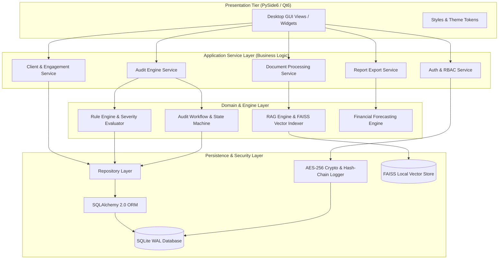
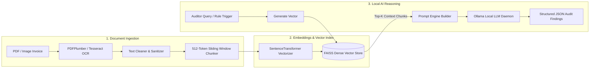
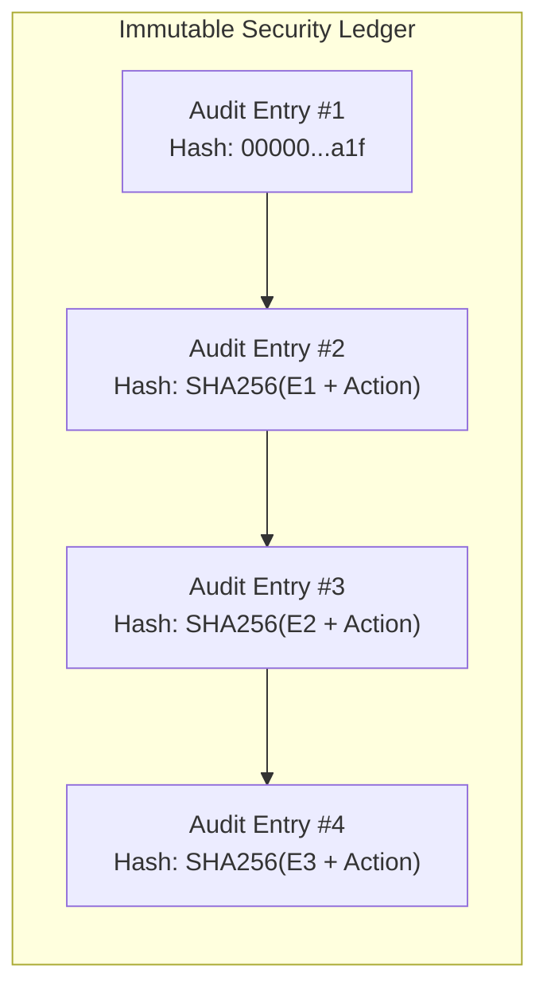

<div align="center">
  # 🚀 FinAuditPro

  **The Next-Generation AI-Powered Executive Intelligence Platform for Audit Professionals.**

  [](https://www.python.org/)
  [](https://www.qt.io/)
  [](https://www.sqlite.org/)
  [](https://ollama.ai/)
  [](LICENSE)
  [](https://github.com/Coderaryanyadav/FinAuditPro)
  [](https://github.com/Coderaryanyadav/FinAuditPro)
</div>

---

## 📖 Executive Overview

**FinAuditPro** is an offline-first desktop application engineered for Chartered Accountants (CAs), statutory auditors, and enterprise compliance teams. Combining local LLM execution (Ollama), multi-engine OCR, offline vector similarity search (FAISS), deterministic statutory rule checking, and zero-synthetic SQL analytics, FinAuditPro provides complete audit automation without ever transmitting sensitive client financial data to external cloud networks.

---

## ✨ Key Features

- 🔒 **100% Air-Gapped & Offline First**: Zero cloud calls; all AI embeddings (SentenceTransformers) and LLM inference (Ollama) run entirely on local host hardware.
- ⚡ **Pure Database-Outward Architecture**: Dynamic SQL aggregations across SQLite without synthetic mocks or static hardcoded metrics.
- 📄 **Multi-Engine Document Intelligence**: Digital text extraction via `PyPDF` with automatic OCR fallback (`PaddleOCR` / `Tesseract`) and password-protected PDF safety guards.
- 🧠 **Retrieval-Augmented Generation (RAG)**: Offline FAISS vector search (`IndexFlatIP`) indexing table-aware chunks for local LLM audit assistance.
- 🛡️ **Enterprise Security & Cryptography**: PBKDF2-HMAC-SHA256 password hashing (100k iterations), AES-256 encrypted database backup archives, and an immutable SHA-256 hash-chain audit ledger.
- 📋 **Deterministic Rule Engine**: Dynamic verification against statutory GSTIN, PAN, Section 40A(3) cash limits, and Benford's Law distribution.
- 📊 **Executive Deliverables**: Automated generation of ReportLab PDF audit packages complete with digital signatures and QR verification hashes.

---

## 🏛️ System Architecture Diagrams

### 1. High-Level Subsystem Architecture



### 2. Local RAG & Document Intelligence Pipeline



### 3. Cryptographic Audit Log Hash Chain



---

## 📚 Documentation Index (`docs/` Directory)

Comprehensive technical documentation is available in the [`docs/`](docs/) directory:

- 🏛️ [**ARCHITECTURE_OVERVIEW.md**](docs/architecture/ARCHITECTURE_OVERVIEW.md): Master System Layered Topology & Pipeline Design.
- 🗄️ [**DATABASE_ARCHITECTURE.md**](docs/architecture/DATABASE_ARCHITECTURE.md): SQLite WAL Engine, Session Management & PostgreSQL Roadmap.
- 📊 [**ER_DIAGRAM.md**](docs/architecture/ER_DIAGRAM.md): Complete 18-Entity Schema Specification & Relationships.
- 🔒 [**SECURITY_ARCHITECTURE.md**](docs/architecture/SECURITY_ARCHITECTURE.md): Cryptography, PBKDF2, AES-256-GCM & SHA-256 Hash Chains.
- 🤖 [**AI_ARCHITECTURE.md**](docs/architecture/AI_ARCHITECTURE.md): Local RAG Subsystem, FAISS Vector Indexing & Ollama LLM.
- 📈 [**REPORT_ARCHITECTURE.md**](docs/architecture/REPORT_ARCHITECTURE.md): ReportLab PDF, Excel Exporter, Digital Signatures & QR Codes.
- 🛠️ [**DEVELOPER_GUIDE.md**](docs/developer/DEVELOPER_GUIDE.md): Developer Onboarding & Code Guidelines.
- 📖 [**USER_MANUAL.md**](docs/user/USER_MANUAL.md): Step-by-Step Desktop UI Operational Manual.
- 💾 [**INSTALLATION.md**](docs/developer/INSTALLATION.md): Multi-Platform Installation & Setup.
- 🧪 [**TEST_ARCHITECTURE.md**](docs/developer/TEST_ARCHITECTURE.md): Test Execution, Pyramid & Coverage Standards.

---

## 🛠️ Technology Stack

- **Core Runtime**: Python 3.11+
- **GUI Framework**: PySide6 (Qt for Python 6.8)
- **Database & ORM**: SQLite (WAL Mode), SQLAlchemy 2.0
- **Vector Search & Embeddings**: FAISS (`faiss-cpu`), SentenceTransformers
- **Local AI Inference**: Ollama REST API (`llama3`, `deepseek-r1`)
- **Document Processing**: PDFPlumber, PyPDF, Tesseract OCR, Pillow
- **Export Engines**: ReportLab (PDF), OpenPyXL (Excel)
- **Cryptography**: PyCryptodome (AES-256-GCM), hashlib (PBKDF2, SHA-256)
- **Packaging**: PyInstaller, Inno Setup / NSIS (Windows), DMG (macOS), AppImage (Linux)

---

## 💻 One-Click Auto-Installer & Quickstart

FinAuditPro includes a **universal auto-installer bootstrapper** that automatically detects your OS, checks runtime prerequisites, creates virtual environments, installs Python dependencies, and launches the app.

### ⚡ One-Click Run (Zero Configuration Required)

- **Windows**: Double-click `install.bat` or run in terminal:
  ```cmd
  install.bat
  ```

- **macOS & Linux**: Run in terminal:
  ```bash
  chmod +x install.sh
  ./install.sh
  ```

- **Manual Bootstrapper Execution**:
  ```bash
  python scripts/bootstrap_env.py
  ```

---

### Step-by-Step Manual Setup

1. **Clone Repository**:
   ```bash
   git clone https://github.com/Coderaryanyadav/FinAuditPro.git
   cd FinAuditPro
   ```

2. **Establish Virtual Environment**:
   ```bash
   python -m venv .venv
   # Windows
   .venv\Scripts\activate
   # macOS/Linux
   source .venv/bin/activate
   ```

3. **Install Dependencies**:
   ```bash
   pip install --upgrade pip
   pip install -r requirements.txt
   ```

4. **Initialize Local Ollama Model**:
   ```bash
   ollama pull llama3
   ```

5. **Launch Application**:
   ```bash
   python src/main.py
   ```

---

## 🧪 Testing

Run the automated Pytest regression suite:

```bash
python -m pytest -o addopts="" tests/
```

---

## 📄 License & Credits

Distributed under the **MIT License**. See [`LICENSE`](LICENSE) for details.  
Developed by **Aryan Yadav**, **Jeet Shah**, and **Hitansh Jasani** ([Coderaryanyadav](https://github.com/Coderaryanyadav)).

