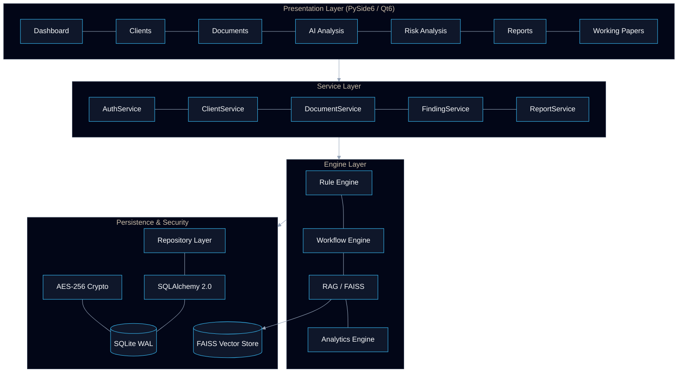
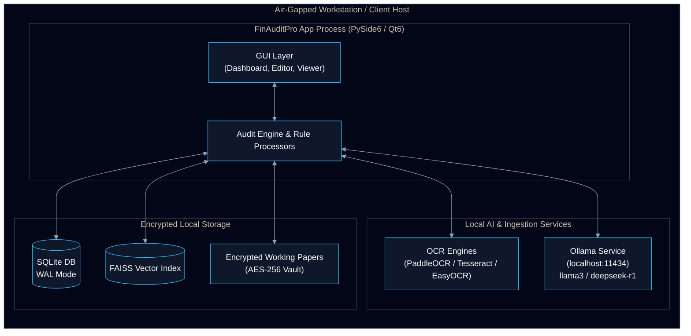
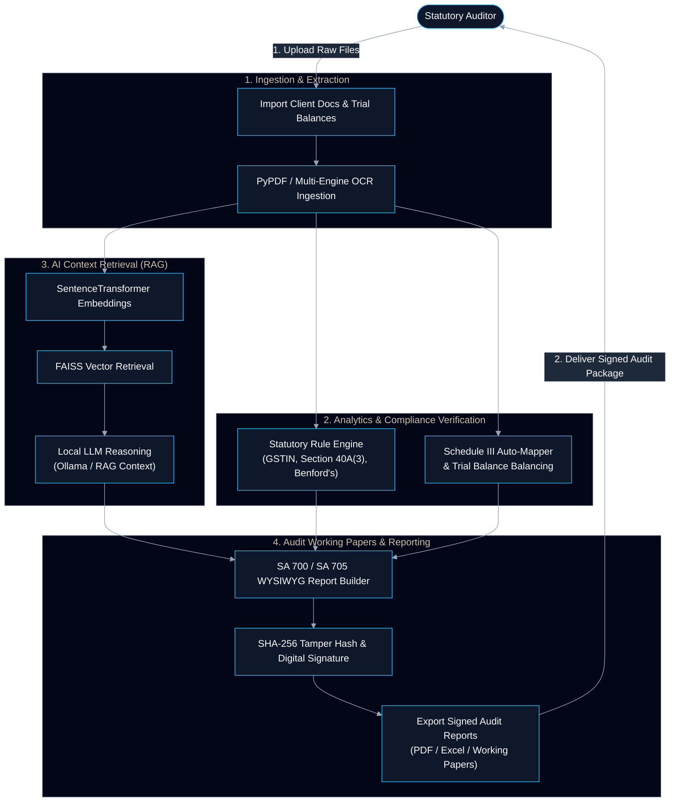

<div align="center">

  

  ### Offline-First AI-Powered Audit Intelligence Platform for Chartered Accountants.

  [](https://www.python.org/)
  [](https://www.qt.io/)
  [](https://www.sqlite.org/)
  <br>
  [](https://ollama.ai/)
  [](tests/)
  [](LICENSE)

</div>

---

<details>
<summary><b>Table of Contents</b></summary>
<br>

- [Overview](#overview)
- [Features](#features)
- [See it in action](#see-it-in-action)
- [Architecture](#architecture)
- [Technology Stack](#technology-stack)
- [Quickstart](#quickstart)
- [Tests](#tests)
- [Project Structure](#project-structure)
- [Documentation](#documentation)
- [License](#license)

</details>

---

## Overview

**FinAuditPro** is an air-gapped desktop application built for statutory auditors and CA firms. It combines local LLM inference, multi-engine OCR, offline FAISS vector search, deterministic rule checking, and cryptographic report verification — all without transmitting sensitive client data to any external server.

---

## Features

| Module | Description |
|--------|-------------|
| **Security & Auth** | PBKDF2-HMAC-SHA256 password hashing (100k iterations), RBAC with role-based permission gates, AES-256 encrypted backups, SHA-256 immutable audit ledger |
| **Document Intelligence** | PyPDF text extraction + OCR fallback (PaddleOCR / Tesseract / EasyOCR), table extraction, multi-format ingestion |
| **AI Audit Engine** | FAISS `IndexFlatIP` vector store, SentenceTransformer embeddings, RAG context retrieval via Ollama (llama3 / deepseek-r1) |
| **Rule Engine** | GSTIN / PAN format validation, Section 40A(3) cash limit detection, Benford's Law distribution analysis, CARO 2020 checklist |
| **Financial Statements** | Trial balance CSV import, Schedule III auto-mapping, Balance Sheet and P&L generation |
| **Audit Reports** | SA 700 / SA 705 WYSIWYG editor, real SHA-256 tamper hash, `DigitalSignatureManager`, `QRVerificationManager`, PDF export via `QPdfWriter` |
| **Working Papers** | Engagement-scoped audit file management, indexed document registry |
| **Analytics** | KPI cards, QtCharts spline/pie charts, real-time dashboard from live DB queries |
| **Workflow Engine** | Audit lifecycle state machine with event bus and progress tracking |

---

## See it in action

<p align="center">
  <!-- TODO: Drop in a GIF demo here. Recommended: 8–15 sec, <5MB via ScreenToGif or Kap showing importing a trial balance and generating a report -->
  
</p>

<br>

<table align="center">
  <tr>
    <td align="center" width="50%">
      <b>Dashboard</b><br/>
      <!-- TODO: Capture a 1280x800 dark theme screenshot with sample data loaded -->
      
    </td>
    <td align="center" width="50%">
      <b>Audit Report View</b><br/>
      <!-- TODO: Capture a 1280x800 dark theme screenshot showing WYSIWYG editor -->
      
    </td>
  </tr>
  <tr>
    <td align="center" colspan="2">
      <b>Rule Engine & Analytics</b><br/>
      <!-- TODO: Capture a 1280x800 dark theme screenshot showing statutory rules or charts -->
      
    </td>
  </tr>
</table>

---

## Architecture


```mermaid
%%{init: {
  'theme': 'base',
  'themeVariables': {
    'primaryColor': '#0f172a',
    'primaryTextColor': '#f8fafc',
    'primaryBorderColor': '#38bdf8',
    'lineColor': '#94a3b8',
    'secondaryColor': '#1e293b',
    'tertiaryColor': '#334155',
    'clusterBkg': '#020617',
    'clusterBorder': '#334155'
  }
}}%%
graph TD
    subgraph UI["Presentation Layer (PySide6 / Qt6)"]
        DASH[Dashboard] --- CLIENTS[Clients]
        CLIENTS --- DOCS[Documents]
        DOCS --- AI[AI Analysis]
        AI --- RISK[Risk Analysis]
        RISK --- REPORTS[Reports]
        REPORTS --- WP[Working Papers]
    end

    subgraph SVC["Service Layer"]
        AUTH_S[AuthService] --- CLIENT_S[ClientService]
        CLIENT_S --- DOC_S[DocumentService]
        DOC_S --- FINDING_S[FindingService]
        FINDING_S --- REPORT_S[ReportService]
    end

    subgraph ENGINE["Engine Layer"]
        RULE_E[Rule Engine] --- WORKFLOW_E[Workflow Engine]
        WORKFLOW_E --- AI_E[RAG / FAISS]
        AI_E --- ANALYTICS_E[Analytics Engine]
    end

    subgraph DATA["Persistence & Security"]
        REPO[Repository Layer] --- ORM[SQLAlchemy 2.0]
        ORM --- DB[(SQLite WAL)]
        SEC[AES-256 Crypto] --- DB
        VEC[(FAISS Vector Store)]
    end

    UI --> SVC
    SVC --> ENGINE
    ENGINE --> DATA
    AI_E --> VEC
```

---

### System Deployment Topology


```mermaid
%%{init: {
  'theme': 'base',
  'themeVariables': {
    'primaryColor': '#0f172a',
    'primaryTextColor': '#f8fafc',
    'primaryBorderColor': '#38bdf8',
    'lineColor': '#94a3b8',
    'secondaryColor': '#1e293b',
    'tertiaryColor': '#334155',
    'clusterBkg': '#020617',
    'clusterBorder': '#334155'
  }
}}%%
flowchart LR
    subgraph ClientHost[" Air-Gapped Workstation / Client Host"]
        subgraph AppProcess["FinAuditPro App Process (PySide6 / Qt6)"]
            UI_Layer["GUI Layer\n(Dashboard, Editor, Viewer)"]
            Core_Engine["Audit Engine & Rule Processors"]
        end

        subgraph LocalAI[" Local AI & Ingestion Services"]
            OllamaDaemon["Ollama Service\n(localhost:11434)\nllama3 / deepseek-r1"]
            OCREngines["OCR Engines\n(PaddleOCR / Tesseract / EasyOCR)"]
        end

        subgraph Storage[" Encrypted Local Storage"]
            DB[(SQLite DB\nWAL Mode)]
            FAISS_Store[(FAISS Vector Index)]
            AuditVault["Encrypted Working Papers\n(AES-256 Vault)"]
        end
    end

    UI_Layer <--> Core_Engine
    Core_Engine <--> OCREngines
    Core_Engine <--> OllamaDaemon
    Core_Engine <--> DB
    Core_Engine <--> FAISS_Store
    Core_Engine <--> AuditVault
```

---

### Data Flow Diagram (DFD)


```mermaid
%%{init: {
  'theme': 'base',
  'themeVariables': {
    'primaryColor': '#0f172a',
    'primaryTextColor': '#f8fafc',
    'primaryBorderColor': '#38bdf8',
    'lineColor': '#94a3b8',
    'secondaryColor': '#1e293b',
    'tertiaryColor': '#334155',
    'clusterBkg': '#020617',
    'clusterBorder': '#334155'
  }
}}%%
flowchart TD
    Auditor([ Statutory Auditor])

    subgraph P1["1. Ingestion & Extraction"]
        DocIngest["Import Client Docs & Trial Balances"]
        OCR_Parse["PyPDF / Multi-Engine OCR Ingestion"]
    end

    subgraph P2["2. Analytics & Compliance Verification"]
        RuleEngine["Statutory Rule Engine\n(GSTIN, Section 40A(3), Benford's)"]
        Sch3Engine["Schedule III Auto-Mapper\n& Trial Balance Balancing"]
    end

    subgraph P3["3. AI Context Retrieval (RAG)"]
        Embedder["SentenceTransformer Embeddings"]
        FAISSIndex["FAISS Vector Retrieval"]
        OllamaRAG["Local LLM Reasoning\n(Ollama / RAG Context)"]
    end

    subgraph P4["4. Audit Working Papers & Reporting"]
        ReportGen["SA 700 / SA 705 WYSIWYG Report Builder"]
        CryptoSign["SHA-256 Tamper Hash & Digital Signature"]
        ExportEngine["Export Signed Audit Reports\n(PDF / Excel / Working Papers)"]
    end

    Auditor -->|1. Upload Raw Files| DocIngest
    DocIngest --> OCR_Parse
    OCR_Parse --> RuleEngine
    OCR_Parse --> Sch3Engine

    OCR_Parse --> Embedder
    Embedder --> FAISSIndex
    FAISSIndex --> OllamaRAG
    OllamaRAG --> ReportGen

    RuleEngine --> ReportGen
    Sch3Engine --> ReportGen

    ReportGen --> CryptoSign
    CryptoSign --> ExportEngine
    ExportEngine -->|2. Deliver Signed Audit Package| Auditor
```

---

## Technology Stack

| Category | Technology | Usage & Specification |
|---|---|---|
| **GUI Framework** | [](https://www.qt.io/) | Qt6 cross-platform desktop UI framework with dark theme styling |
| **Database & ORM** | [](https://www.sqlite.org/) | SQLAlchemy 2.0 ORM with Write-Ahead Logging (WAL) concurrency |
| **Local AI Engine** | [](https://ollama.ai/) | Air-gapped RAG pipeline via `llama3` / `deepseek-r1` REST API |
| **Vector Search** | [](https://github.com/facebookresearch/faiss) | `faiss-cpu` vector store with `SentenceTransformer` embeddings |
| **OCR Engines** | Multi-Engine OCR | Auto-fallback cascade: PaddleOCR $\rightarrow$ Tesseract $\rightarrow$ EasyOCR |
| **PDF & Reporting** | ReportLab & QPdfWriter | High-fidelity SA 700 / SA 705 audit report generation & PDF export |
| **Cryptography** | AES-256 & SHA-256 | PBKDF2-HMAC password hashing, encrypted vault, immutable log ledger |

---

> [!IMPORTANT]
> ###  100% Offline & Air-Gap Compliance Guarantee
> **FinAuditPro** is built from the ground up for strict confidentiality. It makes **zero outbound network connections**. All LLM inferences, document embeddings, vector indexing, OCR processing, and database operations execute strictly on your local workstation host.

---

## Quickstart

### Prerequisites

- Python 3.11+
- [Ollama](https://ollama.ai/) installed and running locally (`ollama serve`)

### Installation

```bash
# 1. Clone the repository
git clone https://github.com/Coderaryanyadav/FinAuditPro.git
cd FinAuditPro

# 2. Set up virtual environment
python -m venv .venv

# Windows:
.venv\Scripts\activate
# macOS / Linux:
source .venv/bin/activate

# 3. Install dependencies
pip install --upgrade pip
pip install -r requirements.txt

# 4. Pull a local LLM model (Ollama)
ollama pull llama3

# 5. Launch application
python src/main.py
```

**Windows One-Click Installer:**
```cmd
install.bat
```

**macOS / Linux One-Click Installer:**
```bash
chmod +x install.sh && ./install.sh
```

---

## Tests

```bash
pytest tests/ -v
```

**Current status: 51/51 passing** across security, analytics, reporting, rule engine, document intelligence, deployment, config, and UI component integration tests.

---

## Project Structure

```text
FinAuditPro/
├── src/
│   ├── main.py                    # Application entry point
│   ├── core/config.py             # Pydantic AppConfig settings
│   ├── ui/                        # PySide6 desktop interface components
│   ├── services/                  # Business logic & authentication layer
│   ├── database/
│   │   ├── models.py              # SQLAlchemy ORM models
│   │   └── repositories/          # Repository pattern DAOs
│   ├── security/                  # RBAC, AES-256 crypto, audit ledger
│   ├── ai/                        # Local Ollama client, FAISS RAG pipeline
│   ├── reporting/                 # PDF generator, digital signatures, QR validation
│   ├── rule_engine/               # Statutory compliance rules (GSTIN, Sec 40A(3), Benford)
│   ├── document_intelligence/     # PyPDF & Multi-engine OCR pipeline
│   ├── analytics/                 # KPI cards, forecasting, QtCharts
│   └── workflow/                  # Audit lifecycle state machine & event bus
├── tests/                         # Pytest integration & unit test suite
│   └── sample_data/               # Sample bank statements & financial trial balances
├── docs/                          # Architecture guides & documentation
│   ├── assets/                    # Diagram assets & visual documentation
│   └── dev-notes/                 # Developer notes & maintenance logs
├── scripts/                       # Deployment, installer, & packaging scripts
├── pyproject.toml                 # Build system & linting configuration
├── requirements.txt               # Production Python dependencies
├── requirements-dev.txt           # Development & testing dependencies
├── FinAuditPro.spec               # PyInstaller executable build spec
├── install.bat                    # Windows one-click installer
└── install.sh                     # macOS/Linux one-click installer
```

---

## Documentation

Full technical docs are located in [`docs/`](docs/):

- [`ARCHITECTURE.md`](docs/ARCHITECTURE.md) — Clean architecture & layer specifications
- [`ARCHITECTURE_GUIDE.md`](docs/architecture/ARCHITECTURE_GUIDE.md) — Architecture guide & security setup
- [`DFD_LEVEL_0.md`](docs/architecture/DFD_LEVEL_0.md) — Level 0 Data Flow Context Diagram
- [`DEVELOPER_GUIDE.md`](docs/DEVELOPER_GUIDE.md) — Contributor onboarding
- [`USER_MANUAL.md`](docs/USER_MANUAL.md) — End-user operational guide

---

## License

MIT License — see [`LICENSE`](LICENSE).

<br>

---

<div align="center">
  <sub>Built with  by <b>Aryan Yadav</b>, <b>Jeet Shah</b>, and <b>Hitansh Jasani</b> (<a href="https://github.com/Coderaryanyadav">@Coderaryanyadav</a>)</sub>
</div>

