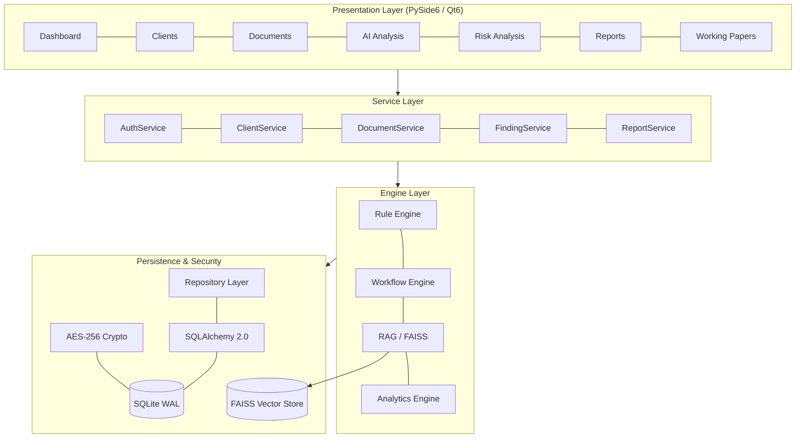

<div align="center">

# 🏛️ FinAuditPro

**Offline-First AI-Powered Audit Intelligence Platform for Chartered Accountants.**

[](https://www.python.org/)
[](https://www.qt.io/)
[](https://www.sqlite.org/)
[](https://ollama.ai/)
[](tests/)
[](LICENSE)

</div>

---

## 📖 Overview

**FinAuditPro** is an air-gapped desktop application built for statutory auditors and CA firms. It combines local LLM inference, multi-engine OCR, offline FAISS vector search, deterministic rule checking, and cryptographic report verification — all without transmitting sensitive client data to any external server.

---

## ✨ Features

| Module | Description |
|--------|-------------|
| 🔒 **Security & Auth** | PBKDF2-HMAC-SHA256 password hashing (100k iterations), RBAC with role-based permission gates, AES-256 encrypted backups, SHA-256 immutable audit ledger |
| 📄 **Document Intelligence** | PyPDF text extraction + OCR fallback (PaddleOCR / Tesseract / EasyOCR), table extraction, multi-format ingestion |
| 🧠 **AI Audit Engine** | FAISS `IndexFlatIP` vector store, SentenceTransformer embeddings, RAG context retrieval via Ollama (llama3 / deepseek-r1) |
| 📋 **Rule Engine** | GSTIN / PAN format validation, Section 40A(3) cash limit detection, Benford's Law distribution analysis, CARO 2020 checklist |
| 📊 **Financial Statements** | Trial balance CSV import, Schedule III auto-mapping, Balance Sheet and P&L generation |
| 📑 **Audit Reports** | SA 700 / SA 705 WYSIWYG editor, real SHA-256 tamper hash, `DigitalSignatureManager`, `QRVerificationManager`, PDF export via `QPdfWriter` |
| 🗂️ **Working Papers** | Engagement-scoped audit file management, indexed document registry |
| 📈 **Analytics** | KPI cards, QtCharts spline/pie charts, real-time dashboard from live DB queries |
| 🔄 **Workflow Engine** | Audit lifecycle state machine with event bus and progress tracking |

---

## 🏛️ Architecture


```mermaid
graph TD
    subgraph UI["Presentation Layer (PySide6 / Qt6)"]
        DASH[Dashboard] --- CLIENTS[Clients]
        CLIENTS --- DOCS[Documents]
        DOCS --- AI[AI Analysis]
        AI --- RISK[Risk Analysis]
        RISK --- REPORTS[Reports]
        REPORTS --- WP[Working Papers]
    end

    subgraph SVC["Service Layer"]
        AUTH_S[AuthService] --- CLIENT_S[ClientService]
        CLIENT_S --- DOC_S[DocumentService]
        DOC_S --- FINDING_S[FindingService]
        FINDING_S --- REPORT_S[ReportService]
    end

    subgraph ENGINE["Engine Layer"]
        RULE_E[Rule Engine] --- WORKFLOW_E[Workflow Engine]
        WORKFLOW_E --- AI_E[RAG / FAISS]
        AI_E --- ANALYTICS_E[Analytics Engine]
    end

    subgraph DATA["Persistence & Security"]
        REPO[Repository Layer] --- ORM[SQLAlchemy 2.0]
        ORM --- DB[(SQLite WAL)]
        SEC[AES-256 Crypto] --- DB
        VEC[(FAISS Vector Store)]
    end

    UI --> SVC
    SVC --> ENGINE
    ENGINE --> DATA
    AI_E --> VEC
```

---

## 🛠️ Technology Stack

- **GUI**: PySide6 6.7 (Qt for Python)
- **ORM / DB**: SQLAlchemy 2.0, SQLite with WAL mode
- **AI**: Ollama REST API, FAISS `faiss-cpu`, SentenceTransformers
- **OCR**: PaddleOCR, EasyOCR, Tesseract (auto-detected at runtime)
- **PDF**: `QPdfWriter` (Qt), ReportLab `SimpleDocTemplate`
- **Excel**: OpenPyXL
- **Crypto**: `hashlib` PBKDF2-HMAC-SHA256, PyCryptodome AES-256-GCM
- **Config**: Pydantic `BaseSettings` (`src/core/config.py`)
- **Packaging**: PyInstaller (`FinAuditPro.spec`)

---

## 🚀 Quickstart

### Prerequisites

- Python 3.11+
- [Ollama](https://ollama.ai/) installed and running locally

### Installation

```bash
# 1. Clone
git clone https://github.com/Coderaryanyadav/FinAuditPro.git
cd FinAuditPro

# 2. Virtual environment
python -m venv .venv
# Windows:
.venv\Scripts\activate
# macOS / Linux:
source .venv/bin/activate

# 3. Install dependencies
pip install --upgrade pip
pip install -r requirements.txt

# 4. Pull a local LLM model
ollama pull llama3

# 5. Launch
python src/main.py
```

**Windows one-click:**
```cmd
install.bat
```

**macOS / Linux one-click:**
```bash
chmod +x install.sh && ./install.sh
```

---

## 🧪 Tests

```bash
pytest tests/ -v
```

**Current status: 51/51 passing** across security, analytics, reporting, rule engine, document intelligence, deployment, config, and UI component integration tests.

---

## 📁 Project Structure

```
FinAuditPro/
├── src/
│   ├── main.py                    # Application entry point
│   ├── core/config.py             # Pydantic AppConfig
│   ├── ui/                        # PySide6 widget screens
│   ├── services/                  # Business logic layer
│   ├── database/
│   │   ├── models.py              # SQLAlchemy ORM models
│   │   └── repositories/          # Repository pattern DAOs
│   ├── security/                  # Auth, RBAC, crypto, audit trail
│   ├── ai/                        # Ollama client, FAISS, workers
│   ├── reporting/                 # PDF, Excel, digital signature, QR
│   ├── rule_engine/               # Deterministic statutory rules
│   ├── document_intelligence/     # OCR, chunking, embedding pipeline
│   ├── analytics/                 # KPI, forecasting, charts
│   └── workflow/                  # Audit lifecycle state machine
├── tests/                         # Pytest test suite
├── docs/                          # Technical documentation
├── scripts/                       # Bootstrap, packaging, installers
├── 05_Sample_Input_Files/         # Sample CSVs and XLSXs for testing
├── requirements.txt
├── pyproject.toml
├── FinAuditPro.spec               # PyInstaller release spec
├── install.bat                    # Windows one-click installer
└── install.sh                     # macOS/Linux one-click installer
```

---

## 📚 Documentation

Full technical docs are in [`docs/`](docs/):

- [`ARCHITECTURE.md`](docs/ARCHITECTURE.md) — Clean architecture & layer specifications
- [`ARCHITECTURE_GUIDE.md`](docs/architecture/ARCHITECTURE_GUIDE.md) — Architecture guide & security setup
- [`DFD_LEVEL_0.md`](docs/architecture/DFD_LEVEL_0.md) — Level 0 Data Flow Context Diagram
- [`DEVELOPER_GUIDE.md`](docs/DEVELOPER_GUIDE.md) — Contributor onboarding
- [`USER_MANUAL.md`](docs/USER_MANUAL.md) — End-user operational guide

---

## 📄 License

MIT License — see [`LICENSE`](LICENSE).

Developed by **Aryan Yadav**, **Jeet Shah**, and **Hitansh Jasani** ([@Coderaryanyadav](https://github.com/Coderaryanyadav)).
