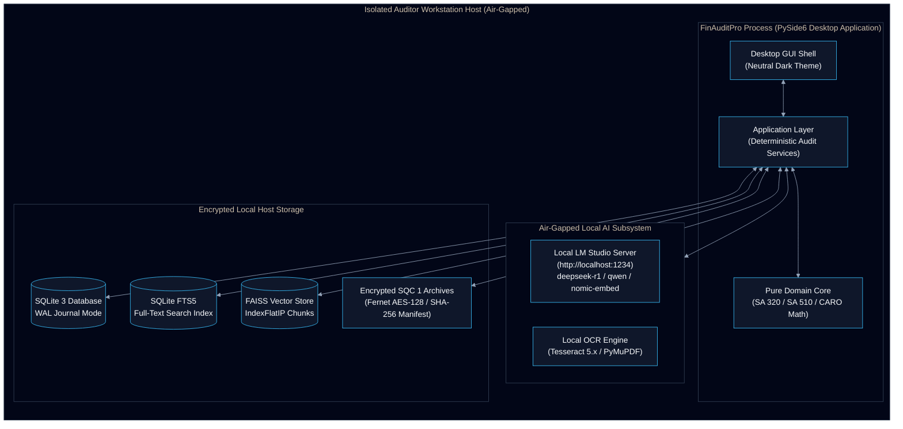
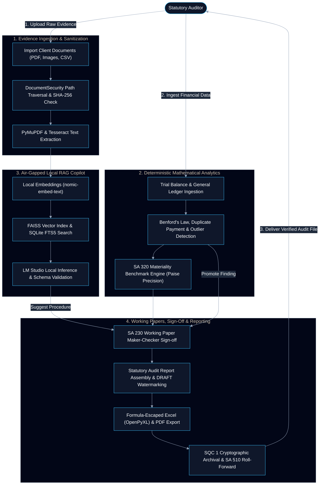

<div align="center">

  <h1>FinAuditPro</h1>

  <h3>Offline-First AI-Powered Audit Intelligence Platform for Statutory Audit Practice</h3>

  <p><i>Tailored for Indian Chartered Accountants, Statutory Auditors, and Compliance Professionals (SA 320, SA 230, SA 510, CARO 2020)</i></p>

  [](https://www.python.org/)
  [](https://www.qt.io/)
  [](https://www.sqlite.org/)
  [](https://lmstudio.ai/)
  [](tests/)
  [](pyproject.toml)
  [](pyproject.toml)
  [](LICENSE)

</div>

---

<details>
<summary><b>Table of Contents</b></summary>
<br>

- [Overview](#overview)
- [Key Features](#key-features)
- [System Architecture](#system-architecture)
  - [4-Layer Domain-Driven Architecture](#4-layer-domain-driven-architecture)
  - [Air-Gapped Workstation Deployment Topology](#air-gapped-workstation-deployment-topology)
  - [Audit Evidence Data Flow Diagram (DFD)](#audit-evidence-data-flow-diagram-dfd)
- [Technology Stack](#technology-stack)
- [Quickstart Guide](#quickstart-guide)
  - [Prerequisites](#prerequisites)
  - [Installation & Launch](#installation--launch)
- [Automated Verification & Diagnostics](#automated-verification--diagnostics)
- [Repository Structure](#repository-structure)
- [Documentation Map](#documentation-map)
- [Security & Air-Gap Guarantee](#security--air-gap-guarantee)
- [License & Authors](#license--authors)

</details>

---

## Overview

**FinAuditPro** is an air-gapped, offline-first desktop audit operating system designed specifically for Indian statutory audit practice. It provides Chartered Accountants (CAs) and audit firms with deterministic mathematical analytics, automated SA 320 materiality calculation, PyMuPDF and Tesseract OCR document extraction, SQLite FTS5 full-text indexing, FAISS local vector similarity search, electronic working paper maker-checker workflows, and SQC 1 sealed archival — all powered by local LLM reasoning (via LM Studio) without ever sending client financial records to external cloud servers.

---

## Key Features

| Subsystem | Core Capabilities & Statutory Standards |
| :--- | :--- |
| **Workspace & Multi-Tenancy** | 3-tier hierarchy (`Firm` $\rightarrow$ `Client` $\rightarrow$ `Engagement`), financial year scoping (`FY 2024-25`), single-tenant SQLite multi-engagement partitioning with strict `engagement_id` query isolation. |
| **Financial Ingestion & Analytics** | Automated Trial Balance, General Ledger, and Bank Statement import; **exact integer paise** calculation precision; Benford's 1st Law Chi-Square ($\chi^2$) analysis; duplicate payment detection; weekend/holiday posting detectors; high-value outlier z-scores. |
| **Audit Matrix & Materiality** | SA 320 compliant materiality engine (Overall, Performance, and Trivial threshold calculations based on Revenue/PBT/Assets benchmarks); risk assessment and planned audit procedure matrix. |
| **Document Processing & OCR** | Multi-format ingestion (PDF, PNG, JPG, CSV, TXT); PyMuPDF vector text extraction + Tesseract OCR fallback; SQLite FTS5 full-text indexing; SHA-256 evidence digests; path traversal and ZIP slip protection. |
| **Air-Gapped AI Copilot (RAG)** | Local LM Studio REST integration (`http://localhost:1234`); `nomic-embed-text` embeddings with FAISS vector indexing; `<think>` reasoning token neutralization; prompt injection defense; mandatory `[AI Generated]` disclaimers with human override. |
| **Working Papers & Sign-Off** | SA 230 electronic working paper lifecycle (`Draft` $\rightarrow$ `InReview` $\rightarrow$ `SignedOff`); maker-checker segregation of duties; open review notes blocking validation; SHA-256 content hash locking. |
| **Statutory Reporting & Export** | Dynamic ReportLab PDF generation with automatic `"DRAFT"` watermark management; spreadsheet formula-injection escaping (`'=...`) in OpenPyXL exports; full audit event provenance logging. |
| **Archival & SA 510 Roll-Forward** | SQC 1 engagement sealing with internal SHA-256 manifest validation; SQLite `PRAGMA query_only = ON` lock; multi-year roll-forward with carried-forward findings; SA 510 opening balance tie-out variance analysis. |

---

## System Architecture

### 4-Layer Domain-Driven Architecture

FinAuditPro strictly enforces clean layer separation. Dependencies flow inward toward the pure domain layer:


```mermaid
%%{init: {
  'theme': 'base',
  'themeVariables': {
    'primaryColor': '#0f172a',
    'primaryTextColor': '#f8fafc',
    'primaryBorderColor': '#38bdf8',
    'lineColor': '#94a3b8',
    'secondaryColor': '#1e293b',
    'tertiaryColor': '#334155',
    'clusterBkg': '#020617',
    'clusterBorder': '#334155'
  }
}}%%
graph TD
    subgraph UI["1. Presentation Layer (PySide6 / Qt6.8)"]
        DASH[Dashboard View] --- DOCS[Document View]
        DOCS --- FIN[Financial Data View]
        FIN --- MATRIX[Audit Matrix View]
        MATRIX --- WP[Working Papers View]
        WP --- AI_V[AI Copilot View]
        AI_V --- REP[Report View]
        REP --- ARCH[Archival & Roll-Forward View]
    end

    subgraph APP["2. Application Layer (Services & DTOs)"]
        ENG_S[EngagementService] --- DOC_S[DocumentService]
        DOC_S --- FIN_S[FinancialDataService]
        FIN_S --- MAT_S[AuditMatrixService]
        MAT_S --- WP_S[WorkingPaperService]
        WP_S --- REP_S[ReportService]
        REP_S --- ARC_S[ArchivalService]
        ARC_S --- AI_S[AIService]
    end

    subgraph DOM["3. Pure Domain Layer (Entities & Rules)"]
        DOM_E[Domain Entities] --- MAT_ENG[SA 320 Materiality Engine]
        MAT_ENG --- BEN_ENG[Benford's Law Engine]
        BEN_ENG --- SAN_ENG[Formula Injection Sanitizer]
        SAN_ENG --- PRM_ENG[Prompt Defense Engine]
    end

    subgraph INFRA["4. Infrastructure Layer (Drivers & Persistence)"]
        ORM[SQLAlchemy 2.0 ORM] --- MIGRATIONS[Migrations 1..9]
        MIGRATIONS --- DB[(SQLite WAL + FTS5)]
        EXTRACT[PyMuPDF & Tesseract OCR] --- FAISS[(FAISS Vector Store)]
        FAISS --- LM_CLIENT[LM Studio HTTP Provider]
        LM_CLIENT --- PDF_GEN[ReportLab PDF Engine]
    end

    UI --> APP
    APP --> DOM
    INFRA --> DOM
    INFRA --> APP
    APP -.->|Repositories| INFRA
```

---

### Air-Gapped Workstation Deployment Topology


```mermaid
%%{init: {
  'theme': 'base',
  'themeVariables': {
    'primaryColor': '#0f172a',
    'primaryTextColor': '#f8fafc',
    'primaryBorderColor': '#38bdf8',
    'lineColor': '#94a3b8',
    'secondaryColor': '#1e293b',
    'tertiaryColor': '#334155',
    'clusterBkg': '#020617',
    'clusterBorder': '#334155'
  }
}}%%
flowchart LR
    subgraph Host[" Isolated Auditor Workstation Host (Air-Gapped)"]
        subgraph AppProcess["FinAuditPro Process (PySide6 Desktop Application)"]
            UI_Layer["Desktop GUI Shell\n(Neutral Dark Theme)"]
            Services["Application Layer\n(Deterministic Audit Services)"]
            Domain["Pure Domain Core\n(SA 320 / SA 510 / CARO Math)"]
        end

        subgraph LocalAI[" Air-Gapped Local AI Subsystem"]
            LMStudio["Local LM Studio Server\n(http://localhost:1234)\ndeepseek-r1 / qwen / nomic-embed"]
            OCR["Local OCR Engine\n(Tesseract 5.x / PyMuPDF)"]
        end

        subgraph Storage[" Encrypted Local Host Storage"]
            DB[(SQLite 3 Database\nWAL Journal Mode)]
            FTS[(SQLite FTS5\nFull-Text Search Index)]
            VectorStore[(FAISS Vector Store\nIndexFlatIP Chunks)]
            Archives["Encrypted SQC 1 Archives\n(Fernet AES-128 / SHA-256 Manifest)"]
        end
    end

    UI_Layer <--> Services
    Services <--> Domain
    Services <--> LocalAI
    Services <--> DB
    Services <--> FTS
    Services <--> VectorStore
    Services <--> Archives
```

---

### Audit Evidence Data Flow Diagram (DFD)


```mermaid
%%{init: {
  'theme': 'base',
  'themeVariables': {
    'primaryColor': '#0f172a',
    'primaryTextColor': '#f8fafc',
    'primaryBorderColor': '#38bdf8',
    'lineColor': '#94a3b8',
    'secondaryColor': '#1e293b',
    'tertiaryColor': '#334155',
    'clusterBkg': '#020617',
    'clusterBorder': '#334155'
  }
}}%%
flowchart TD
    Auditor([ Statutory Auditor])

    subgraph P1["1. Evidence Ingestion & Sanitization"]
        DocIngest["Import Client Documents (PDF, Images, CSV)"]
        SecCheck["DocumentSecurity Path Traversal & SHA-256 Check"]
        TextExt["PyMuPDF & Tesseract Text Extraction"]
    end

    subgraph P2["2. Deterministic Mathematical Analytics"]
        FinancialImport["Trial Balance & General Ledger Ingestion"]
        Analytics["Benford's Law, Duplicate Payment & Outlier Detection"]
        Materiality["SA 320 Materiality Benchmark Engine (Paise Precision)"]
    end

    subgraph P3["3. Air-Gapped Local RAG Copilot"]
        Embedder["Local Embeddings (nomic-embed-text)"]
        FAISS_Idx["FAISS Vector Index & SQLite FTS5 Search"]
        LM_Inference["LM Studio Local Inference & Schema Validation"]
    end

    subgraph P4["4. Working Papers, Sign-Off & Reporting"]
        WP_Lifecycle["SA 230 Working Paper Maker-Checker Sign-off"]
        Report_Gen["Statutory Audit Report Assembly & DRAFT Watermarking"]
        Safe_Export["Formula-Escaped Excel (OpenPyXL) & PDF Export"]
        Archive_Seal["SQC 1 Cryptographic Archival & SA 510 Roll-Forward"]
    end

    Auditor -->|1. Upload Raw Evidence| DocIngest
    DocIngest --> SecCheck --> TextExt
    TextExt --> Embedder --> FAISS_Idx --> LM_Inference
    
    Auditor -->|2. Ingest Financial Data| FinancialImport
    FinancialImport --> Analytics --> Materiality
    
    Analytics -->|Promote Finding| WP_Lifecycle
    LM_Inference -->|Suggest Procedure| WP_Lifecycle
    Materiality --> WP_Lifecycle
    
    WP_Lifecycle --> Report_Gen
    Report_Gen --> Safe_Export
    Safe_Export --> Archive_Seal
    Archive_Seal -->|3. Deliver Verified Audit File| Auditor
```

---

## Technology Stack

| Category | Technology | Specification & Purpose |
| :--- | :--- | :--- |
| **Desktop GUI** | [](https://www.qt.io/) | High-density desktop UI shell with neutral dark surfaces (`#0f1117`, `#181b22`, `#222732`). |
| **Database & ORM** | [](https://www.sqlite.org/) | SQLAlchemy 2.0 ORM with Write-Ahead Logging (WAL) and migrations 1..9. |
| **Full-Text Search** | [](https://www.sqlite.org/fts5.html) | Virtual table porter tokenization for millisecond document keyword search. |
| **Local AI Engine** | [](https://lmstudio.ai/) | Air-gapped local OpenAI-compatible REST endpoint (`http://localhost:1234`). |
| **Vector Indexing** | [](https://github.com/facebookresearch/faiss) | CPU-optimized `IndexFlatIP` vector index for local document retrieval. |
| **OCR & Extraction** | PyMuPDF & Tesseract | Vector PDF extraction with automated fallback to Tesseract 5.x OCR. |
| **PDF Reporting** | ReportLab 4.2+ | Dynamic statutory audit report compiler with `"DRAFT"` watermark engine. |
| **Spreadsheet Safety** | OpenPyXL Sanitizer | Automatic formula-injection escaping (`'=...`) for all CSV/XLSX exports. |
| **Cryptography** | Cryptography (Fernet) | PBKDF2-HMAC salt derivation, AES-128-CBC encryption, and SHA-256 ledgers. |
| **Static Verification** | Ruff & MyPy | Strict type checking (`mypy --strict`) and 0-warning linter enforcement. |

---

> [!IMPORTANT]
> ### 🛡️ 100% Air-Gap & Confidentiality Guarantee
> **FinAuditPro** is engineered for statutory confidentiality. It makes **zero outbound internet connections**. All document OCR processing, LLM inferences, vector embeddings, mathematical analytics, database transactions, and report generation run **100% locally on your machine**.

---

---

## Production Releases & Downloads

Pre-built, standalone release packages are available on the [GitHub Releases](https://github.com/Coderaryanyadav/FinAuditPro/releases) page:

### 🍏 macOS (Apple Silicon & Intel)
1. Download `FinAuditPro-1.0.0-macOS-arm64.dmg` (or Intel `x86_64`).
2. Double-click the DMG to open the installer.
3. Drag **FinAuditPro** into your **Applications** folder.
4. Launch FinAuditPro from Launchpad or Spotlight.

### 🪟 Windows (64-bit)
1. Download `FinAuditPro-Setup-1.0.0-x64.exe` (or standalone portable `.zip`).
2. Run the installer wizard (or extract portable folder).
3. Launch **FinAuditPro** from your Start Menu or Desktop shortcut.

> *All release binaries are standalone and require zero manual Python installation.* For full packaging details, see [RELEASE.md](RELEASE.md).

---

## Quickstart Guide (Running from Source)

### Prerequisites

- **Python**: Python 3.12 or higher (verified on Python 3.12, 3.13, and 3.14)
- **OS**: macOS (Apple Silicon arm64 / Intel), Linux x64, or Windows x64
- **Optional Tools**:
  - `tesseract` (for OCR on scanned images: `brew install tesseract` on macOS / `sudo apt-get install tesseract-ocr` on Linux)
  - [LM Studio](https://lmstudio.ai/) (for local AI assistant features: load `deepseek-r1-distill-qwen-14b` and start server on port 1234)

---

### Installation & Launch

```bash
# 1. Clone the repository
git clone https://github.com/Coderaryanyadav/FinAuditPro.git
cd FinAuditPro

# 2. Create and activate virtual environment
python3 -m venv .venv

# macOS / Linux:
source .venv/bin/activate
# Windows (cmd/PowerShell):
.venv\Scripts\activate

# 3. Install in editable mode with optional feature packages
pip install --upgrade pip
pip install -e .[ocr,ai]
pip install -r requirements-dev.txt

# 4. Run automated pre-flight system diagnostics
python scripts/development/automated_system_check.py

```bash
# 5. Launch the desktop application
python -m finauditpro
```

> **Default Administrator Credentials:**
> - **Username:** `admin@finauditpro.com`
> - **Password:** `Admin@123`
> *(Seeded automatically on first launch; manage users in Settings)*

---

## Automated Verification & Diagnostics

```bash
# Run the complete test suite (138/138 passing)
pytest tests/ -v

# Run strict static type checking
mypy src/finauditpro

# Run code linter
ruff check src/ tests/ scripts/

# Run the master 15-stage 1,000-point forensic runner
python scripts/development/run_1000_verifications.py

# Run statutory database optimization
python scripts/maintenance/vacuum_and_reindex.py
```

**Test Suite Status**: **138 passed (100%)** across domain calculations, security hardening, multi-tenant database isolation, maker-checker sign-offs, FTS5 search, and multi-year roll-forward tie-outs.

---

## Repository Structure

```text
FinAuditPro/
├── README.md                      # Primary project overview & documentation index
├── LICENSE                        # MIT License
├── SECURITY.md                    # Canonical security policy & vulnerability reporting
├── CONTRIBUTING.md                # Development workflow & contribution guide
├── CODE_OF_CONDUCT.md             # Contributor Covenant code of conduct
├── CHANGELOG.md                   # Keep a Changelog format release notes (Root ONLY)
├── pyproject.toml                 # Packaging & tool configurations (pytest, ruff, mypy)
├── uv.lock                        # Deterministic dependency lockfile (Single Source of Truth)
├── requirements.txt               # Generated production runtime dependencies (uv export)
├── requirements-dev.txt           # Generated development & testing dependencies (uv export)
├── finauditpro.spec               # PyInstaller standalone build specification
├── .gitignore                     # Git ignore rules for caches, builds, DBs, and client data
├── .env.example                   # Machine environment variable overrides template
├── .python-version                # Target Python version pin (3.12+)
│
├── src/
│   └── finauditpro/               # 4-Layer Domain-Driven Architecture Source Tree
│       ├── __init__.py            # Package root (__version__ = "1.0.0")
│       ├── __main__.py            # Desktop GUI & headless CLI entry point
│       ├── domain/                # Pure entities, value objects & calculation rules
│       ├── application/           # Application services, DTOs & security coordinators
│       ├── infrastructure/        # SQLite ORM, migrations 1..9, OCR, FAISS & ReportLab
│       └── ui/                    # PySide6 desktop views, dialogs & neutral dark theme
│
├── tests/                         # 130-Test Automated QA Verification Suite
│   ├── fixtures/                  # Synthetic audit test spreadsheets & datasets
│   ├── conftest.py                # Shared fixtures & test database managers
│   └── test_*.py                  # Unit, integration, security & architecture tests
│
├── docs/                          # Structured Technical & Statutory Documentation
│   ├── README.md                  # Master documentation map
│   ├── product-audit-and-redesign.md # Tier-1 product audit & UX redesign blueprint
│   ├── guide.md                   # End-to-end operational guide & strategic assessment
│   ├── installation.md            # Installation & launch guide
│   ├── design.md                  # UI/UX design tokens & visual hierarchy specification
│   ├── decisions.md               # Architecture Decision Records (ADRs 001..005)
│   ├── roadmap.md                 # Product milestones & future engineering goals
│   ├── CHANGELOG.md               # Version release notes & milestone history
│   ├── architecture/              # System & SQLite database architecture
│   ├── features/                  # Subsystem functional specifications
│   ├── security/                  # Security model & threat defense guide
│   ├── development/               # Developer onboarding & QA guide
│   └── operations/                # Operational runbooks & troubleshooting
│
├── scripts/                       # Categorized Developer & Operational Automation
│   ├── README.md                  # Script reference guide
│   ├── development/               # Supervised launcher & diagnostic runners
│   ├── packaging/                 # PyInstaller bundle, Windows ISS, Linux desktop & macOS signing
│   ├── database/                  # Database wipe & re-migration utilities
│   └── maintenance/               # Vacuum, archive verify & retention sweeps
│
└── .github/                       # GitHub Actions CI/CD & Project Governance
    ├── CODEOWNERS                 # Architectural domain sign-off enforcement
    ├── dependabot.yml             # Weekly automated dependency vulnerability checks
    ├── PULL_REQUEST_TEMPLATE.md   # Architectural & statutory PR checklist
    ├── ISSUE_TEMPLATE/            # Structured bug and feature request forms
    ├── SECURITY.md                # Canonical security policy & vulnerability disclosure
    ├── CONTRIBUTING.md            # Developer onboarding & PR guidelines
    ├── CODE_OF_CONDUCT.md         # Community standards
    └── workflows/                 # Fast CI matrix workflow (ruff, mypy, pytest)
```

---

## Documentation Map

Full documentation is available in the [`docs/`](docs/) directory:

- **[Tier-1 Product Audit & Redesign Blueprint](docs/product-audit-and-redesign.md)**
- **[Comprehensive User Guide & Strategic Assessment](docs/guide.md)**
- **[Master Documentation Index](docs/README.md)**
- **[Installation & Run Guide](docs/installation.md)**
- **[System & Database Architecture](docs/architecture/system-architecture.md)**
- **[Security Architecture & Threat Defense](docs/security/security-guide.md)**
- **[Financial Ingestion & Analytics](docs/features/financial-data.md)**
- **[Working Papers & Maker-Checker Sign-off](docs/features/working-papers.md)**
- **[Statutory Reporting & Export Pipeline](docs/features/reporting.md)**
- **[Archival & Multi-Year Roll-Forward](docs/features/archival.md)**
- **[Local AI Subsystem & RAG Pipeline](docs/features/ai.md)**
- **[Developer Onboarding & QA Guide](docs/development/developer-guide.md)**
- **[Operations & Troubleshooting Guide](docs/operations/operations-guide.md)**
- **[Architecture Decision Records (ADRs 001..005)](docs/decisions.md)**
- **[Product Roadmap](docs/roadmap.md)**
- **[Release Notes / Changelog](docs/CHANGELOG.md)**
- **[Canonical Security Policy](.github/SECURITY.md)**


---

## Security & Air-Gap Guarantee

- **Fail-Closed RBAC**: Fine-grained role permissions (`Partner`, `Manager`, `Senior`, `Staff`) strictly enforced at the application service layer.
- **Read-Only Archive Protection**: Sealed archives lock SQLite connections in `query_only=ON` mode with cryptographic SHA-256 manifest validation.
- **Formula-Injection Escaping**: XLSX/CSV export pipeline neutralizes leading `=`, `+`, `-`, `@`, `\t`, `\r` trigger characters.
- **Strict Data Isolation**: Repositories enforce `engagement_id` filtering on all database and document queries.
- **Zero Real Client Data**: Repository contains strictly synthetic test datasets.

---

## License & Authors

FinAuditPro is licensed under the **MIT License**. See [`LICENSE`](LICENSE) for details.

<br>

<div align="center">
  <sub>Built with ❤️ for Indian Statutory Audit Practice by <b>Aryan Yadav</b>, <b>Jeet Shah</b>, and <b>Hitansh Jasani</b></sub>
</div>
