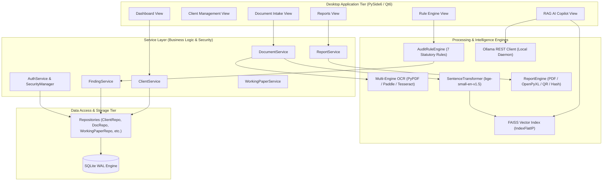
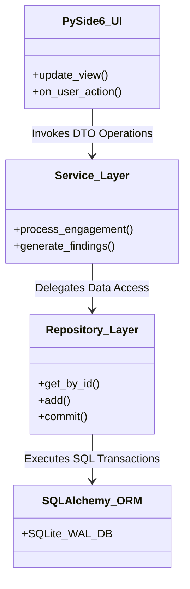
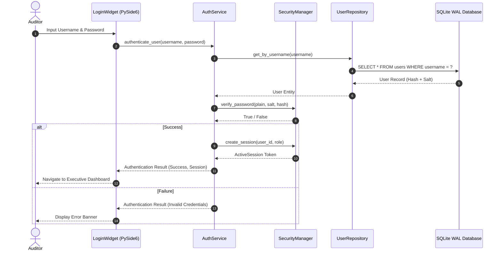
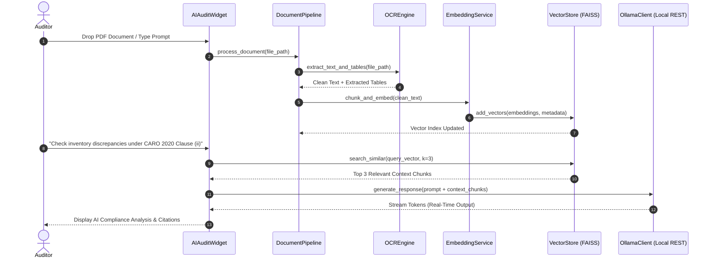
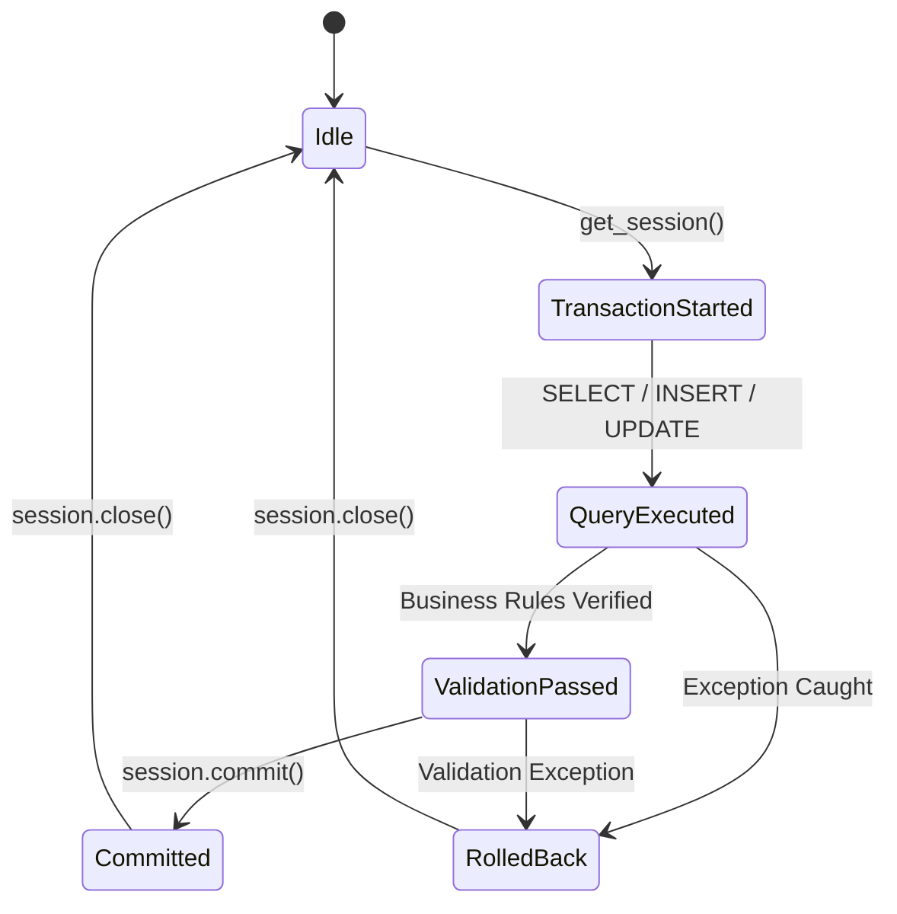
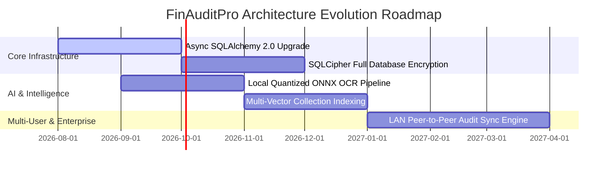

# FinAuditPro — System Architecture & Technical Specifications

> **System Version**: 1.0.0\
> **Target Audience**: Enterprise Architects, Security Auditors, Principal
> Engineers, Open-Source Maintainers\
> **Security Classification**: Internal / Public Technical Specifications

---

## 1. Executive Overview

**FinAuditPro** is an offline-first, air-gapped desktop application built for
statutory auditors, Chartered Accountants (CAs), and audit firms in India. It
automates financial document ingestion, statutory compliance rule evaluation
(ICAI Standards on Auditing SA 200–790, CARO 2020, Income Tax Act, Companies Act
2013), offline AI retrieval-augmented generation (RAG), working paper
generation, and tamper-evident audit report compilation.

### Key Architectural Characteristics

- **Zero External Telemetry**: Runs completely offline without external server
  dependencies or cloud data leakage.
- **Air-Gapped AI Pipeline**: Uses local LLM inference (Ollama with `llama3.2` /
  `deepseek-r1`) and local vector embeddings (FAISS + HuggingFace Transformers).
- **Strict Clean Architecture**: Enforces a database-outward pattern where UI
  components never interact directly with database models.
- **Cryptographic Audit Ledger**: Implements SHA-256 hash-chained immutable
  audit logging and digital signature verification for generated PDF/Excel audit
  packs.

---

## 2. System Philosophy & Core Design Principles

```
┌──────────────────────────────────────────────────────────────────────────────┐
│                           PRESENTATION TIER (PySide6)                        │
└──────────────────────────────────────┬───────────────────────────────────────┘
                                       │ Event Signals & Data DTOs
┌──────────────────────────────────────▼───────────────────────────────────────┐
│                         SERVICE TIER (Business Logic)                        │
└──────────────────────────────────────┬───────────────────────────────────────┘
                                       │ Repository Interfaces & Entities
┌──────────────────────────────────────▼───────────────────────────────────────┐
│                        REPOSITORY TIER (SQLAlchemy ORM)                      │
└──────────────────────────────────────┬───────────────────────────────────────┘
                                       │ SQL Queries (WAL Mode)
┌──────────────────────────────────────▼───────────────────────────────────────┐
│                         DATA TIER (SQLite Database)                          │
└──────────────────────────────────────────────────────────────────────────────┘
```

1. **Database-Outward Flow**: All financial state, compliance findings, document
   indexes, and audit trails originate from SQLite as the single source of
   truth.
2. **Deterministic-First Compliance**: Hard numerical rules (GSTIN checksums,
   PAN patterns, Section 40A(3) cash thresholds, Benford's Law distribution
   analysis) execute deterministically before probabilistic AI inferences.
3. **Decoupled Asynchronous Workers**: Heavy CPU/GPU workloads (OCR extraction,
   vector embedding, local LLM generation) execute on non-blocking background
   QThread workers.
4. **Defense-in-Depth Security**: PBKDF2-HMAC-SHA256 password hashing (100,000
   iterations), AES-256 Fernet data encryption at rest, role-based access
   control (RBAC), and session tampering prevention.

---

## 3. High-Level Architecture Diagram



---

## 4. Clean Architecture Layer Specifications

FinAuditPro enforces strict boundary separation across four main project layers:

| Layer                     | Package Directory                                                                              | Responsibilities & Component Scope                                                                                                     | Dependencies                         |
| :------------------------ | :--------------------------------------------------------------------------------------------- | :------------------------------------------------------------------------------------------------------------------------------------- | :----------------------------------- |
| **Presentation**          | `src/ui/`                                                                                      | Qt6 GUI widgets, user input handlers, visual charts, signal/slot wiring, progress bars, background worker management (`OllamaWorker`). | Service Layer, Data DTOs             |
| **Services & Workflow**   | `src/services/`, `src/workflow/`                                                               | Business orchestrators, authentication flow, session tracking, audit trail logging, workflow state machine.                            | Repositories, Rule Engine, Reporting |
| **Domain & Core Engines** | `src/rule_engine/`, `src/document_intelligence/`, `src/ai/`, `src/security/`, `src/reporting/` | Pure business entities, statutory rules, OCR extraction, FAISS vector indexing, AES encryption, PDF/Excel compilation.                 | Core Config, Models, External Libs   |
| **Data Access & Storage** | `src/database/`                                                                                | SQLAlchemy 2.0 ORM models (`models.py`), repository DAOs (`repositories/`), SQLite WAL database engine (`database.py`).                | SQLAlchemy, SQLite                   |



---

## 5. Folder Structure & Component Mapping

```text
src/
├── main.py                          # Desktop Application Entry Point (PySide6 QApplication)
├── core/
│   ├── config.py                    # AppConfig (Pydantic environment settings & path resolving)
│   └── exceptions.py                # Enterprise Domain Exceptions (ValidationError, AuthError, etc.)
├── database/
│   ├── database.py                  # SQLite WAL connection pooling & SessionLocal generator
│   ├── models.py                    # 22 SQLAlchemy ORM Declarative Entity Models
│   └── repositories/                # Data Access Objects (ClientRepo, DocRepo, FindingRepo, etc.)
├── services/                        # Business Logic Controllers (Auth, Client, Document, Report)
├── security/                        # RBAC, PBKDF2 Hashing, AES-256 Crypto, SHA-256 Audit Trail
├── rule_engine/                     # Statutory Compliance Rules (GSTIN, Sec 40A(3), Benford, CARO)
├── document_intelligence/           # Document Ingestion, PyPDF, Multi-Engine OCR & Table Extraction
├── ai/                              # Ollama Local REST Client, VectorStore (FAISS), Worker Threads
├── reporting/                       # PDF Generator (ReportLab), Excel Exporter, Digital Signature, QR
├── analytics/                       # SQL Analytics Engine, KPI Aggregator, Forecast Engine
├── workflow/                        # Audit Lifecycle State Machine & Event Bus
└── ui/                              # PySide6 Desktop User Interface Components & QSS Themes
```

---

## 6. Detailed Request & Interaction Lifecycles

### 6.1 User Authentication & Session Lifecycle



### 6.2 Document Ingestion & RAG AI Query Lifecycle



---

## 7. Security Boundaries & Trust Architecture

```
┌─────────────────────────────────────────────────────────────────────────────┐
│                         UNTRUSTED INPUT BOUNDARY                            │
│   - External PDF Files, Client Excel Sheets, Scanned Images, User Prompts  │
└──────────────────────────────────────┬──────────────────────────────────────┘
                                       │ Input Sanitization & Validation
┌──────────────────────────────────────▼──────────────────────────────────────┐
│                         APPLICATION TRUST ZONE                              │
│   - AES-256 Encrypted Datastore (finauditpro.db)                            │
│   - Local Vector Database (FAISS Index)                                     │
│   - PBKDF2 Password Hashing & RBAC Authorization Gates                       │
│   - SHA-256 Hash-Chained Audit Ledger                                       │
└──────────────────────────────────────┬──────────────────────────────────────┘
                                       │ Local REST (127.0.0.1:11434 Only)
┌──────────────────────────────────────▼──────────────────────────────────────┐
│                         LOCAL ISOLATED AI DAEMON                            │
│   - Ollama Service (Air-Gapped Local LLM Inference Engine)                 │
└─────────────────────────────────────────────────────────────────────────────┘
```

- **Trust Zone 1 (Local Input Boundary)**: External client uploads (PDFs, Excel
  workbooks, images) are parsed inside isolated memory buffers using defensive
  PyPDF and PaddleOCR handlers.
- **Trust Zone 2 (Core Application Storage)**: Database records, working papers,
  and user credentials are protected via AES-256 CBC encryption and SHA-256
  integrity checksums.
- **Trust Zone 3 (Local Daemon Interface)**: Communications with Ollama occur
  exclusively over localhost (`127.0.0.1:11434`). No network ports are exposed
  externally.

---

## 8. Database Architecture & Transaction Management

FinAuditPro utilizes SQLite 3 running in **Write-Ahead Logging (WAL)** mode for
concurrent read/write performance.



### PRAGMA Configuration

- `PRAGMA journal_mode=WAL;` — Enables concurrent reads while writing.
- `PRAGMA synchronous=NORMAL;` — Balances IO performance with safety against
  system crashes.
- `PRAGMA foreign_keys=ON;` — Strict referential integrity enforcement.
- `PRAGMA busy_timeout=5000;` — Handles transient database locks gracefully.

---

## 9. Design Patterns Used Across Codebase

| Design Pattern                 | Implementation Class / Module            | Purpose                                                                                         |
| :----------------------------- | :--------------------------------------- | :---------------------------------------------------------------------------------------------- |
| **Facade**                     | `ReportEngine`, `AuditRuleEngine`        | Provides unified interfaces over complex multi-step subsystems (PDF + Excel + Signatures).      |
| **Repository**                 | `ClientRepository`, `DocumentRepository` | Decouples ORM database queries from domain business logic.                                      |
| **Factory**                    | `ReportTemplateFactory`                  | Dynamically instantiates audit opinion templates based on finding severity.                     |
| **Singleton**                  | `AppConfig`, `SecurityManager`           | Ensures global configuration state and security session state remain unique.                    |
| **Strategy**                   | `OCREngine`                              | Automatically selects PyPDF, PaddleOCR, or Tesseract based on document layout and availability. |
| **Observer / Event Bus**       | `WorkflowManager`, `WorkflowEvents`      | Dispatches lifecycle events (e.g. `DOCUMENT_UPLOADED`, `FINDING_INGESTED`) across UI widgets.   |
| **Producer-Consumer / Worker** | `OllamaWorker`                           | Offloads blocking LLM HTTP streaming to PySide6 `QThread` workers.                              |

---

## 10. Future Architecture Roadmap



---

_FinAuditPro Technical Architecture Reference — FinAuditPro Open Source Team._
