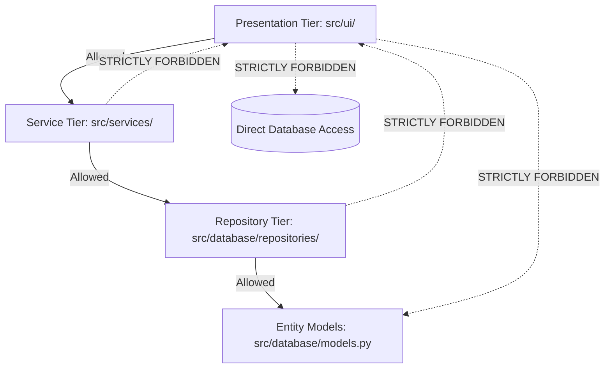
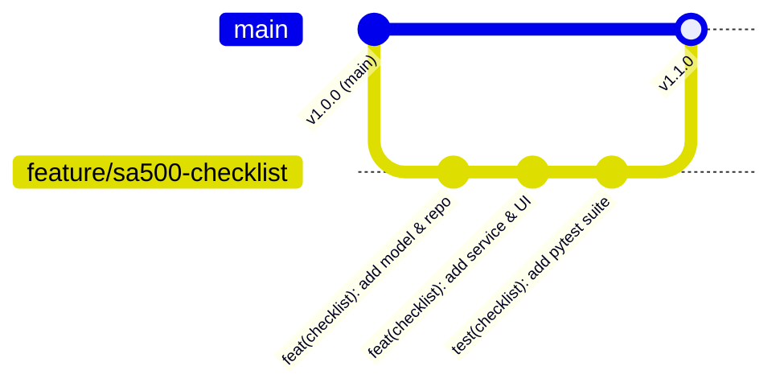

# FinAuditPro — Architecture & Engineering Implementation Guide

> **Target Audience**: Core Developers, Open-Source Contributors, Technical Leads  
> **Status**: Active Operational Reference  

---

## 1. Architectural Rationale & Core Guidance

FinAuditPro implements a strict **Clean Layered Architecture** pattern tailored for desktop Python (PySide6 / Qt6) applications.

### Why Clean Architecture for Desktop Python?
1. **Separation of GUI and Business Logic**: Desktop UI code (PySide6 widgets) changes frequently due to visual styling, whereas statutory audit rules (ICAI standards, Income Tax thresholds) remain stable.
2. **Offline Air-Gapped Testability**: Decoupling database repositories and AI inference services allows testing business logic using mock objects without launching the GUI or database daemon.
3. **Security Isolation**: Data encryption engines, RBAC policies, and audit logging operate below the UI tier, preventing accidental bypass of security rules.

---

## 2. Layer Constraints & Boundaries



### Strict Architectural Rules
- **Rule 1 (No Database in UI)**: UI widgets (`src/ui/*.py`) must NEVER import `SessionLocal` or execute SQL/SQLAlchemy queries directly. All data access must pass through Services and Repositories.
- **Rule 2 (No UI Imports in Domain/Services)**: Services, repositories, and rule engines must never import PySide6 UI components (`QWidget`, `QLabel`, `QMessageBox`).
- **Rule 3 (Explicit Transaction Scope)**: Database sessions are opened and managed within service methods using contextual session managers (`with get_session() as session:`).
- **Rule 4 (Typed DTOs & Dataclasses)**: Public service methods must accept and return typed dataclasses or primitives, preventing direct leakage of ORM state across boundaries.

---

## 3. End-to-End Concrete Code Examples

### 3.1 Step 1: Define Database Model (`src/database/models.py`)

```python
from sqlalchemy import Column, Integer, String, Float, ForeignKey, DateTime, Text
from sqlalchemy.orm import relationship
import datetime
from .database import Base

class AuditChecklist(Base):
    """Statutory SA 230 Audit Planning Checklist Entity."""
    __tablename__ = "audit_checklists"

    id = Column(Integer, primary_key=True, index=True)
    engagement_id = Column(Integer, ForeignKey("audit_projects.id"), nullable=False)
    section_code = Column(String(20), nullable=False)  # e.g., 'SA-500'
    title = Column(String(255), nullable=False)
    status = Column(String(50), default="PENDING")    # PENDING, IN_PROGRESS, COMPLETED
    comments = Column(Text, nullable=True)
    created_at = Column(DateTime, default=datetime.datetime.utcnow)

    # Relationships
    engagement = relationship("AuditProject", back_populates="checklists")
```

---

### 3.2 Step 2: Implement Repository (`src/database/repositories/checklist_repo.py`)

```python
from typing import List, Optional
from sqlalchemy.orm import Session
from database.models import AuditChecklist

class ChecklistRepository:
    """DAO handling persistence operations for AuditChecklist entity."""

    def __init__(self, session: Session):
        self.session = session

    def get_by_id(self, item_id: int) -> Optional[AuditChecklist]:
        return self.session.query(AuditChecklist).filter(AuditChecklist.id == item_id).first()

    def get_by_engagement(self, engagement_id: int) -> List[AuditChecklist]:
        return self.session.query(AuditChecklist).filter(
            AuditChecklist.engagement_id == engagement_id
        ).all()

    def add(self, item: AuditChecklist) -> AuditChecklist:
        self.session.add(item)
        self.session.flush()
        return item

    def update_status(self, item_id: int, status: str, comments: Optional[str] = None) -> bool:
        item = self.get_by_id(item_id)
        if not item:
            return False
        item.status = status
        if comments:
            item.comments = comments
        return True
```

---

### 3.3 Step 3: Implement Business Service (`src/services/checklist_service.py`)

```python
from typing import List, Dict, Any, Optional
from database.database import get_session
from database.repositories.checklist_repo import ChecklistRepository
from database.models import AuditChecklist
from core.exceptions import ValidationError, EntityNotFoundError
import logging

logger = logging.getLogger(__name__)

class ChecklistService:
    """Service encapsulating SA 230 checklist verification workflows."""

    def create_item(self, engagement_id: int, section_code: str, title: str) -> Dict[str, Any]:
        if not section_code or not title:
            raise ValidationError("Section code and title are required.")

        with get_session() as session:
            repo = ChecklistRepository(session)
            item = AuditChecklist(
                engagement_id=engagement_id,
                section_code=section_code,
                title=title,
                status="PENDING"
            )
            created = repo.add(item)
            session.commit()
            
            return {
                "id": created.id,
                "engagement_id": created.engagement_id,
                "section_code": created.section_code,
                "title": created.title,
                "status": created.status
            }

    def get_checklist_for_engagement(self, engagement_id: int) -> List[Dict[str, Any]]:
        with get_session() as session:
            repo = ChecklistRepository(session)
            items = repo.get_by_engagement(engagement_id)
            return [
                {
                    "id": i.id,
                    "section_code": i.section_code,
                    "title": i.title,
                    "status": i.status,
                    "comments": i.comments
                }
                for i in items
            ]
```

---

### 3.4 Step 4: Implement PySide6 View (`src/ui/checklist_widget.py`)

```python
from PySide6.QtWidgets import (
    QWidget, QVBoxLayout, QHBoxLayout, QLabel, QPushButton,
    QTableWidget, QTableWidgetItem, QMessageBox
)
from PySide6.QtCore import Qt
from services.checklist_service import ChecklistService
from core.exceptions import ValidationError

class ChecklistWidget(QWidget):
    """UI view presenting statutory audit checklists."""

    def __init__(self, engagement_id: int):
        super().__init__()
        self.engagement_id = engagement_id
        self.service = ChecklistService()
        self.init_ui()
        self.load_data()

    def init_ui(self):
        layout = QVBoxLayout(self)
        
        # Header
        self.title_lbl = QLabel("SA 230 Audit Planning & Execution Checklist")
        self.title_lbl.setStyleSheet("font-size: 16px; font-weight: bold; color: #0f172a;")
        layout.addWidget(self.title_lbl)

        # Table Widget
        self.table = QTableWidget()
        self.table.setColumnCount(4)
        self.table.setHorizontalHeaderLabels(["ID", "Section Code", "Title", "Status"])
        layout.addWidget(self.table)

    def load_data(self):
        try:
            items = self.service.get_checklist_for_engagement(self.engagement_id)
            self.table.setRowCount(len(items))
            for row, item in enumerate(items):
                self.table.setItem(row, 0, QTableWidgetItem(str(item["id"])))
                self.table.setItem(row, 1, QTableWidgetItem(item["section_code"]))
                self.table.setItem(row, 2, QTableWidgetItem(item["title"]))
                self.table.setItem(row, 3, QTableWidgetItem(item["status"]))
        except Exception as e:
            QMessageBox.critical(self, "Load Error", f"Failed to load checklist: {e}")
```

---

### 3.5 Step 5: Implement Automated Unit Test (`tests/test_checklist_service.py`)

```python
import pytest
from services.checklist_service import ChecklistService
from core.exceptions import ValidationError

def test_checklist_creation_success(db_session, sample_engagement):
    service = ChecklistService()
    result = service.create_item(
        engagement_id=sample_engagement.id,
        section_code="SA-500",
        title="Verify Bank Balance Confirmation Letters"
    )

    assert result["id"] is not None
    assert result["section_code"] == "SA-500"
    assert result["status"] == "PENDING"

def test_checklist_validation_failure():
    service = ChecklistService()
    with pytest.raises(ValidationError):
        service.create_item(engagement_id=1, section_code="", title="")
```

---

## 4. Security & Coding Guidelines

### Secure Coding Checklist
- [x] **Zero Raw SQL String Injections**: Always use SQLAlchemy ORM queries or parameterized statements.
- [x] **No Hardcoded Passwords/Tokens**: Credentials must be hashed using PBKDF2 with 100,000 iterations.
- [x] **Explicit Resource Management**: Database sessions must use `with get_session() as session:` blocks.
- [x] **Safe Thread Offloading**: PySide6 GUI signals must update widgets; worker threads must never manipulate GUI widgets directly.

---

## 5. Development & Git Workflow



### Commit Message Standard (Conventional Commits)
- `feat(ui)`: New user interface view or component.
- `feat(rule)`: New ICAI statutory audit rule implementation.
- `fix(security)`: Security patch or vulnerability remediation.
- `refactor(db)`: Database query or repository structure optimization.
- `test(services)`: Unit/integration test addition or coverage improvement.

---

## 6. Architecture Anti-Patterns & Common Mistakes

> [!WARNING]
> **Anti-Pattern 1: Direct Session Management inside PySide6 Widgets**  
> *Incorrect*: Creating `session = SessionLocal()` inside a button click handler.  
> *Correct*: Delegate operation to a `Service` class.

> [!WARNING]
> **Anti-Pattern 2: Swallowing Exceptions silently**  
> *Incorrect*: `except Exception: pass`  
> *Correct*: Log exception via `logger.error(...)` and return structured error response to UI.

---

*FinAuditPro Architecture Implementation Guide — FinAuditPro Open Source Team.*
