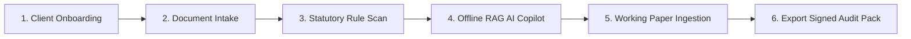
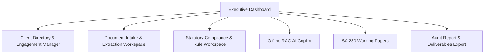
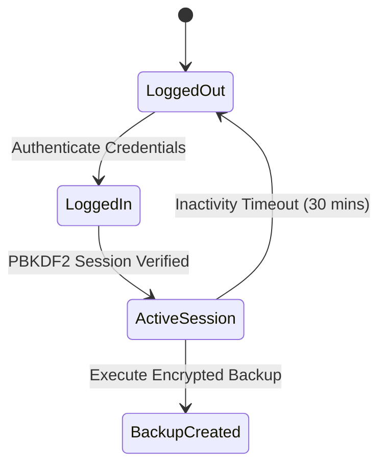

# FinAuditPro — End-User Operational Manual

> **Software Version**: 2.4.0\
> **Target Audience**: Statutory Auditors, Chartered Accountants (CAs), Audit
> Managers, Compliance Officers

---

## 1. Introduction

**FinAuditPro** is an offline-first desktop application and enterprise API platform designed specifically
for Chartered Accountants and statutory auditing firms in India. It automates
financial document ingestion, statutory compliance verification (ICAI Standards
on Auditing, CARO 2020, Income Tax Act, Companies Act 2013), working paper
compilation, and tamper-evident audit report generation.



---

## 2. Key Features & Capabilities

- **Air-Gapped Privacy**: Executes 100% offline on your desktop. Client data
  never leaves your machine.
- **Automated Document Intelligence**: Extracts text and tabular financial data
  from PDFs, Excel workbooks, and scanned images using PyPDF and multi-engine
  OCR (PaddleOCR / Tesseract).
- **Statutory Rule Engine**: Evaluates statutory rules including GSTIN presence,
  GST rate slab verification (`0.0%`–`28.0%`), Section 40A(3) cash limit violation (> ₹10,000), Benford's Law numerical
  anomaly detection, and CARO 2020 inventory checks.
- **Offline RAG AI Assistant**: Uses a local Ollama LLM (`llama3`) and local
  FAISS vector search to query client documents securely.
- **Tamper-Evident Report Generation**: Compiles professional SA 700 / SA 705
  audit reports in PDF format with SHA-256 digital signature hashes and QR
  verification.

---

## 3. Installation & First-Time Setup

### 3.1 System Requirements

- **OS**: Windows 10/11, macOS 12+, or Ubuntu 22.04+ (64-bit)
- **RAM**: 8 GB minimum (16 GB recommended for local AI RAG)
- **Storage**: 5 GB free disk space

### 3.2 Installation

#### Windows (One-Click Installer)

1. Download `FinAuditPro-Setup.exe` or clone the repository.
2. Double-click `install.bat` to run automated setup.

#### macOS & Linux

1. Open Terminal and navigate to the root project directory.
2. Run the installer script:
   ```bash
   chmod +x install.sh && ./install.sh
   ```

### 3.3 Initial Launch & Default Credentials

1. Launch FinAuditPro from your desktop shortcut or terminal (`python src/main.py`).
2. On initial clean boot, the application automatically provisions default Partner Admin credentials:
   - **Username / Email**: `admin@finauditpro.com`
   - **Password**: `Admin@123`
3. Update your password after initial login and configure your Firm Name, ICAI Firm Registration Number (FRN), and CA Membership Number under **Settings**.

### 3.4 Database Wipe & Reset Utility

To reset the database and active session lockouts for testing or fresh deployment:
```bash
python reset_db.py
```


---

## 4. Screen-by-Screen User Interface Walkthrough



### 4.1 Executive Dashboard

- **Live Metrics**: Displays active engagements, average risk score, overall
  statutory compliance rating, documents processed, and estimated audit hours
  saved.
- **Audit Lifecycle Tracker**: Visual progress indicator showing stage
  completion (Planning → Execution → Reporting → Completed).
- **Audit Log Feed**: Real-time ledger of user actions, document uploads, and
  security events.

### 4.2 Client Directory & Engagement Manager

- Create new client profiles with mandatory GSTIN (15 characters), PAN (10
  characters), CIN, and industry selection.
- Manage Key Management Personnel (KMP) registers and track engagement financial
  years (e.g. FY 2025–26).

### 4.3 Document Intake Workspace

- Drag and drop client Trial Balances (CSV/XLSX), Invoices (PDF), Bank
  Statements, and Scanned Receipts into the dropzone.
- Automatic password-protected PDF detection notifies you if a document requires
  password removal before parsing.

### 4.4 Statutory Rule Workspace

- Execute automated statutory rule scans.
- View flagged findings categorized by risk level (Critical, High, Medium, Low)
  with financial impact estimations.
- One-click ingestion of flagged findings directly into SA 230 Working Papers.

### 4.5 Offline RAG AI Copilot Workspace

- Type natural language audit queries (e.g. _"Analyze inventory sheets under
  CARO 2020 Clause (ii)"_).
- Real-time token streaming presents answers accompanied by exact source
  document citations.

### 4.6 Working Papers & Deliverables Export

- Review indexed SA 230 working papers.
- Export full PDF Audit Packs complete with digital signature metadata and
  verification QR codes.
- Export structured Excel summary packs.

---

## 5. User Settings & Security Controls



- **Password Hashing**: Passwords are protected using PBKDF2-HMAC-SHA256 with
  100,000 iterations.
- **Encrypted Backups**: Create AES-256 encrypted database backups stored in
  your platform AppData folder.
- **Audit Ledger**: Every action generates an immutable SHA-256 hash log.

---

## 6. Keyboard Shortcuts & Productivity Tips

| Action / Command           | Windows / Linux Shortcut | macOS Shortcut |
| :------------------------- | :----------------------- | :------------- |
| **New Engagement**         | `Ctrl + N`               | `Cmd + N`      |
| **Upload Documents**       | `Ctrl + U`               | `Cmd + U`      |
| **Run Rule Scanner**       | `Ctrl + R`               | `Cmd + R`      |
| **Focus AI Copilot Input** | `Ctrl + K`               | `Cmd + K`      |
| **Export Audit Report**    | `Ctrl + E`               | `Cmd + E`      |

---

## 7. Troubleshooting & Frequently Asked Questions

**Q1: Why does the AI Workspace report "Ollama Offline"?**\
_Answer_: Ensure the Ollama background daemon is running on your machine
(`ollama serve`) and the model is pulled (`ollama pull llama3.2`).

**Q2: How do I handle password-protected PDF bank statements?**\
_Answer_: Remove PDF password encryption using Adobe Acrobat or a PDF utility
prior to uploading so OCR parsing can execute cleanly.

**Q3: Where is my audit data stored?**\
_Answer_: All databases (`finauditpro.db`) and vector indexes are stored locally
in your operating system's user AppData folder (`%APPDATA%\FinAuditPro\` on
Windows, `~/Library/Application Support/FinAuditPro/` on macOS).

---

_FinAuditPro End-User Manual — FinAuditPro Customer Documentation Team._
