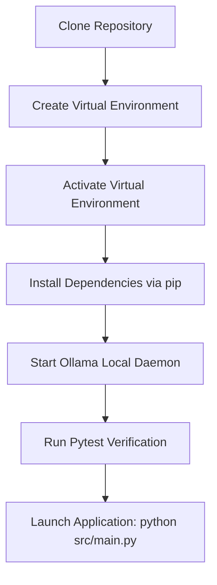
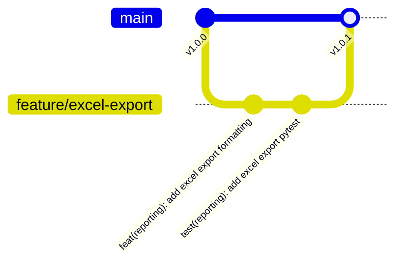

# FinAuditPro — Developer Onboarding & Engineering Manual

> **Version**: 1.0.0\
> **Audience**: Core Developers, Open-Source Contributors, Technical Reviewers

---

## 1. Introduction & Overview

Welcome to the **FinAuditPro** developer onboarding manual. FinAuditPro is an
enterprise-grade desktop audit platform engineered for Chartered Accountants and
statutory auditors. The codebase is written in Python 3.11+, using **PySide6 (Qt
for Python)** for the GUI, **SQLAlchemy 2.0 / SQLite WAL** for data persistence,
**FAISS & Ollama** for offline AI RAG, and **ReportLab / OpenPyXL** for report
output compilation.

---

## 2. System Requirements & Supported Platforms

### Supported Operating Systems

- **Windows**: Windows 10 / Windows 11 (64-bit)
- **macOS**: macOS 12 Monterey or newer (Intel & Apple Silicon ARM64)
- **Linux**: Ubuntu 22.04 LTS, Fedora 38, Debian 12 (x86_64)

### Development Prerequisites

- **Python**: Version 3.11 or 3.12 (64-bit)
- **Git**: Version 2.35+
- **Ollama**: Local LLM runner installed from [ollama.ai](https://ollama.ai/)
- **Tesseract OCR (Optional)**: System binary for scanned image text extraction

---

## 3. Local Environment Setup



### Installation Steps

```bash
# 1. Clone Repository
git clone https://github.com/Coderaryanyadav/FinAuditPro.git
cd FinAuditPro

# 2. Create Virtual Environment
python3 -m venv .venv

# 3. Activate Virtual Environment
# On macOS / Linux:
source .venv/bin/activate
# On Windows Command Prompt:
.venv\Scripts\activate.bat

# 4. Upgrade pip & Install All Unified Dependencies
pip install --upgrade pip
pip install -r requirements.txt

# 5. Start Local Ollama Daemon (In a separate terminal)
ollama serve
ollama pull llama3.2
```

---

## 4. Development Commands & Workflows

### 4.1 Launching the Desktop Application

```bash
python src/main.py
```

### 4.2 Running Test Suites (`pytest`)

FinAuditPro includes a comprehensive unit and integration test suite:

```bash
# Run all tests with verbosity
pytest tests/ -v

# Run specific test module
pytest tests/test_security.py -v

# Run with coverage report
pytest --cov=src tests/
```

### 4.3 Code Quality & Linting Tools

```bash
# Check code formatting with Black
black --check src/ tests/

# Auto-format codebase
black src/ tests/

# Run Ruff linter
ruff check src/ tests/
```

---

## 5. Directory Structure & Layer Mapping

```text
FinAuditPro/
├── src/
│   ├── main.py                    # Application Entry Point
│   ├── core/                      # Configuration & Domain Exceptions
│   ├── database/                  # ORM Models & Repository DAOs
│   ├── services/                  # Business Logic Controllers
│   ├── security/                  # PBKDF2 Hashing, AES-256 Crypto, Audit Ledger
│   ├── rule_engine/               # Statutory Compliance Engine (CARO, GST, Sec 40A(3))
│   ├── document_intelligence/     # PyPDF, Multi-Engine OCR & Metadata Extraction
│   ├── ai/                        # Local Ollama REST Client & FAISS Vector Index
│   ├── reporting/                 # PDF Generator, Excel Pack Exporter, Digital Signatures
│   ├── analytics/                 # Live SQL Metrics, KPI Engines, Forecast Charts
│   ├── workflow/                  # Audit Lifecycle State Machine & Event Bus
│   └── ui/                        # PySide6 Desktop Widgets & QSS Styles
├── tests/                         # Pytest Integration & Unit Test Suite
├── docs/                          # Architecture & Developer Documentation
├── scripts/                       # Environment Bootstrapper & Release Packaging
├── pyproject.toml                 # Build & Tool Configurations
├── requirements.txt               # Unified Master Requirements File
├── install.bat                    # Windows One-Click Installer
└── install.sh                     # macOS/Linux One-Click Installer
```

---

## 6. How to Build & Extend Features

### 6.1 Creating a Statutory Audit Rule

1. Inherit from `BaseRule` in `src/rule_engine/base_rule.py`.
2. Implement the `evaluate(data, context)` method.
3. Register the new rule in `src/rule_engine/rule_loader.py`.
4. Add unit test cases in `tests/test_rule_engine.py`.

### 6.2 Creating a New UI Screen

1. Create new PySide6 widget class in `src/ui/` inheriting from `QWidget`.
2. Delegate business logic and database access to a `Service` class in
   `src/services/`.
3. Use non-blocking background workers (`QThread`) for long-running CPU
   operations.
4. Add screen tab navigation in `src/ui/dashboard.py`.

---

## 7. Git & Commit Guidelines



### Commit Message Format (Conventional Commits)

- `feat(ui)`: New user interface view or design system component.
- `feat(rule)`: New ICAI statutory audit rule implementation.
- `fix(security)`: Security fix or crypto remediation.
- `refactor(db)`: Repository query optimization or DB schema refinement.
- `test(services)`: Addition or update of automated pytest cases.

---

## 8. Frequently Asked Questions & Troubleshooting

**Q1: `pytest` complains about missing PySide6 display server in headless CI
environment.**\
_Solution_: PySide6 widget tests use `QT_QPA_PLATFORM=offscreen`. Run tests with
`QT_QPA_PLATFORM=offscreen pytest`.

**Q2: Ollama connection fails in local testing.**\
_Solution_: Ensure the Ollama daemon is running (`ollama serve`) and accessible
at `http://127.0.0.1:11434`.

---

_FinAuditPro Developer Onboarding Guide — FinAuditPro Technical Core Team._
