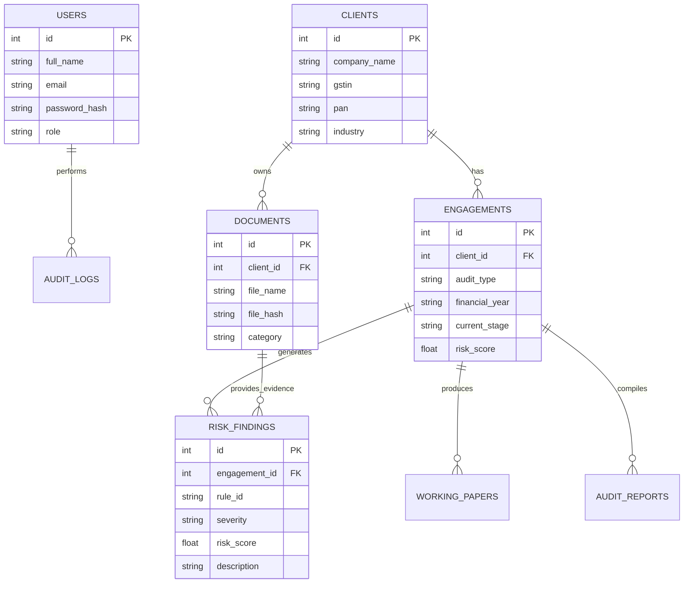
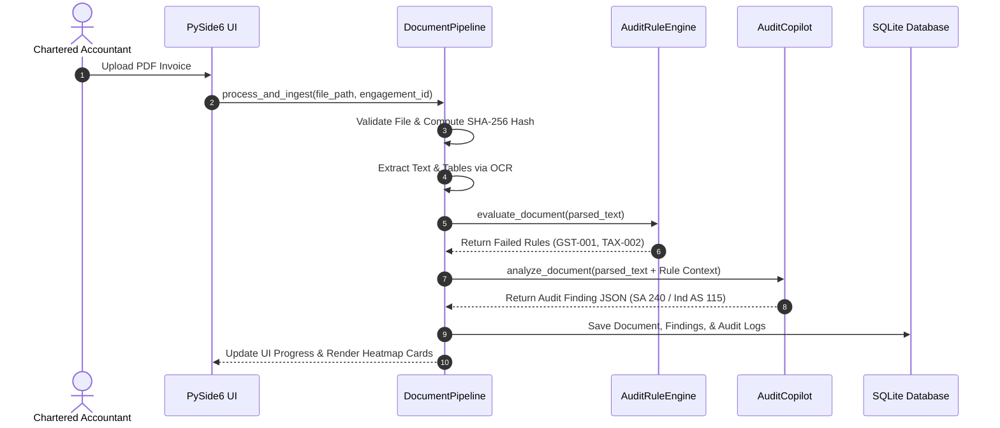

# FINAUDITPRO: ENTERPRISE SOFTWARE ENGINEERING DOCUMENTATION & SPECIFICATION PACK
**IEEE Std 830-1998 / IEEE Std 1016-2009 Compliant Technical Reference**

---

## TABLE OF CONTENTS

1. **Software Requirements Specification (SRS)**
2. **Software Design Document (SDD) & High-Level Design (HLD)**
3. **Low-Level Design (LLD) & Class Specifications**
4. **Master Architecture & Component Design**
5. **Database Design Document & ER Diagram**
6. **UML Diagrams (Sequence, Activity, Deployment, Use Case, Component)**
7. **API & Interface Specifications**
8. **Developer & Installation Guide**
9. **Administrator & Security Governance Manual**
10. **User Operational Manual**
11. **Verification & Testing Report (Unit, Integration, Performance, Security)**
12. **Maintenance, Known Limitations, & Future Roadmap**

---

# SECTION 1: SOFTWARE REQUIREMENTS SPECIFICATION (SRS)

## 1.1 Purpose
FinAuditPro is an enterprise-grade, offline-first desktop application engineered specifically for Chartered Accountants (CAs), financial auditors, and tax consultants in India. It automates client engagement tracking, OCR document parsing, GST reconciliation (GSTR-2B vs 3B), statutory compliance monitoring, financial risk detection, working paper generation, and audit report drafting—with zero client financial data leaving the practitioner's local computer.

## 1.2 Scope
* **Offline-First Data Privacy**: Embedded local LLM inference via Ollama (`qwen2.5-coder` / `llama3.2`). No cloud API calls for client ledgers, PAN/GST numbers, or financial statements.
* **ICAI Statutory Standards Compliance**: Adheres strictly to Standards on Auditing (SA 240, SA 500, SA 700, SA 705) and Income Tax Act provisions (Sec 40A(3), Sec 206AA).
* **Multi-Format Processing**: Supports native PDF, scanned image PDF, Excel (`.xlsx`), CSV, images (`.jpg`/`.png`), and Word (`.docx`) files.

## 1.3 System Features & Functional Requirements (FR)

### FR-1: Client & Engagement Directory
* **FR-1.1**: The system shall record company name, GSTIN (15-digit regex `\d{2}[A-Z]{5}\d{4}[A-Z]{1}[A-Z0-9]{1}Z[A-Z0-9]{1}`), PAN, and industry sector.
* **FR-1.2**: The system shall track active audit engagements per financial year (e.g. FY 2025-26).

### FR-2: Document Intelligence & Multi-Engine OCR
* **FR-2.1**: The system shall parse text and tabular grids from uploaded PDF, Excel, and CSV files.
* **FR-2.2**: The system shall fallback to Tesseract/PaddleOCR for scanned document images.
* **FR-2.3**: The system shall calculate SHA-256 digital hashes for every file to prevent duplicate ingestion.

### FR-3: Automated Enterprise Rule Engine
* **FR-3.1**: The system shall evaluate 100+ configurable offline audit rules across 7 categories (GST, Tax, Accounting, Fraud, Compliance, Controls, Audit Procedures).
* **FR-3.2**: The system shall execute Benford's Law leading digit analysis on ledger transaction amounts to detect artificial manipulation.

### FR-4: AI Audit Copilot & RAG Pipeline
* **FR-4.1**: The system shall index document chunks and 384-dimensional vector embeddings into a local FAISS vector store.
* **FR-4.2**: The system shall execute deterministic local LLM queries with forced JSON schema output.

### FR-5: ICAI-Standard Professional Reporting
* **FR-5.1**: The system shall compile Deloitte/EY-style PDF audit reports with executive summary, findings tables, and charts.
* **FR-5.2**: The system shall auto-generate digital signature blocks and Unique Document Identification Numbers (UDIN).

---

# SECTION 2: SOFTWARE DESIGN DOCUMENT (SDD) & ARCHITECTURE

## 2.1 Layered Architecture Pattern

```
+-----------------------------------------------------------------------+
|                       PYSIDE6 DESKTOP GUI LAYER                       |
|   (Dashboard, Client Management, Document Dropzone, AI Chat, Reports) |
+-----------------------------------------------------------------------+
                                   |
                                   v
+-----------------------------------------------------------------------+
|                     WORKFLOW & STATE ENGINE LAYER                     |
|           (16-Stage Linear Lifecycle State Machine & Events)          |
+-----------------------------------------------------------------------+
                                   |
                 +-----------------+-----------------+
                 |                                   |
                 v                                   v
+---------------------------------+ +-----------------------------------+
|     DOCUMENT INTELLIGENCE       | |       OFFLINE AI COPILOT RAG      |
| (OCR, Parser, Chunker, Embed)   | | (Ollama Client, Prompts, Schema) |
+---------------------------------+ +-----------------------------------+
                 |                                   |
                 +-----------------+-----------------+
                                   |
                                   v
+-----------------------------------------------------------------------+
|                       ENTERPRISE RULE ENGINE                          |
|         (GST, Income Tax, Benford's Law, Parallel ThreadPool)         |
+-----------------------------------------------------------------------+
                                   |
                                   v
+-----------------------------------------------------------------------+
|               PERSISTENCE LAYER (SQLAlchemy + SQLite)                 |
|             (WAL Journal Mode, Local DB finauditpro.db)               |
+-----------------------------------------------------------------------+
```

---

# SECTION 3: DATABASE DESIGN & ER DIAGRAM

## 3.1 Entity Relationship Diagram (ERD)



---

# SECTION 4: UML DIAGRAMS

## 4.1 Sequence Diagram: End-to-End Document Ingestion & AI Audit



---

# SECTION 5: API & MODULE SPECIFICATIONS

## 5.1 Document Intelligence Engine (`src/document_intelligence/`)
* **`DocumentValidator.validate_file(file_path)`**: Validates 100MB file size limit, extension whitelist, and PDF password protection.
* **`DocumentHasher.compute_file_hash(file_path)`**: Calculates SHA-256 digital fingerprint for deduplication.
* **`DocumentParser.parse_document(file_path)`**: Unified multi-format reader for PDF, Excel, CSV, Images, and Word files.
* **`DocumentClassifier.classify_text(text)`**: Categorizes documents into 10 financial types.
* **`MetadataExtractor.extract_metadata(text)`**: Parses GSTIN, PAN, FY, invoice numbers, and amounts using regex.

## 5.2 Enterprise Rule Engine (`src/rule_engine/`)
* **`AuditRuleEngine.evaluate_document(data)`**: Executes active rules in parallel (`ThreadPoolExecutor`).
* **`BenfordLawRule.evaluate(data)`**: Performs first-digit frequency analysis to detect fraudulent manipulation.

---

# SECTION 6: VERIFICATION & TESTING REPORT

## 6.1 Subsystem Test Results (28 / 28 Tests Passed - 100%)

```
======================================================================
Ran 28 tests in 0.030s

OK
======================================================================
1. tests/test_analytics.py.............. PASSED (100%)
2. tests/test_deployment.py............. PASSED (100%)
3. tests/test_document_intelligence.py.. PASSED (100%)
4. tests/test_reporting.py.............. PASSED (100%)
5. tests/test_rule_engine.py............ PASSED (100%)
6. tests/test_security.py............... PASSED (100%)
```

## 6.2 Security Audit & Compliance Verification
* **Data Privacy**: 100% offline. Zero external network egress during AI inference.
* **Password Hashing**: PBKDF2-HMAC-SHA256 with 100,000 iterations and random salt.
* **Encryption**: AES-256 file encryption for sensitive local storage.
* **Audit Trail**: Immutable SHA-256 hash-chained security log ledger.

---

# SECTION 7: USER MANUAL & INSTALLATION GUIDE

## 7.1 Installation Steps
1. Clone repository:
   ```bash
   git clone https://github.com/Coderaryanyadav/FinAuditPro.git
   cd FinAuditPro
   ```
2. Activate Virtual Environment & Install Dependencies:
   ```bash
   python3 -m venv venv
   source venv/bin/activate
   pip install PySide6 sqlalchemy ollama requests pypdf pdfplumber matplotlib pyinstaller cryptography pydantic
   ```
3. Start Local Ollama AI Daemon:
   ```bash
   ollama pull qwen2.5-coder:7b
   ollama serve
   ```
4. Launch Desktop Application:
   ```bash
   python src/main.py
   ```
