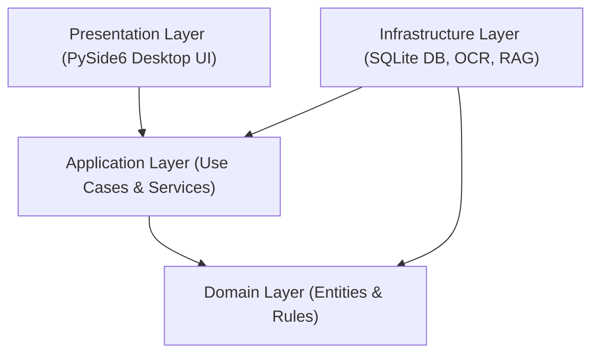
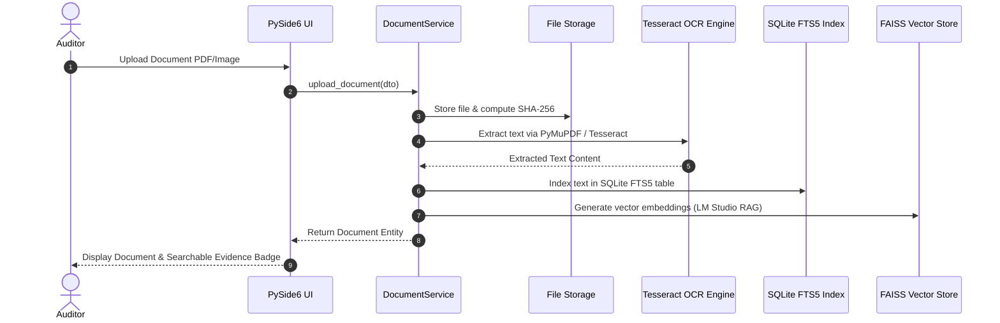

# FinAuditPro — System Architecture Specification

This document details the architectural boundaries, layer interaction rules, data flow pipelines, and component responsibilities of **FinAuditPro**.

---

## 1. Clean Layer Architecture

FinAuditPro follows a clean 4-layer architecture with strict unidirectional dependencies flowing inwards toward the core domain:

### Layer Rules
1. **Domain Layer (`src/finauditpro/domain/`)**: Pure business logic, value objects, and statutory calculation pure functions (e.g. SA 320 materiality calculations, SA 510 tie-out math). **Zero external framework dependencies** (no SQLAlchemy, PySide6, or httpx).
2. **Application Layer (`src/finauditpro/application/`)**: Coordinates domain entities and infrastructure services to fulfill use cases (e.g. `EngagementService`, `RollForwardService`). Decoupled from desktop UI controls.
3. **Infrastructure Layer (`src/finauditpro/infrastructure/`)**: Provides persistent storage, database migration execution, document text extraction via PyMuPDF/Tesseract, local vector embeddings, and PDF export rendering.
4. **Presentation Layer (`src/finauditpro/ui/`)**: Desktop user interface built with PySide6. Communicates exclusively via Application Services; imports zero ORM or database persistence modules.

---

## 2. Document & Evidence Data Flow

---

## 3. Financial Analytics & Finding Lifecycle

1. **Import Stage**: Multi-file Trial Balance, General Ledger, and Bank Statements parsed into strongly typed `FinancialDataset` entities.
2. **Deterministic Analysis**:
   - **Benford's 1st Law**: Compares first-digit distributions against logarithmic expected frequencies.
   - **Duplicate Payment Detector**: Identifies matching amounts, vendor names, or invoice dates.
   - **Outlier Detector**: Computes z-score metrics to flag statistical anomalies.
3. **Finding Promotion**: Auditor reviews flagged exceptions and promotes valid items into structured `Finding` entities with linked document evidence.
