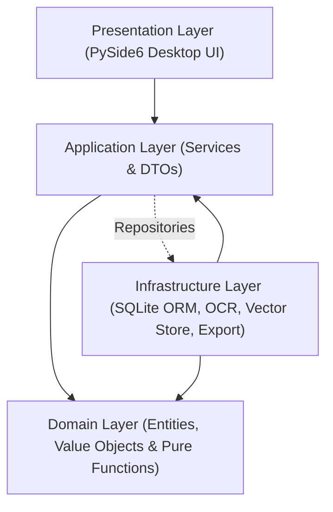

# FinAuditPro — System Architecture Specification

FinAuditPro is an offline-first desktop audit operating system designed specifically for Indian statutory audit practice. It is architected with strict boundary separation between presentation, application use cases, domain business logic, and infrastructure persistence.

---

## 1. Clean 4-Layer Architecture

The system strictly enforces unidirectional dependency flow inward toward the pure domain layer:

### Layer Boundary Invariants (Enforced via AST Unit Tests in `tests/test_architecture.py`):
1. **Domain Layer (`src/finauditpro/domain/`)**:
   - **Zero External Dependencies**: Pure Python dataclasses, enums, value objects, and calculation pure functions (e.g. SA 320 materiality calculation, SA 510 tie-out math, formula injection sanitization).
   - **Prohibited Imports**: May not import `PySide6`, `sqlalchemy`, `httpx`, `fitz`, `reportlab`, or any infrastructure/UI modules.
2. **Application Layer (`src/finauditpro/application/`)**:
   - **Orchestrates Use Cases**: Exposes application services (`EngagementService`, `DocumentService`, `FinancialDataService`, `AuditMatrixService`, `WorkingPaperService`, `ReportService`, `ArchivalService`, `RollForwardService`, `AIService`).
   - **DTO Contracts**: Communicates strictly via strongly typed Pydantic / dataclass DTOs.
3. **Infrastructure Layer (`src/finauditpro/infrastructure/`)**:
   - **Persistence & External Drivers**: SQLite ORM models, versioned migration execution (`migration_list.py`), document text extractors (PyMuPDF, Tesseract OCR), local vector indexing (FAISS), and PDF reporting (ReportLab).
4. **Presentation Layer (`src/finauditpro/ui/`)**:
   - **Desktop UI**: PySide6 (Qt 6.8) shell featuring high-density typography, neutral dark surfaces, sidebar navigation, dialogs, and asynchronous worker threads for non-blocking UI interactions.
