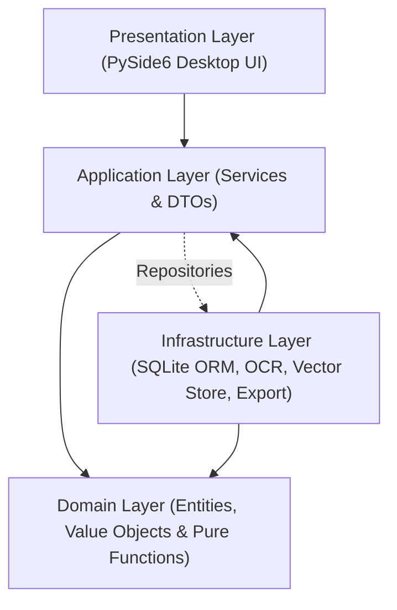

# FinAuditPro — System & Database Architecture Specification

FinAuditPro is an offline-first desktop audit operating system designed specifically for Indian statutory audit practice. It is architected with strict boundary separation between presentation, application use cases, pure domain logic, and SQLite persistence.

---

## 1. Clean 4-Layer Architecture

The system strictly enforces unidirectional dependency flow inward toward the pure domain layer:

### Layer Boundary Invariants (Enforced via AST Unit Tests in `tests/test_architecture.py`):
1. **Domain Layer (`src/finauditpro/domain/`)**:
   - **Zero External Dependencies**: Pure Python dataclasses, enums, value objects, and calculation pure functions (e.g. SA 320 materiality calculation, SA 510 tie-out math, formula injection sanitization).
   - **Prohibited Imports**: May not import `PySide6`, `sqlalchemy`, `httpx`, `fitz`, `reportlab`, or any infrastructure/UI modules.
2. **Application Layer (`src/finauditpro/application/`)**:
   - **Orchestrates Use Cases**: Exposes application services (`EngagementService`, `DocumentService`, `FinancialDataService`, `AuditMatrixService`, `WorkingPaperService`, `ReportService`, `ArchivalService`, `RollForwardService`, `AIService`).
   - **DTO Contracts**: Communicates strictly via strongly typed Pydantic / dataclass DTOs.
3. **Infrastructure Layer (`src/finauditpro/infrastructure/`)**:
   - **Persistence & External Drivers**: SQLite ORM models, versioned migration execution (`migration_list.py`), document text extractors (PyMuPDF, Tesseract OCR), local vector indexing (FAISS), and PDF reporting (ReportLab).
4. **Presentation Layer (`src/finauditpro/ui/`)**:
   - **Desktop UI**: PySide6 (Qt 6.8) shell featuring high-density typography, neutral dark surfaces, sidebar navigation, dialogs, and asynchronous worker threads for non-blocking UI interactions.

---

## 2. Database Location & WAL Concurrency

By default, the database is stored in the user's platform application data directory:
- **macOS**: `~/Library/Application Support/FinAuditPro/db/finauditpro.db`
- **Linux**: `~/.local/share/FinAuditPro/db/finauditpro.db`
- **Windows**: `%APPDATA%\FinAuditPro\db\finauditpro.db`

The location can be customized via the `--db-path` CLI option or the `FINAUDITPRO_DB_PATH` environment variable. The engine operates in Write-Ahead Logging (`WAL`) mode for concurrent reads.

---

## 3. Authoritative Schema Migrations (1 to 9)

Schema versioning is strictly managed via sequential, idempotent SQL migrations defined in `src/finauditpro/infrastructure/persistence/migration_list.py`:

| Version | Migration Identifier | Primary Tables / Schema Objects |
| :--- | :--- | :--- |
| **001** | `001_initial_schema` | `firms`, `clients`, `engagements`, `users`, `audit_events` |
| **002** | `002_create_document_tables_and_fts` | `documents`, `document_pages`, `document_chunks`, `document_tables`, `evidence_links`, `documents_fts` (FTS5 virtual table) |
| **003** | `003_create_financial_tables_and_findings` | `financial_datasets`, `trial_balance_lines`, `ledger_entries`, `bank_statement_lines`, `financial_exceptions`, `findings` |
| **004** | `004_create_audit_planning_and_unified_findings_tables` | `materiality_assessments`, `risks`, `audit_procedures` |
| **005** | `005_create_ai_subsystem_tables` | `ai_conversation_turns`, `ai_suggested_findings`, `ai_query_audits` |
| **006** | `006_create_working_paper_tables` | `working_papers`, `working_paper_versions`, `review_notes`, `sign_offs` |
| **007** | `007_create_reporting_tables` | `audit_reports`, `report_sections`, `report_approvals`, `safe_export_audits` |
| **008** | `008_create_archival_and_retention_tables` | `engagement_archives`, `archive_manifest_items`, `retention_policies`, `reopen_audit_logs` |
| **009** | `009_create_roll_forward_tables` | `roll_forward_records`, `carried_forward_findings`, `opening_balance_links`, `engagements.prior_engagement_id` |
