# FinAuditPro — Comprehensive Forensic System Audit & Architectural Assessment
**Document Reference:** `docs/engineering/CURRENT_SYSTEM_AUDIT.md`  
**Classification:** Canonical Architecture & Engineering Audit  
**Version:** 1.2.0-FORENSIC  
**Date:** 2026-09-27  

---

## Executive Summary

FinAuditPro is an offline-first, single-workstation desktop operating system designed for Indian Chartered Accountants performing statutory company audits under the Companies Act 2013, ICAI Standards on Auditing (SA 200–SA 700), CARO 2020, and Tax Audit Form 3CD.

The codebase contains substantial, mathematically deterministic engines, a complete 4-layer Domain-Driven Design (DDD) architecture, SQLite WAL persistence with append-only tamper-evident audit triggers, 419 unit and integration tests (100% passing), and 18 desktop UI views built with PySide6.

However, a forensic inspection of the live workflow reveals that while individual modules are rigorously implemented in isolation, the end-to-end statutory audit pipeline exhibits **critical workflow disconnections, dual-model overlaps, friction in entity creation, and missing automated data bridges** between stages.

---

## Section 1: Complete Architecture Overview

```mermaid
graph TD
    subgraph UI_Layer [1. UI Presentation Layer - PySide6 / Qt]
        MW[MainWindow Shell]
        Nav[Sidebar Navigation - 18 Views]
        Header[Global Header & Engagement Context]
        Drawer[AI Copilot Drawer ⌘K]
    end

    subgraph App_Layer [2. Application Services & Orchestration]
        Context[EngagementContext Singleton]
        AuthSvc[AuthService / RBAC / TOTP]
        FirmSvc[FirmService]
        ClientSvc[ClientService]
        EngSvc[EngagementService / State Machine]
        FinSvc[FinancialDataService / AccountMappingService]
        MatrixSvc[AuditMatrixService / MaterialityService]
        WPSvc[WorkingPaperService / Scaffolder]
        AuditAdjSvc[AuditAdjustmentService / CoreAuditService]
        DocSvc[DocumentService / PBCRequestService]
        RepSvc[ReportService / AuditReportService]
        CompSvc[ComplianceService / ArchivalService]
        AISvc[AIService / LocalLMStudioSupervisor]
    end

    subgraph Domain_Layer [3. Pure Domain Layer - Zero External Dependencies]
        Entities[Pure Domain Entities & Value Objects]
        Engines[Deterministic Statutory & Mathematical Engines]
        States[EngagementStateMachine / EvidenceStateMachine]
        Math[Integer-Paise Monetary Math / Benford / Sampling]
    end

    subgraph Infra_Layer [4. Infrastructure & Persistence Layer]
        DB[DatabaseManager - SQLite WAL Mode]
        Triggers[Append-Only Immutability Triggers]
        Repos[25 Specialized SQLAlchemy Repositories]
        Crypto[Fernet AES-128 Column Encryption & SHA-256 Hashes]
        FTS[SQLite FTS5 Full-Text Search Engine]
        RAG[FAISS Vector Store & Local LM Studio REST]
    end

    UI_Layer --> App_Layer
    App_Layer --> Domain_Layer
    App_Layer --> Infra_Layer
    Infra_Layer --> Domain_Layer
```

### Architectural Quality Invariants
1. **Zero-Cloud Egress:** 100% offline; zero network telemetry.
2. **Deterministic Integer-Paise Math:** All currency calculations stored as integer paise ($1\text{ INR} = 100\text{ paise}$).
3. **Hexagonal Independence:** Domain layer contains no Qt, SQLAlchemy, or external framework imports.
4. **Append-Only Audit Trails:** Database-level SQLite triggers prevent updates or deletions in `audit_events`.

---

## Section 2: Domain Entities

| Entity File | Core Entities Defined | Classification | Notes / Issues |
|---|---|---|---|
| `entities.py` | `Firm`, `Client`, `Engagement`, `User`, `AuditEvent`, `RoleEnum`, `AuditTypeEnum`, `EngagementStatusEnum` | `IMPLEMENTED` | Root practice management entities. Missing statutory company fields (CIN, Indian PAN/GSTIN regex validation). |
| `financial_entities.py` | `TrialBalanceLine`, `FinancialDataset`, `LedgerEntry`, `BankTransaction`, `ExceptionItem` | `IMPLEMENTED` | Comprehensive integer-paise representation of ingested client accounting data. |
| `account_mapping_entities.py` | `AccountMapping`, `AccountMappingHistory`, `LeadSheet`, `AdjustedTrialBalance`, `ScheduleIIICategory` | `IMPLEMENTED` | Robust Schedule III taxonomies. |
| `audit_matrix_entities.py` | `MaterialityAssessment`, `AuditRisk`, `AuditProcedure`, `ProcedureRiskLink`, `AuditFinding` | `IMPLEMENTED` | Complete planning, risk, and procedure entity models. |
| `working_paper_entities.py` | `WorkingPaper`, `WorkingPaperSection`, `ReviewNote`, `SignOff`, `HistoricalVersion` | `IMPLEMENTED` | Complete maker-checker review entity graph. |
| `audit_execution_entities.py` | `AuditSampleItem`, `AuditException`, `AuditMisstatement` | `DUPLICATED` | Overlaps with `ExceptionItem` in `financial_entities.py` and `AuditFinding` in `audit_matrix_entities.py`. |
| `pbc_and_query_entities.py` | `DocumentRequest`, `AuditQuery`, `ExternalConfirmation` | `IMPLEMENTED` | Client collaboration entities. |
| `audit_completion_entities.py` | `GoingConcernAssessment`, `MRLRecord`, `SubsequentEvent`, `CAROWorkpaper`, `TaxAuditCheck` | `IMPLEMENTED` | Full statutory finalisation checklists. |
| `financial_statement_entities.py` | `FinancialStatementPackage`, `FinancialStatementNote`, `AccountingPolicy` | `IMPLEMENTED` | Schedule III financial assembly. |
| `audit_report_entities.py` | `AuditReportWorkpaper`, `AuditReportLineage`, `AuditReportVersion` | `IMPLEMENTED` | Formal SA 700 / 705 / 706 reporting entities. |
| `document_entities.py` | `Document`, `DocumentPage`, `DocumentTable`, `EvidenceLink` | `IMPLEMENTED` | OCR/FTS document hierarchy. |
| `archival_entities.py` | `EngagementArchive`, `ArchiveReopenRecord` | `IMPLEMENTED` | SQC 1 10-year lock records. |
| `roll_forward_entities.py` | `RollForwardRecord`, `OpeningBalanceLink` | `IMPLEMENTED` | SA 510 multi-year tie-out records. |

---

## Section 3: Application Services

| Service | Scope / Responsibility | Classification | Friction / Gaps Identified |
|---|---|---|---|
| `FirmService` | Manages audit firm profiles and practice registration | `IMPLEMENTED` | Clean. |
| `ClientService` | Manages client corporate profiles | `IMPLEMENTED` | Missing CIN/GSTIN auto-formatting and Schedule III industry presets. |
| `EngagementService` | Engagement lifecycle, state transitions, dashboard metrics | `IMPLEMENTED` | State machine transitions rigorously enforced. |
| `FinancialDataService` | Ingests XLSX/CSV TB, GL, BRS datasets | `IMPLEMENTED` | Comparative CY vs PY upload requires manual multi-step ingestion. |
| `AccountMappingService` | Schedule III mapping, lead sheet generation, adjusted TB | `IMPLEMENTED` | Backend exists, but auto-mapping from account names is basic. |
| `AuditMatrixService` | SA 320 materiality, SA 315 risk register, SA 330 procedures | `PARTIAL` | Materiality cannot auto-pull benchmark values from TB; requires retyping. |
| `MaterialityService` | SA 320 calculations | `DUPLICATED` | Functionality overlaps between `MaterialityService` and `AuditMatrixService`. |
| `WorkingPaperService` | Manages working paper tree, lead sheets, sign-offs | `IMPLEMENTED` | Testing grid and SA 530 sampling integrated. |
| `CoreAuditService` | Orchestrates sampling, exceptions, misstatements | `PARTIAL` | High backend fidelity, partially exposed to UI. |
| `AuditAdjustmentService` | Proposed and accepted adjusting journal entries (AJE) | `IMPLEMENTED` | Comprehensive debit/credit balancing. |
| `DocumentService` | Document ingestion, text extraction, FTS indexing | `IMPLEMENTED` | Multi-page PDF parsing, FTS5 indexing. |
| `DocumentRequestService` | PBC request tracking and status updates | `IMPLEMENTED` | Clean. |
| `AuditQueryService` | Auditor-to-client query workflow | `IMPLEMENTED` | Clean. |
| `ReportService` | Report assembly, PDF/XLSX generation, disarming formulas | `IMPLEMENTED` | Formula injection defense enabled. |
| `AuditReportService` | Versioned audit opinions and CARO 2020 annexures | `DUPLICATED` | Overlaps with `ReportService`. |
| `AIService` / `AICopilotService` | Local LM Studio supervisor, RAG querying | `IMPLEMENTED` | Prompt injection defenses; falls back gracefully when offline. |
| `ComplianceService` | CARO 2020, Tax Audit 3CD, Schedule III checklists | `IMPLEMENTED` | Rule evaluation engines active. |
| `ArchivalService` | Cryptographic SHA-256 seal and read-only enforcement | `IMPLEMENTED` | SQC 1 compliance active. |
| `RollForwardService` | Rolls forward closing balances as SA 510 opening balances | `IMPLEMENTED` | Clean. |
| `AuthService` | Authentication, PBKDF2 hashing, TOTP, RBAC | `IMPLEMENTED` | First-run onboarding and login functional. |

---

## Section 4: Repositories (Persistence Layer)

| Repository | Table / Entity Managed | Classification | Audit Details |
|---|---|---|---|
| `FirmRepository` | `firms` | `IMPLEMENTED` | CRUD + FRN indexing. |
| `ClientRepository` | `clients` | `IMPLEMENTED` | Single-tenant isolation by firm. |
| `EngagementRepository` | `engagements` | `IMPLEMENTED` | Versioning + state querying. |
| `UserRepository` | `users` | `IMPLEMENTED` | User accounts, roles, TOTP secrets. |
| `AuditEventRepository` | `audit_events` | `IMPLEMENTED` | Append-only; trigger-protected against mutations. |
| `FinancialDataRepository` | `financial_datasets`, `trial_balance_lines`, `ledger_entries`, `bank_transactions` | `IMPLEMENTED` | High performance batch inserts. |
| `AccountMappingRepository` | `account_mappings`, `account_mapping_history` | `IMPLEMENTED` | Full mapping lineage tracking. |
| `AuditAdjustmentRepository`| `audit_journal_entries`, `audit_journal_lines` | `IMPLEMENTED` | Balanced transaction guarantees. |
| `AuditMatrixRepository` | `materiality_assessments`, `audit_risks`, `audit_procedures`, `audit_findings` | `IMPLEMENTED` | Complete planning matrix persistence. |
| `WorkingPaperRepository` | `working_papers`, `working_paper_sections`, `review_notes`, `sign_offs` | `IMPLEMENTED` | Maker-checker hierarchy. |
| `CoreAuditEngineRepository`| `audit_sample_items`, `audit_exceptions`, `audit_misstatements` | `IMPLEMENTED` | SA 450 misstatement tracking. |
| `DocumentRepository` | `documents`, `document_pages`, `extracted_tables`, `evidence_links` | `IMPLEMENTED` | SQLite FTS5 table sync. |
| `DocumentRequestRepository`| `client_document_requests`, `audit_queries`, `external_confirmations` | `IMPLEMENTED` | Communication persistence. |
| `ComplianceRepository` | `caro_workpapers`, `tax_audit_checks`, `compliance_items` | `IMPLEMENTED` | Statutory checklist storage. |
| `AuditCompletionRepository`| `going_concern_assessments`, `mrl_records`, `subsequent_events` | `IMPLEMENTED` | SA 560/570/580 records. |
| `AuditReportRepository` | `audit_report_workpapers`, `audit_report_lineage`, `audit_report_versions` | `IMPLEMENTED` | Opinion versioning. |
| `ReportRepository` | `report_templates`, `reports`, `report_artifacts` | `DUPLICATED` | Overlaps with `AuditReportRepository`. |
| `ArchivalRepository` | `engagement_archives`, `archive_reopen_records` | `IMPLEMENTED` | Sealing signatures. |
| `RollForwardRepository` | `roll_forward_records`, `opening_balance_links` | `IMPLEMENTED` | Roll forward links. |
| `ContinuousAuditRepository`| `continuous_audit_alerts`, `data_quality_issues` | `ORPHANED` | Models exist, but no active continuous background worker. |

---

## Section 5: UI Screens & Desktop Views (18 Views)

| Screen Name | View Class | Navigation ID | Classification | CA User Friction / Status |
|---|---|---|---|---|
| **Command Center** | `DashboardView` | `btn_dashboard` | `IMPLEMENTED` | Real-time domain metrics. Empty state when no engagement active. |
| **Intake & PBC** | `PBCTrackerView` | `btn_pbc` | `IMPLEMENTED` | Document checklist and request generation. |
| **Planning & SA 320** | `AuditMatrixView` | `btn_audit_matrix` | `PARTIAL` | SA 320 materiality, risk matrix, and procedure catalog. Missing auto-pull from TB. |
| **TB/GL & Scrutiny** | `FinancialDataView` | `btn_financial_data` | `IMPLEMENTED` | Ingestion, Benford's analysis, duplicate checks, outlier detector. |
| **Working Papers** | `WorkingPaperView` | `btn_working_papers` | `IMPLEMENTED` | 3-pane workbench, interactive testing grid, MUS sampling, UDIN sign-offs. |
| **Reports & Sign-Off** | `ReportView` | `btn_reports` | `IMPLEMENTED` | Export to sanitized PDF / XLSX with watermarking. |
| **Client Queries** | `AuditQueryView` | `btn_queries` | `IMPLEMENTED` | Threaded auditor-client inquiry tracker. |
| **Uploaded Evidence** | `DocumentView` | `btn_documents` | `IMPLEMENTED` | Multi-page OCR viewer, FTS search, page bounding box links. |
| **GST 2B Reconciler** | `GSTVerificationView` | `btn_gst` | `IMPLEMENTED` | Inward supply vs Purchase register reconciliation. |
| **Compliance Checklist**| `ComplianceView` | `btn_compliance` | `IMPLEMENTED` | CARO 2020 21 clauses, Tax Audit Form 3CD, Schedule III checks. |
| **PRB Inspection** | `InspectionView` | `btn_inspection` | `IMPLEMENTED` | ICAI Peer Review Board audit trail & tamper inspection mode. |
| **AI Copilot Lab** | `AIAssistantView` | `btn_ai_assistant` | `IMPLEMENTED` | Prompt engineering sandbox with RAG citations. |
| **Clients** | `ClientView` | `btn_clients` | `IMPLEMENTED` | Client directory and profile editor. |
| **Engagements** | `EngagementView` | `btn_engagements` | `IMPLEMENTED` | Engagement directory, lifecycle phase progression. |
| **Audit Firms** | `FirmView` | `btn_firms` | `IMPLEMENTED` | Multi-firm management. |
| **Archival & Sealing**| `ArchivalView` | `btn_archival` | `IMPLEMENTED` | SQC 1 10-year cryptographic seal and read-only enforcement. |
| **Roll-Forward** | `RollForwardView` | `btn_roll_forward` | `IMPLEMENTED` | SA 510 tie-out to next financial year. |
| **Settings** | `SettingsView` | `btn_settings` | `IMPLEMENTED` | Security, password change, TOTP configuration, local AI settings. |

---

## Section 6: Database Schema & Migrations

- **Database Engine:** SQLite 3 with Write-Ahead Logging (`PRAGMA journal_mode=WAL`) and Foreign Keys (`PRAGMA foreign_keys=ON`).
- **Migration Architecture:** Sequential versioned migrations (Migrations 1 through 9) applied on bootstrap via `MigrationRunner`.
- **FTS5 Integration:** `document_fts` virtual table for full-text search across all uploaded audit evidence.
- **Trigger Integrity:** `prevent_audit_events_update` and `prevent_audit_events_delete` SQLite triggers strictly block modification of `audit_events`.

---

## Section 7: Financial & Analytical Engines

| Engine | File | Classification | Status & Verification |
|---|---|---|---|
| **Materiality Engine** | `materiality_engine.py` | `IMPLEMENTED` | Exact integer-paise math; computes Overall, Performance (50–75%), and Clearly Trivial thresholds. |
| **Sampling Engine (SA 530)** | `sampling_engine.py` | `IMPLEMENTED` | Monetary Unit Sampling (MUS), Stratified Sampling, Systematic Random Selection. |
| **Benford's Law Engine** | `analytics_engine.py` | `IMPLEMENTED` | First-digit and first-two-digits distribution with $\chi^2$ goodness-of-fit. |
| **Duplicate Payment Engine** | `analytics_engine.py` | `IMPLEMENTED` | Exact and fuzzy matching on Invoice No, Vendor, Amount, and Date. |
| **GST Reconciliation Engine** | `gst_reconciliation_engine.py` | `IMPLEMENTED` | Match, mismatch, and timing difference classification for GSTR-2B vs Books. |
| **3-Way Match Engine** | `three_way_match_engine.py` | `IMPLEMENTED` | PO, GRN, and Vendor Invoice variance detection. |
| **Cutoff Testing Engine** | `cutoff_testing_engine.py` | `IMPLEMENTED` | Tests transactions $\pm 15$ days around balance sheet date (March 31). |
| **Fixed Asset Engine** | `fixed_asset_engine.py` | `IMPLEMENTED` | Depreciation calculation under Companies Act 2013 Schedule II. |
| **Payroll Forensic Engine** | `payroll_forensic_engine.py` | `IMPLEMENTED` | Ghost employee detection and anomaly scanning. |
| **Bank Reconciliation Engine**| `bank_reconciliation_engine.py` | `IMPLEMENTED` | Unpresented cheques, stale cheques (>90 days), and timing variances. |
| **Cash Flow Evaluation Engine**| `cash_flow_evaluation_engine.py`| `IMPLEMENTED` | Direct & Indirect AS-3 / Ind AS 7 validation. |
| **Going Concern Engine** | `going_concern_engine.py` | `IMPLEMENTED` | SA 570 financial ratio health check (Altman Z-Score adapted). |
| **Finalization Gate Engine** | `finalization_gate_engine.py` | `IMPLEMENTED` | 14 mandatory pre-completion checks before audit report release. |

---

## Section 8: Working-Paper & Review System (SA 230)

1. **Standard Working Paper Hierarchy:**
   - **A-Series:** Acceptance, Independence, Engagement Letter (SA 210), Materiality (SA 320), Planning (SA 300).
   - **B-Series:** Balance Sheet Lead Schedules (B-10 Share Capital to B-90 Cash & Bank).
   - **C-Series:** Profit & Loss Schedules (C-10 Revenue to C-50 Other Expenses).
   - **D-Series:** CARO 2020, Tax Audit Form 3CD, Statutory Registers.
   - **E-Series:** Finalisation, Going Concern (SA 570), MRL (SA 580), Subsequent Events (SA 560), Audit Report (SA 700).
2. **Substantive Testing Grid:**
   - Markdown JSON serialization (`<!-- GRID_JSON: ... -->`) embedded within section content.
   - Live variance computation: $\text{Variance} = \text{Tested Amount} - \text{Book Value}$.
   - Audit tick-mark picker: `^` (Agreed to invoice), `√` (Vouched), `Σ` (Casted), `B` (Bank confirmed), `x` (Exception).
3. **SA 530 Sampling Integration:**
   - Built-in MUS & Stratified calculator seeds sample rows directly into the substantive testing grid.
4. **Line-Pinned Review Notes:**
   - Review notes can be tagged to specific line numbers or sections with full thread tracking (`Open` $\rightarrow$ `Addressed` $\rightarrow$ `Cleared`).
5. **Maker-Checker Electronic Sign-Offs & UDIN:**
   - Sign-off hierarchy: Preparer (Associate), Reviewer (Manager), Approver (Partner).
   - Validation and cryptographic hashing of the ICAI 18-digit Unique Document Identification Number (UDIN).

---

## Section 9: Evidence & Document System

- **Multi-Format Extraction:** PDF (text mode + Tesseract fallback), XLSX, CSV, JSON, TXT.
- **SQLite FTS5 Full-Text Indexing:** Fast keyword search across millions of OCR text fragments.
- **Evidence Linking:** Pinned links from audit findings and working paper sections to specific document pages, table rows, and bounding boxes ($[x_0, y_0, x_1, y_1]$).

---

## Section 10: Risk & Procedure System (SA 315 & SA 330)

- **Risk Model:** Assesses Inherent Risk ($\text{Low/Medium/High}$), Control Risk ($\text{Low/Medium/High}$), and calculates derived Risk of Material Misstatement ($\text{RoMM}$).
- **Statutory Catalog:** 35+ ICAI statutory procedures covering Schedule III and standard risk assertions (Completeness, Existence, Accuracy, Valuation, Rights & Obligations, Presentation & Disclosure).

---

## Section 11: Reporting & Export System

- **Sanitized Exports:** ReportLab PDF generator with dynamic header, partner signatures, and draft/confidential watermarking.
- **Formula Injection Sanitization:** Escapes malicious leading characters (`=`, `+`, `-`, `@`, `\t`, `\r`) in XLSX exports to protect downstream spreadsheet applications.

---

## Section 12: AI Copilot & Prompt Hardening System

- **Offline-First LM Studio Integration:** Background supervisor communicates with local LLM REST endpoints on `http://localhost:1234/v1`.
- **RAG Architecture:** Embeddings stored in local FAISS vector store.
- **Security Defenses:** Neutralizes prompt injection tokens (e.g. `[THINK_TOKEN_NEUTRALIZED]`, instruction overrides) before submitting queries to local model.

---

## Section 13: Security, Traceability, & Archival

- **Column-Level Encryption:** Fernet AES-128-CBC encryption for sensitive taxpayer data (PAN, Bank details).
- **Authentication & RBAC:** PBKDF2-HMAC-SHA256 password hashing (600,000 rounds) with optional RFC 6238 TOTP two-factor authentication.
- **Workstation Security:** Auto-lock timer with password re-prompt.
- **SQC 1 10-Year Archival:** Sealing an engagement calculates an SHA-256 tree digest of all workpapers and makes all records read-only.

---

## Section 14: Test Suite & Packaging

- **Test Suite:** 419 unit and integration tests across 131 test files. 100% passing (`pytest`).
- **Packaging Pipeline:** Automated PyInstaller bundle generation and polished macOS `.dmg` creation via `dmgbuild` / `hdiutil`.

---

## Section 15: Cross-Cutting Forensic Inventory & Classification

### 1. Duplicate Models
- `AuditFindingModel` (in `models.py`) vs `AuditExceptionModel` / `AuditMisstatementModel` (in `core_audit_engine_models.py`): Both store audit anomalies with overlapping severity and status attributes.
- `ReportModel` / `ReportTemplateModel` (in `report_models.py`) vs `AuditReportWorkpaperModel` (in `audit_report_models.py`): Two separate report persistence hierarchies.

### 2. Duplicate Services
- `MaterialityService` vs `AuditMatrixService`: Both compute SA 320 materiality numbers.
- `ReportService` vs `AuditReportService`: Both assemble report packages.

### 3. Multiple Sources of Truth
- **Materiality:** Calculated in `AuditMatrixService`, but also recalculated independently in `WorkingPaperView` and `InspectionView`.
- **Engagement Status:** Managed by `EngagementStateMachine`, but UI dropdowns also offer ad-hoc status overrides.

### 4. Disconnected Workflows
- **Trial Balance to SA 320 Materiality:** Benchmarks (Turnover, PBT, Total Assets) must be manually typed into the Materiality Assessment dialog despite existing in the imported Trial Balance.
- **Trial Balance to Schedule III Lead Sheets:** Account mappings are saved in `account_mappings`, but the Working Paper tree (B-10 to B-90) does not automatically pull live ledger sums into lead sheets without manual refresh.
- **Empty Database Experience:** A fresh installation presents an empty database with no default firm/client, causing navigation dialog warnings for first-time users.

---

## Section 16: Prioritized List of Problems (To Address in Phases)

### 🔴 High Priority (Immediate Friction)
1. **First-Run / Empty Workspace Experience:** Provide a 1-click Demo Workspace Seeder (*ABC Private Limited, FY 2025-26*) and unified 1-step engagement setup wizard with Indian statutory validation (CIN, PAN, GSTIN).
2. **TB Benchmark Extraction into SA 320 Materiality:** Auto-pull Revenue, PBT, Total Assets, and Net Worth directly from ingested Trial Balance lines into the Materiality Assessment form.
3. **Live Lead Sheet Data Binding:** Ensure Trial Balance closing balances dynamically feed into Schedule III Balance Sheet and P&L Working Papers.

### 🟡 Medium Priority (Consolidation & Lineage)
4. **Consolidate Duplicate Findings & Exception Models:** Unify `AuditFindingModel`, `AuditExceptionModel`, and `AuditMisstatementModel` into a single canonical SA 450 lifecycle.
5. **Consolidate Reporting Services:** Merge `ReportService` and `AuditReportService` into a single report engine.
6. **Risk-to-Procedure Bi-directional Lineage:** Ensure procedures created from SA 315 risks automatically appear in the assigned Working Paper section testing table.

### 🟢 Low Priority (Polish & Optimization)
7. **Continuous Audit Background Worker:** Connect `continuous_audit_models` to active background scrutiny or prune orphaned tables.
8. **Automated Schedule III Classifier:** Enhance NLP/rule-based auto-tagging of Trial Balance account descriptions to Schedule III categories.

---

**AUDIT COMPLETE — STOPPING HERE.**
