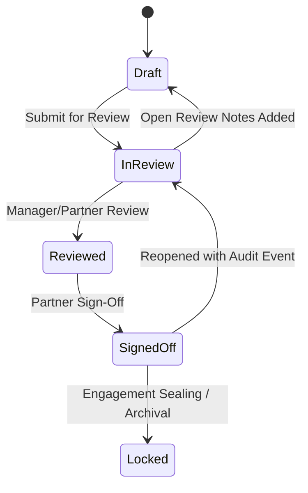

# Working Papers, Review Workflow & Maker-Checker Sign-Off

FinAuditPro enforces SA 230 compliant electronic audit working paper documentation.

---

## 1. Working Paper Lifecycle State Machine

---

## 2. Segregation of Duties & Open Review Notes Blocking

- **Maker-Checker Segregation**: An auditor who authored a working paper version cannot perform the managerial review or partner sign-off on that same working paper.
- **Unresolved Review Notes**: The system actively prevents advancing a working paper to `SignedOff` status if any unresolved `ReviewNote` items remain in `Open` status.
- **Content Hash Locking**: Upon partner sign-off, a SHA-256 digest of the working paper content is stored, enabling tamper detection.
