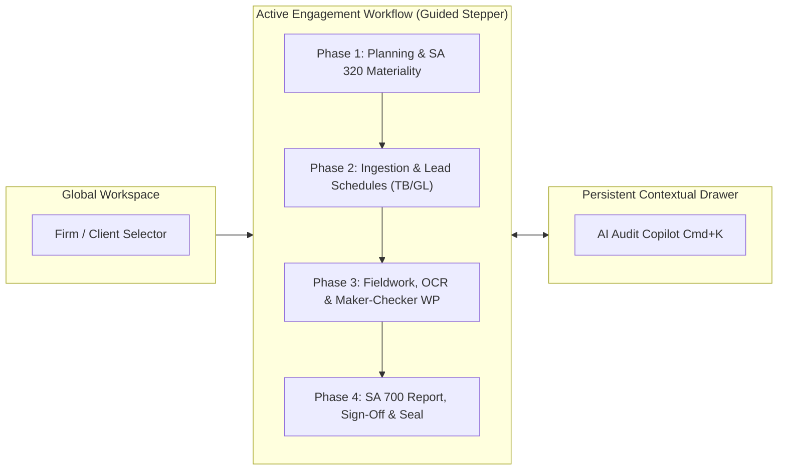

# FinAuditPro — Brutal Product Teardown, Internal Audit & Tier-1 Redesign Blueprint

**Author**: Principal Product Architect & Systems Audit Lead\
**Evaluation Standard**: Big Tech Tier-1 Bar (Apple / Google / Amazon /
Flipkart)\
**Target User Persona**: Indian Chartered Accountants (CAs), Audit Managers,
Article Assistants, and Engagement Partners

---

## 1. Executive Summary & Forensic Product Scorecard

| Assessment Dimension                   |   Current Score   | Tier-1 Benchmark | Verdict & Root Problem                                                                                                 |
| :------------------------------------- | :---------------: | :--------------: | :--------------------------------------------------------------------------------------------------------------------- |
| **Core Architecture & Engine**         |  **9 / 10 (A)**   |      9 / 10      | Clean 4-layer DDD, integer-paise math, SQLite WAL, and AST layer guards are robust and high quality.                   |
| **Security & Air-Gap Compliance**      | **9.5 / 10 (A+)** |     9.5 / 10     | Local-only execution, zero cloud egress, Fernet AES-128-CBC encryption, and append-only triggers are industry-leading. |
| **User Flow & Navigation (UX)**        | **3.5 / 10 (D-)** |     9.5 / 10     | **Broken Information Architecture.** 15 flat disjoint tabs force the auditor into constant manual context-switching.   |
| **Practitioner Empathy (CA Workflow)** |  **4 / 10 (D)**   |      9 / 10      | Built like a database management tool (CRUD tables) rather than a guided audit engagement pipeline.                    |
| **AI Integration Flow**                |  **5 / 10 (C)**   |      9 / 10      | AI is sequestered in an isolated full-page tab instead of living as a persistent, in-context slide-over assistant.     |

> ### 🚨 The Brutal Bottom Line:
>
> **The engine is a Ferrari, but the dashboard is a maze of 15 unconnected
> switches.**\
> The Python code, security guarantees, and test suites (130 passing tests) are
> solid. However, if Apple, Google, or Flipkart launched this to CA firms
> tomorrow, it would face high churn because **auditors do not audit by
> navigating database tables**. They work in a **guided engagement lifecycle**
> (Planning $\rightarrow$ Risk & Materiality $\rightarrow$ Testing & Evidence
> $\rightarrow$ Review $\rightarrow$ Report).

---

## 2. Forensic Teardown: Why the Current Flow Fails Real CAs

### Problem 1: The "15 Flat Tabs" Cognitive Overload

- **The Current Anti-Pattern**: The sidebar contains 15 independent buttons:
  `Dashboard`, `Audit Firms`, `Clients`, `Engagements`, `Documents`,
  `Financial Statements`, `GST Reconciliation`, `Statutory Compliance`,
  `Audit Matrix`, `AI Copilot`, `Working Papers`, `Reports`, `File Archival`,
  `Roll-Forward`, `Settings`.
- **Why CAs Hate This**:
  1. A CA does not think: _"Let me go to the Documents table, then jump to the
     Audit Matrix table, then jump to the Working Papers table."_
  2. If the user clicks on _Working Papers_ or _Audit Matrix_ without first
     setting the active engagement in a separate dropdown, they see blank grids
     with zero indication of what to do next.
  3. Finding where you left off requires mental backtracking across 6 different
     screens.

### Problem 2: Disconnected AI Copilot (The "Siloed AI" Flaw)

- **The Current Anti-Pattern**: The AI Assistant is isolated in its own
  dedicated view (`AIAssistantView`).
- **Why It Breaks Flow**: When an auditor is reviewing a complex Trial Balance
  anomaly or reading a working paper and wants AI analysis, they must leave the
  screen, navigate to the AI tab, type their question, and try to remember what
  they saw on the previous screen.
- **How Tier-1 Does It**: AI is a **slide-over drawer / floating copilot (Cmd +
  K)** available across _every_ screen, pre-loaded with the current document,
  schedule, or transaction context.

### Problem 3: No Side-by-Side Evidence Verification (The SA 230 Violation)

- **The Current Anti-Pattern**: Documents live in `DocumentView` and Working
  Papers live in `WorkingPaperView`.
- **Why It Breaks Flow**: In a real statutory audit, an auditor _must_ see the
  invoice/contract on the right half of the screen while filling in the vouching
  checklist or review note on the left half. Forcing them to switch tabs or open
  separate external viewers destroys auditing speed.

### Problem 4: Missing Automated Statutory Scaffolding

- **The Current Anti-Pattern**: When a new engagement is created, the working
  paper area is empty. The user has to manually create sections.
- **How Tier-1 Does It**: Creating an engagement for an Indian company should
  **auto-scaffold standard Schedule III working paper heads**:
  - `A: Cash & Bank Balances`
  - `B: Trade Receivables & Ageing`
  - `C: Property, Plant & Equipment (Fixed Assets)`
  - `D: Borrowings & Bank Guarantees`
  - `E: Revenue from Operations`
  - `F: Statutory Dues (GST, TDS, PF, ESI)`

---

## 3. How Apple / Google / Flipkart Would Architect FinAuditPro

If Apple or Google designed an audit operating system for CAs, the entire
application would center around **one active engagement at a time**, structured
into a **4-Stage Linear Engagement Stepper**:



---

## 4. What Needs to Be REMOVED (Eliminate Friction & Noise)

| Item to Remove / Refactor                         | Rationale                                                              | Replacement / Solution                                                                 |
| :------------------------------------------------ | :--------------------------------------------------------------------- | :------------------------------------------------------------------------------------- |
| ❌ **15-Item Flat Sidebar**                       | Overwhelms users; feels like an administrative database backend.       | Replace with **4-Phase Engagement Stepper** + Top Global Client/FY Bar.                |
| ❌ **Full-Screen AI Tab**                         | Destroys workflow continuity by taking users away from their work.     | Replace with **Slide-Over AI Copilot Drawer (Cmd + K)** accessible anywhere.           |
| ❌ **Separate "Audit Matrix" View**               | Disconnected from actual Trial Balance accounts.                       | Merge planning, materiality (SA 320), and risk register into **Phase 1: Planning**.    |
| ❌ **Separate "GST" & "Compliance" Views**        | Fragmented statutory checklists.                                       | Embed them directly into statutory procedure working paper folders (`Statutory Dues`). |
| ❌ **Separate "Roll-Forward" & "Archival" Views** | Clutters the daily workspace with annual once-per-year operations.     | Move into **Phase 4: Finalization & Engagement Closure Menu**.                         |
| ❌ **Manual Database IDs in UI**                  | Exposing raw UUIDs or integer primary keys confuses non-technical CAs. | Display human-friendly identifiers: `FY 25-26 / STAT / 001`, `WP-CASH-01`.             |

---

## 5. What Needs to Be ADDED (High-Value Tier-1 Features)

### 1. Unified 4-Phase Engagement Stepper

Replace the 15 tabs with a clean, guided engagement workflow:

1. **Phase 1 — Setup & Planning**:
   - Engagement parameters (FY, Team, Entity Type).
   - SA 320 Materiality Calculator (Instant benchmark selection $\rightarrow$
     OM, PM, CTT in paise).
   - Inherent & Control Risk Matrix.
2. **Phase 2 — Financial Ingestion & Lead Schedules**:
   - Drag-and-drop Trial Balance / GL extract.
   - Auto-mapped Schedule III Balance Sheet & P&L grouping.
   - 1-Click Forensic Analytics (Benford's Law distribution, duplicate payments,
     high-value outliers).
3. **Phase 3 — Fieldwork & Working Papers (Split Screen)**:
   - Left: Standard Working Paper checklist (SA 230) with Maker-Checker
     sign-offs.
   - Right: Integrated Document / PDF OCR Evidence viewer with instant text
     highlighting.
   - Embedded Review Notes with blocking controls.
4. **Phase 4 — Reporting & Closure**:
   - SA 700 / SA 705 draft report preview with watermark toggle.
   - CARO 2020 clause checklist.
   - 1-Click Cryptographic Seal (SQC 1) & SA 510 Next-Year Roll-Forward.

### 2. Context-Aware AI Audit Copilot (Slide-Over Drawer)

- **Keybinding**: `Cmd + K` (macOS) / `Ctrl + K` (Windows/Linux) or a clean
  floating header button.
- **Smart Context**: Automatically inherits context from the current screen:
  - On TB Screen: _"Are there any debit balances in trade payables?"_
  - On PDF Evidence Screen: _"Extract the penalty clauses and payment terms from
    this contract."_
  - On Working Paper: _"Draft an audit finding for ₹4,50,000 unverified cash
    vouchers."_

### 3. Integrated Split-Screen Evidence Viewer

- Eliminates switching back and forth between document tabs and working papers.
- Selecting an evidence link in a working paper instantly renders the PDF page
  with bounding box highlights on the right pane.

---

## 6. Target UX State vs. Current State Comparison

```text
CURRENT ARCHITECTURE (Disjoint & Fragmented):
[Sidebar: 15 Buttons] ──> [15 Isolated Full-Screen Forms] ──> Manual Cross-Referencing

TIER-1 TARGET ARCHITECTURE (Guided, Unified & Contextual):
┌─────────────────────────────────────────────────────────────────────────────┐
│ [Firm: S.K. Agrawal & Co.]  [Client: Tata Steel Ltd.]  [FY: 2025-26 (Stat)] │
├─────────────────────────────────────────────────────────────────────────────┤
│  ① Planning & SA 320  ──>  ② TB/GL & Analytics  ──>  ③ Working Papers  ──>  ④ Report & Seal │
├─────────────────────────────────────────────────────────────────────────────┤
│                                                      │                      │
│   LEFT PANE: Guided Working Paper / Lead Schedule    │  RIGHT PANE:         │
│   • Cash & Bank Lead Schedule (WP-01)                │  • Embedded PDF/OCR  │
│   • SA 230 Maker-Checker Sign-off                    │  • Evidence Preview  │
│   • Review Notes (0 Open / 2 Resolved)               │  • AI Copilot Drawer │
│                                                      │                      │
└─────────────────────────────────────────────────────────────────────────────┘
```

---

## 7. Phased Execution Blueprint (Zero Regression)

Because our underlying domain layer (`src/finauditpro/domain/`), application
services (`src/finauditpro/application/`), and SQLite database migrations are
already solid and 100% test-verified, we can refactor the UI **without rewriting
the backend**:

|    Phase    | Action Item                                    | Target Files                                                                                                                     |
| :---------: | :--------------------------------------------- | :------------------------------------------------------------------------------------------------------------------------------- |
| **Phase 1** | **Global Shell & Header Redesign**             | Refactor `main_window.py` to introduce the persistent top Client/FY selector and reduce sidebar to the 4 core engagement phases. |
| **Phase 2** | **Contextual Slide-Over AI Drawer**            | Convert `ai_assistant_view.py` into a dockable/floating slide-over drawer widget triggered via `Cmd+K`.                          |
| **Phase 3** | **Split-Screen Evidence & Working Paper View** | Combine `document_view.py` and `working_paper_view.py` into a unified split view with real-time evidence preview.                |
| **Phase 4** | **Schedule III & Statutory Scaffolding**       | Pre-populate default ICAI working paper folders on engagement initialization.                                                    |

---

## 8. Final Verdict

FinAuditPro has **world-class security, precision math, and architecture under
the hood**.\
By consolidating the user experience into a **guided 4-phase engagement pipeline
with a persistent slide-over AI copilot**, the software will transform from a
complex developer tool into an **indispensable, delightful operating system for
Chartered Accountants**.
