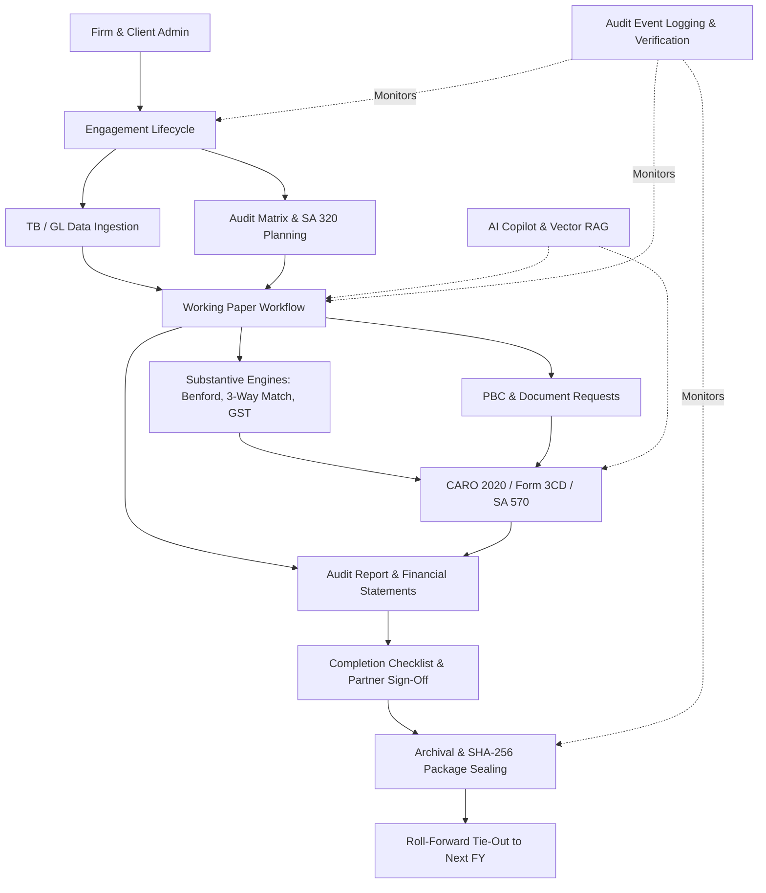

# FinAuditPro Baseline Architecture & Refactor Audit Document

**Date:** September 20, 2026  
**Status:** Approved Baseline Baseline Established (Phase 0 Complete)  
**Target Repository:** `FinAuditPro` (Python/PySide6 Desktop Application)

---

## 1. Executive Summary & Audit Purpose

FinAuditPro is an enterprise-grade desktop audit operating system built using Python and PySide6, designed for audit firms, chartered accountants, and audit engagement teams. It provides end-to-end audit lifecycle support—from client onboarding and risk assessment to substantive testing, financial statement analysis, compliance reporting, and archival.

This document establishes a safe, non-destructive baseline for future UI/UX and architectural refactoring phases. **No core application logic, database schemas, SQLite engine, or security/audit controls have been removed or rewritten.**

---

## 2. Current Architecture Overview

FinAuditPro follows **Clean Architecture** and **Domain-Driven Design (DDD)** principles, strictly isolating domain entities and business rules from application orchestration, persistence mechanisms, and UI components.

```
                  ┌─────────────────────────────────────────┐
                  │              PySide6 UI Layer           │
                  │   Views, Dialogs, Themes, Workers       │
                  └────────────────────┬────────────────────┘
                                       │
                                       ▼
                  ┌─────────────────────────────────────────┐
                  │            Application Layer            │
                  │  Services, DTOs, Security/RBAC Rules    │
                  └────────────────────┬────────────────────┘
                                       │
                                       ▼
                  ┌─────────────────────────────────────────┐
                  │              Domain Layer               │
                  │ Entities, Value Objects, Audit Engines  │
                  └────────────────────┬────────────────────┘
                                       │
                                       ▼
                  ┌─────────────────────────────────────────┐
                  │           Infrastructure Layer          │
                  │ SQLite DB, Repositories, Vector AI, RAG │
                  └─────────────────────────────────────────┘
```

### Layer Breakdown

1. **Domain Layer (`src/finauditpro/domain/`)**
   - **Entities & Value Objects:** `entities.py`, `financial_entities.py`, `working_paper_entities.py`, `compliance_entities.py`, `audit_matrix_entities.py`, `financial_statement_entities.py`, `archival_entities.py`, `value_objects.py`.
   - **Audit & Analytics Engines:**
     - `materiality_engine.py` (SA 320 Materiality & Performance Materiality).
     - `journal_analytics_engine.py` (Benford's Law analysis, rare posting detection, unusual hour postings).
     - `three_way_match_engine.py` (PO, Invoice, GRN 3-way matching).
     - `gst_reconciliation_engine.py` (GSTR-2B vs GSTR-3B vs GL reconciliation).
     - `going_concern_engine.py` (SA 570 Going Concern evaluation).
     - `sampling_engine.py` (MUS & Stratified random sampling).
     - `finalization_gate_engine.py` (Completion checklist & audit gate checks).
     - `roc_secretarial_engine.py`, `related_party_engine.py`, `cutoff_testing_engine.py`, `bank_reconciliation_engine.py`, `payroll_forensic_engine.py`, `fixed_asset_engine.py`, `deferred_tax_engine.py`, `opinion_consistency_engine.py`.
   - **Safety & Utility:** `export_sanitizer.py`, `prompt_engine.py`, `clock.py`, `exceptions.py`.

2. **Application Layer (`src/finauditpro/application/`)**
   - **Security & Access Control:** `security/rbac.py` (Roles: `PARTNER`, `MANAGER`, `SENIOR_AUDITOR`, `STAFF_AUDITOR`, `CLIENT_USER`), `services/auth_service.py`.
   - **Orchestration Services:** `client_service.py`, `firm_service.py`, `engagement_service.py`, `financial_service.py`, `financial_data_service.py`, `working_paper_service.py`, `audit_matrix_service.py`, `audit_adjustment_service.py`, `audit_report_service.py`, `audit_report_generation_service.py`, `compliance_service.py`, `document_service.py`, `document_request_service.py`, `audit_query_service.py`, `continuous_audit_service.py`, `engagement_finalization_service.py`, `archival_service.py`, `roll_forward_service.py`, `ai_service.py`, `report_renderer.py`, `backup_restore_service.py`.
   - **Data Transfer Objects:** `core_audit_dtos.py` & inline DTOs in service modules.

3. **Infrastructure Layer (`src/finauditpro/infrastructure/`)**
   - **Persistence (`persistence/`):** SQLite database access via `database.py` and modular migration engine (`migrations.py`, `migration_list.py`, `migration_sqls*.py`).
   - **Repositories (`persistence/repositories/`):** `user_repository.py`, `firm_repository.py`, `client_repository.py`, `engagement_repository.py`, `working_paper_repository.py`, `financial_data_repository.py`, `audit_matrix_repository.py`, `audit_adjustment_repository.py`, `audit_completion_repository.py`, `archival_repository.py`, `compliance_repository.py`, `document_repository.py`, `document_request_repository.py`, `audit_query_repository.py`, `continuous_audit_repository.py`, `roll_forward_repository.py`, `report_repository.py`, `audit_event_repository.py`.
   - **Security (`security/`):** `encryption.py` (AES-256 GCM), `totp.py` (Step-up MFA), `biometrics.py`, `lockout.py`.
   - **AI Vector Store & RAG (`ai/`):** `faiss_vector_store.py`, `rag_pipeline.py`, `lmstudio_provider.py`, `lmstudio_supervisor.py`.
   - **Document Processing (`documents/`):** `document_pipeline.py`, `document_classifier.py`, `document_extractors.py`, `document_security.py`.
   - **Financial Processing (`financial/`):** `financial_importer.py`, `currency_parser.py`.

4. **UI Layer (`src/finauditpro/ui/`)**
   - PySide6 desktop interface with dark/light design system (`theme.py`, `styles.py`).
   - Shell: `main_window.py` with dynamic sidebar navigation and 18 routed views.
   - Worker Threads (`workers/`): `document_worker.py`, `financial_worker.py` for non-blocking UI operations.
   - Lock Screen (`widgets/lock_screen.py`) and custom dialogs (`dialogs/`).

---

## 3. Navigation & Routing Inventory

`MainWindow` routes 18 views categorized into functional groups:

| Key / Button ID | Route Label | Category | View Component |
| :--- | :--- | :--- | :--- |
| `btn_dashboard` | Command Center | WORKSPACE | `DashboardView` |
| `btn_pbc` | Intake & PBC | GUIDED PIPELINE | `PBCTrackerView` |
| `btn_audit_matrix` | Planning & SA 320 | GUIDED PIPELINE | `AuditMatrixView` |
| `btn_financial_data` | TB/GL & Scrutiny | GUIDED PIPELINE | `FinancialDataView` |
| `btn_working_papers` | Working Papers | GUIDED PIPELINE | `WorkingPaperView` |
| `btn_reports` | Reports & Sign-Off | GUIDED PIPELINE | `ReportView` |
| `btn_queries` | Client Queries | FIELDWORK TOOLS | `AuditQueryView` |
| `btn_documents` | Uploaded Evidence | FIELDWORK TOOLS | `DocumentView` |
| `btn_gst` | GST 2B Reconciler | FIELDWORK TOOLS | `GSTVerificationView` |
| `btn_compliance` | Compliance Checklist | FIELDWORK TOOLS | `ComplianceView` |
| `btn_inspection` | PRB Inspection Sandbox | FIELDWORK TOOLS | `InspectionView` |
| `btn_ai_assistant` | AI Copilot Lab | FIELDWORK TOOLS | `AIAssistantView` |
| `btn_clients` | Clients | ADMINISTRATION | `ClientView` |
| `btn_engagements` | Engagements | ADMINISTRATION | `EngagementView` |
| `btn_firms` | Audit Firms | ADMINISTRATION | `FirmView` |
| `btn_archival` | Archival & Sealing | SYSTEM | `ArchivalView` |
| `btn_roll_forward` | Roll-Forward Tie-Out | SYSTEM | `RollForwardView` |
| `btn_settings` | Settings | SYSTEM | `SettingsView` |

---

## 4. Feature Inventory & Workflows

1. **Working-Paper Workflow:** Complete lifecycle management for working papers (Creation, Ref # auto-assignment, Lead schedule assignment, Multi-level review notes, Partner/Manager Sign-Offs, Immortality/Tamper-Locking upon signoff).
2. **PBC & Document Request Workflow:** Client Document Request management, status tracking, item attachments, query resolution.
3. **Financial Analytics:** Multi-format file ingestion (Excel/CSV), Trial Balance mapping to Schedule III, Benford's Law digit verification, GL Scrutiny, Journal entry anomaly detection, MUS sampling engine, 3-way match, cash flow evaluation.
4. **Compliance Workflow:** CARO 2020 Clause-by-Clause evaluation, Tax Audit Form 3CD compliance, ROC Secretarial verification, SA 570 Going Concern evaluation, SA 580 MRL generator.
5. **GST Reconciliation:** GSTR-2B vs GSTR-3B vs GL automated reconciliation, mismatch categorization, ITC eligibility determination.
6. **Archival & Roll-Forward Workflow:** Archival readiness checklist enforcement, AES-256 package sealing, SHA-256 manifest generation, strict read-only enforcement post-archival, new FY roll-forward tie-out wizard with carried finding provenance.
7. **Authentication & RBAC:** Multi-role RBAC enforcement, local PBKDF2 password hashing, Step-Up TOTP 2FA, Biometric authentication hooks, UI auto-lockout on idle.
8. **Security Controls & Audit Trail:** Immutable append-only `audit_events` logging, audit chain cryptographic verifier, CSV/Excel formula injection escaping (`export_sanitizer.py`), prompt injection filters for RAG pipelines.

---

## 5. Database & Migration Inventory

- **Database Engine:** Embedded SQLite (`auditpro.db`).
- **Migration Architecture:** Version-tracked custom migration engine executing SQL files sequentially.
- **Migration Files:**
  - `migration_sqls.py`: Baseline schema (M1 - M5): users, firms, clients, engagements, trial balance, working papers, findings, audit events.
  - `migration_sqls_c.py`: Schema C (M6 - M7): PBC requests, document requests, audit matrix items, risks, controls.
  - `migration_sqls_d.py`: Schema D (M8 - M9): Completion checklist, sign-off logs, review notes, lead schedules, adjustments.
  - `migration_sqls_e.py`: Schema E (M10): Archival packages, sealing manifests, carried findings, roll-forward records.
  - `migration_sqls_f.py`: Schema F (M11): Continuous audit rules, alert logs, vector document chunks, AI metadata.

---

## 6. Feature Dependency Map



---

## 7. AI & Security Architecture

### AI Architecture
- **Copilot Provider:** Local LM Studio integration (`LMStudioProvider`) with automated supervisor process management (`LMStudioSupervisor`). Fallback to deterministic mock responses if local AI engine is unavailable.
- **RAG & Vector Search:** `FAISSVectorStore` supporting semantic document retrieval across uploaded audit evidence.
- **Adversarial Defense:** `PromptEngine` filters out indirect prompt injection attacks contained within un-sanitized client PDFs/documents before feeding into LLM contexts.

### Security Architecture
- **Auth & RBAC:** Session-based user model with role-based feature gating (`PARTNER`, `MANAGER`, `SENIOR_AUDITOR`, `STAFF_AUDITOR`, `CLIENT_USER`).
- **Data Protection:** Document store encrypted using AES-256 GCM (`document_security.py`).
- **Audit Logging:** Append-only cryptographic ledger (`audit_events`) verified via `audit_chain_verifier.py`.
- **Export Safety:** Formula injection protection (`=`, `+`, `-`, `@` escaping) enforced in `export_sanitizer.py`.

---

## 8. Baseline Test & Lint Results

**Execution Date:** September 20, 2026

| Tool / Test Suite | Result / Metric | Notes |
| :--- | :--- | :--- |
| **pytest** | **307 PASSED** (0 failed, 5 warnings) | Execution time: 44.26s. 100% test pass rate across unit, integration, and e2e suites. |
| **mypy** | 413 errors in 91 files | Errors isolated to missing type annotations in test files and implicit service DTO re-exports. |
| **ruff** | 1 error | Unused import `PIL.Image` in `src/finauditpro/infrastructure/documents/document_extractors.py:96`. |
| **Architecture Tests** | **PASSED** | Verification of engagement isolation (`test_engagement_isolation_m4`, `m7`, `m9`, `m10`, `consolidated`). |
| **Security Tests** | **PASSED** | Verification of encryption, TOTP, RBAC, prompt injection, and red-team hardening tests. |

---

## 9. Known Technical Debt

1. **Type Annotations in Tests & DTO Re-exports:** Mypy highlights 413 missing type annotations in test fixtures/functions and missing explicit re-exports in application services.
2. **Unused Import in Document Extractor:** Ruff reported 1 unused `PIL.Image` import in `document_extractors.py`.
3. **UI View Monolithic Components:** Several PySide6 view files combine layout setup, state management, and direct service calls.
4. **Hardcoded Styling Strings:** Inline QSS styling strings mixed with central `styles.py` and `theme.py`.
5. **Database Migration CLI:** Custom migration scripts (`migration_sqls*.py`) run programmatically but lack interactive CLI tooling or rollback capabilities.

---

## 10. Target Files for Future Refactoring Phases

Below is the list of files expected to be touched or improved during upcoming refactoring phases:

1. **Application & Infrastructure Cleanups:**
   - `src/finauditpro/infrastructure/documents/document_extractors.py` (Fix ruff unused import)
   - `src/finauditpro/application/services/*.py` (Explicit DTO exports for mypy compliance)
2. **UI & UX Enhancement Target Files:**
   - `src/finauditpro/ui/main_window.py` (Navigation & Shell modernization)
   - `src/finauditpro/ui/theme.py`, `src/finauditpro/ui/styles.py` (Design tokens & stylesheet unified system)
   - `src/finauditpro/ui/views/dashboard_view.py`
   - `src/finauditpro/ui/views/working_paper_view.py`
   - `src/finauditpro/ui/views/financial_data_view.py`
   - `src/finauditpro/ui/views/audit_matrix_view.py`
   - `src/finauditpro/ui/views/report_view.py`
   - `src/finauditpro/ui/views/ai_copilot_drawer.py`
   - `src/finauditpro/ui/dialogs/*.py`

---

## 11. Verification Contract

For all subsequent refactoring phases:
- **`pytest` MUST maintain 307+ passed tests with 0 failures.**
- **No database table schemas or existing SQLite columns will be altered destructively.**
- **All security controls (AES-256 encryption, RBAC checks, audit logging, formula escaping) MUST remain strictly active.**
